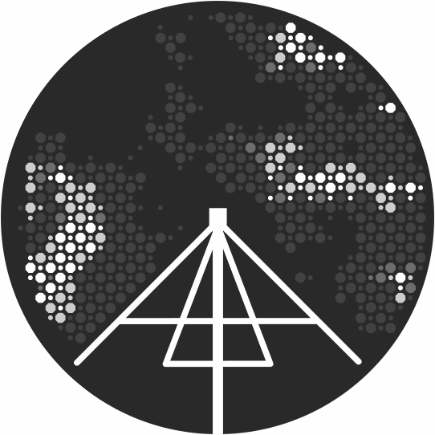

# **nenupy**

[](
    https://pypi.python.org/pypi/nenupy)

<!--  -->
<p align="center">

</p>

*nenupy* is a Python3 ([install](https://www.anaconda.com/download/) via Anaconda) package, written by A. Loh (LESIA, Obs. Paris), in order to handle *NenuFAR* observations.
[*NenuFAR*](https://nenufar.obs-nancay.fr) is a low-frequency radiotelescope located in Nancay, France.

## Installation
### pip
To install *nenupy* with pip/pip3:
```
pip install nenupy
```
<!-- or
```
python3 -m pip install --index-url https://test.pypi.org/simple/ nenupy
``` -->

If `nenupy` is already installed, the newer version can be installed:
```
pip install nenupy --upgrade
```
<!-- ```
python3 -m pip install --index-url https://test.pypi.org/simple/ nenupy --upgrade
``` -->

### Package requirement
* [*astropy*](http://www.astropy.org)
* [*pygsm*](https://github.com/telegraphic/PyGSM): please follow the *pygsm* package instructions to properly install it, it cannot be done via pip.
* *healpy* (install with `conda install -c conda-forge healpy`)


## Command-line Quickstart
A few scripts are installed with the package to facilitate the calling of simple tasks. All those scripts (namely `nenuinfo`, `nenuplot`, `nenusim` and `nenucor`) can be called directly from the shell. Typing `{script} -h` will prompt the *help* menu where the user can figure out the available options and syntax.

### Observation informations
This basic script helps figuring out what were the main parameters of a particular observation:
```
nenuinfo --obs my_nenufar_observation.fits
```

### Data plot
In order to plot some *NenuFAR* data, one can use the `nenuplot` script. The keywords for the data selection are the same as the ones listed on the bottom of this page (that are also used within the Python environment):
```
nenuplot --obs my_nenufar_observation.fits --freq 50.2 --polar NE
```

### Observation simulation
TBW

### XST cross-correlations visualization
TBW


## Access and plot Statistics data
Loading the environment, within python3:
```python
from nenupy.read import SST, BST, XST
```
`SST`, `BST` and `XST` are three separate modules to read **Sub-band Statistics**, **Beamlet Statistics** and **Cross-correlation Statistics** data respectively.

Once a reading module is loaded, a *NenuFAR* observation can be read, here is an example of a **BST** observation:
```python
bst_obs = BST('some_observation_BST.fits')
```
`bst_obs` is now an *instance* of the `BST` class. It means it contains attributes that have been filled with the observation properties as well as some methods/functions to access and plot the data.

Data selection is granted by the `select()` method, which accepts keywords such as `freq`, `polar` and `time`:
```python
bst_obs.select( freq=[20, 60], time='2018-09-01 10:00:00.0', polar='nw' )
```

Once the function `select()` has been called, the data are stored in the `data` attribute. `data` is a dictionnary gathering the selected time (`data['time']`), frequency (`data['freq']`) and amplitude (`data['amp']`) arrays. The user can then use these variable to do some specific analysis or to plot the data using the generic `matplotlib` module:
```python
from matplotlib import pyplot as plt
plt.plot( bst_obs.data['time'].mjd, bst_obs.data['amp'] )
plt.show()
```
Otherwise, the `plot()` method could also be used:
```python
bst_obs.plot()
```

For more 'advanced' tasks, the user is invited to use the standard python tools for plotting and data analysis while selecting the NenuFAR data thanks to the *nenupy* package as demonstrated in the following examples.


### Example: overplot spectra of different mini-arrays
```python
from nenupy import SST
from matplotlib import pyplot as plt

sst = SST('20170426_000000_SST.fits')

sst.select(time='2017-04-26T00:50:00', freq=[10, 90], ma=0)
plt.plot(sst.data['freq'], sst.data['amp'], label='MA 0')

sst.select(time='2017-04-26T00:50:00', freq=[10, 90], ma=1)
plt.plot(sst.data['freq'], sst.data['amp'], label='MA 1')

sst.select(time='2017-04-26T00:50:00', freq=[10, 90], ma=2)
plt.plot(sst.data['freq'], sst.data['amp'], label='MA 2')

plt.legend()

plt.show()
```

### Example: overplot time-profile for both polarizations
```python
from nenupy import BST
from matplotlib import pyplot as plt

bst = BST('20180501_034440_BST.fits')

bst.select(freq=50, polar='NW')
plt.plot(bst.data['time'].mjd, bst.data['amp'], label='NW')

bst.select(freq=50, polar='NE')
plt.plot(bst.data['time'].mjd, bst.data['amp'], label='NE')

plt.legend()

plt.show()
```


## Beam simulation

### SST beam / Mini-Array gain
**SST** beams are computed through a separate module called `SSTbeam`.
```python
from nenupy.beam import SSTbeam
sst = SSTbeam()
```
The object `sst` would then correspond to default Mini-Array number 0.
A query could be more specific, for example:
```python
from nenupy.beam import SSTbeam
sst = SSTbeam(ma=21, freq=46, polar='NE', azana=175., elana=72.)
sst.plotBeam() # will show the simulated beam
```

## Keywords

### Data selection
* `freq`: Frequency in MHz (e.g. `freq=38.5`, `freq=[20, 80.2]`) 
* `ma`: Mini-Array index (e.g. `ma=6`, `ma=[0,1,3,6,42]`)
* `time`: UTC time (e.g. `time='2018-10-22 10:15:35.5'`, `time=['2018-10-22 10:15:35.5', '2018-10-22 16:00:00']`)
* `polar`: Polarization (e.g. `polar='NW'`, `polar='NE'`)
* `abeam`: Analogic beam index (e.g., `abeam=0`)
* `dbeam`: Digital beam index (e.g. `dbeam=0`)

### Observation characteristics
* `azana`: Azimuth in degrees (**analogic** beam)
* `elana`: Elevation in degrees (**analogic** beam)
* `azdig`: Azimuth in degrees (**digital** beam)
* `eldig`: Elevation in degrees (**digital** beam)
* `freqmin`: Minimum frequency in MHz
* `freqmax`: Maximum frequency in MHz
* `obstart`: Observation start time
* `obstop`: Observation stop time

