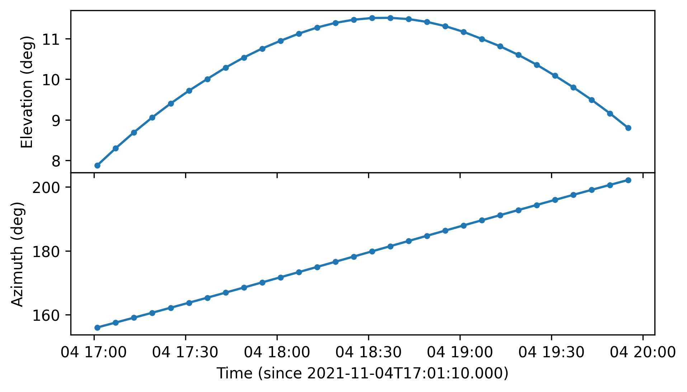
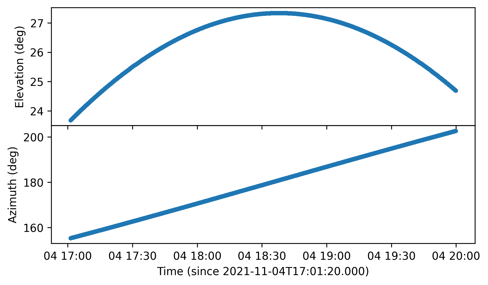

.. _pointing_doc:

Instrument Pointing
===================

Instrument :class:`~nenupy.astro.pointing.Pointing` objects are defined to represent the instrument pointing with respect to time.
They can either be instantiated manually (see :ref:`predefined_pointing_sec`) or from `NenuFAR <https://nenufar.obs-nancay.fr/en/homepage-en/>`_ observation files (see :ref:`obsfile_pointing_sec`).
In both cases, they are designed to be fed to the various methods while performing :ref:`beam_simulation_doc`.

Below, several packages are imported in preparation for the following examples.

.. code-block:: python

    >>> from nenupy.astro.pointing import Pointing
    >>> from nenupy.astro.target import FixedTarget, SolarSystemTarget
    >>> from astropy.time import Time, TimeDelta
    >>> import astropy.units as u
    >>> import numpy as np

.. seealso::
    `NenuFAR pointing <https://nenufar.obs-nancay.fr/en/astronomer/#pointing>`_ for a detailed explanation on the different steps related to instrumental pointing.

.. _predefined_pointing_sec:

Predefined pointings
--------------------

:class:`~nenupy.astro.pointing.Pointing` instances can be fully customized according to the user preference.
However, the most reccurent pointing configurations are easily accessed via *classmethods* defined in the following.

Source tracking pointing
^^^^^^^^^^^^^^^^^^^^^^^^

A :class:`~nenupy.astro.pointing.Pointing` instance aimed at following (or tracking) a particular celestial target can be initialized using :meth:`~nenupy.astro.pointing.Pointing.target_tracking`.
This *classmethod* takes as input the ``target``, of type :class:`~nenupy.astro.target.Target` (see :ref:`target_doc`), to track.
The ``time`` argument describes the start time of each pointing step, while ``duration`` defines the time span of the pointing to this particular direction.

.. code-block:: python

    >>> cas_a = FixedTarget.from_name("Cas A")
    >>> pointing = Pointing.target_tracking(
    >>>     target=cas_a,
    >>>     time=Time("2021-01-01 00:00:00") + np.arange(10)*TimeDelta(1800, format="sec"),
    >>>     duration=TimeDelta(1800, format="sec")
    >>> )

In this example, ``pointing`` targets the source Cas A, and contains 10 successive pointing towards Cas A apparent position.

.. note::

    The ``duration`` argument can be further described to set custom values for each individual pointing.
    In order to visualize the results, the :meth:`~nenupy.astro.pointing.Pointing.plot` displays the azimuth and elevation values computed from the requested parameters.
    The keyword ``display_duration`` adds grey windows corresponding to the duration of each individual pointing (blue dots).

    .. code-block:: python
        :emphasize-lines: 5,7

        >>> cas_a = FixedTarget.from_name("Cas A")
        >>> pointing = Pointing.target_tracking(
        >>>     target=cas_a,
        >>>     time=Time("2021-01-01 00:00:00") + np.arange(10)*TimeDelta(1800, format="sec"),
        >>>     duration=TimeDelta(np.ones(10)*1200, format="sec")
        >>> )
        >>> pointing.plot(display_duration=True)

    .. figure:: ../_images/astro_images/pointing_tracking_duration.png
        :width: 450
        :align: center

        Cas A tracking (in horizontal coordinates), spread across 10 time steps. The duration is highlighted as grey windows.

.. _transit_pointing_sec:

Source transit pointing
^^^^^^^^^^^^^^^^^^^^^^^

The second heavily used pointing type is source transit.
Using the *classmethod* :meth:`~nenupy.astro.pointing.Pointing.target_transit`, it is possible to set up such pointing configuration.
In addition to ``target`` (:class:`~nenupy.astro.target.Target`, see :ref:`target_doc`), the user is expected to provide ``t_min``.
The next source crossing at the requested ``azimuth`` is looked for, starting from ``t_min``.
The pointing is then centered at the transit date, for a total ``duration``.

.. code-block:: python
    :emphasize-lines: 1

    >>> cyg_a = FixedTarget.from_name("Cyg A")
    >>> pointing = Pointing.target_transit(
    >>>    target=cyg_a,
    >>>    t_min=Time("2021-01-01 00:00:00"),
    >>>    duration=TimeDelta(7200, format="sec"),
    >>>    azimuth=180*u.deg
    >>> )

.. note::

    It is also possible to ask for a different ``azimuth`` value, giving access to transits outside the meridian plane.

    .. code-block:: python
        :emphasize-lines: 6

        >>> cyg_a = FixedTarget.from_name("Cyg A")
        >>> pointing = Pointing.target_transit(
        >>>    target=cyg_a,
        >>>    t_min=Time("2021-01-01 00:00:00"),
        >>>    duration=TimeDelta(7200, format="sec"),
        >>>    azimuth=100*u.deg
        >>> )

Zenith pointing
^^^^^^^^^^^^^^^

Finally, it is also possible to define pointings fixed at the local zenith, using the *classmethod* :meth:`~nenupy.astro.pointing.Pointing.zenith_tracking`.
The behavior is similar than :meth:`~nenupy.astro.pointing.Pointing.target_tracking`, except that there is no need to provide a specific target.

.. code-block:: python

    >>> pointing = Pointing.zenith_tracking(
    >>>     time=Time("2021-01-01 00:00:00") + np.arange(10)*TimeDelta(1800, format="sec"),
    >>>     duration=TimeDelta(7200, format="sec")
    >>> )

.. _obsfile_pointing_sec:

Observation files
-----------------

Each `NenuFAR <https://nenufar.obs-nancay.fr/en/homepage-en/>`_ observation is delivered with two files describing both analog and numerical pointings.
These files can be used to instantiate a :class:`~nenupy.astro.pointing.Pointing` object, thanks to the classmethod :class:`~nenupy.astro.pointing.Pointing.from_file`.
Using them as inputs is particularly useful while aiming at simulating the corresponding observation.

altazA file
^^^^^^^^^^^

An ``.altazA`` file describes the analog pointing of the Mini-Arrays, i.e., all pointing orders for each analog beam.
The columns can be read, from left to right, as *'start time of the pointing'*, *'analog beam index'*, *'desired azimuth'*, *'desired elevation'*, *'corrected azimuth (after calibration)'*, *'corrected elevation (after calibration)'*, *'frequency at which the beamsquint effect is computed'*, *'elevation to point (taking into account the beamsquint effect)'*.

.. code-block:: text

    ;========================================================================================
    ; az cor, el cor : method 'mix'
    ;YYYY-MM-DD HH:NN:SS  ANA      az            el      az cor        el cor      Frq  el a pointer
    2021-11-04T17:01:10Z 0000   155.3537      24.3131   156.0355      23.8797     40MHz    7.8797
    2021-11-04T17:07:10Z 0000   156.8850      24.7254   157.5571      24.2973     40MHz    8.2973
    2021-11-04T17:13:10Z 0000   158.4292      25.1127   159.0913      24.6900     40MHz    8.6900
    2021-11-04T17:19:10Z 0000   159.9858      25.4743   160.6375      25.0571     40MHz    9.0571
    2021-11-04T17:25:10Z 0000   161.5539      25.8098   162.1950      25.3982     40MHz    9.3982
    2021-11-04T17:31:10Z 0000   163.1331      26.1188   163.7633      25.7129     40MHz    9.7129
    ...

This file can directly be used to instantiate a :class:`~nenupy.astro.pointing.Pointing`.
The :meth:`~nenupy.astro.pointing.Pointing.plot` method can be used to quickly visualize the pointings orders:

.. code-block:: python

    >>> altaz_a = ".../20211104_170000_20211104_200000_JUPITER_TRACKING.altazA"
    >>> pointing = Pointing.from_file(file_name=altaz_a, beam_index=0)
    >>> pointing.plot()

    Analog pointing (horizontal coordinates) vs. time for a Jupiter observation.

.. note::
    Another file is present in each `NenuFAR <https://nenufar.obs-nancay.fr/en/homepage-en/>`_ observation repository: the so-called 'tracking file'.
    This one lists the analog pointing orders used to control the delay lines. It looks like:

    .. code-block:: text

        2021-11-04T17:01:10Z A 000 036 003 1 59 2 31
        2021-11-04T17:01:10Z A 001 009 025 1 60 2 31
        2021-11-04T17:01:10Z A 003 108 111 1 62 2 31
        2021-11-04T17:01:10Z A 004 018 015 1 57 2 31
        ...

    It is possible to reproduce these numbers, for checking purposes, using the :class:`~nenupy.instru.nenufar.MiniArray` class.
    For instance, the first line corresponds to the first time step, and the first Mini-Array (index ``000``).
    We can read that the ``Xdelay`` and the ``Ydelay`` values are respectively ``036`` and ``003``.
    From the *.altazA* file, above, we also read that the pointing order for the first time step, once the corrections are applied, is :math:`(\phi=156.0355^{\circ}, \theta=7.8797^{\circ})`.
    Using the hidden :meth:`~nenupy.instru.nenufar.MiniArray._skycoord_to_order` method, which takes as input a :class:`~astropy.coordinates.SkyCoord` object for simplicity (that we set using the pointing coordinates), it is possible to find back these delay lines commands:

    .. code-block:: python
        :emphasize-lines: 6
        
        >>> from nenupy.instru import MiniArray
        >>> from astropy.coordinates import SkyCoord
        >>> import astropy.units as u
        >>> ma = MiniArray(index=0)
        >>> ma._skycoord_to_order(SkyCoord(156.0355, 7.8797, unit="deg"))
        (36, 3)
    

altazB file
^^^^^^^^^^^

An ``.altazB`` file describes the numerical pointing of the NenuFAR array in beamforming operating mode.
Several numerical beams can co-exist (see `NenuFAR pointing <https://nenufar.obs-nancay.fr/en/astronomer/#pointing>`_ for more details), each with a given index ``BEAM``.
Each numerical beam is linked to an analog beam (Mini-Arrays configuration), this is why the analog beam index ``ANA`` is associated to each line.

.. code-block:: text

    ; ============================================================================================================
    ;YYYY-MM-DD HH:NN:SS  ANA BEAM  az (deg)   el (deg)           L                   M                   N 
    2021-11-04T17:01:10Z 0000 0000  155.3005   23.6678   0.382712881554200  -0.832095381992832   0.401432591550169
    2021-11-04T17:01:20Z 0000 0000  155.3424   23.6800   0.382068139460654  -0.832297062149275   0.401628605986626
    2021-11-04T17:01:30Z 0000 0000  155.3843   23.6923   0.381423336401039  -0.832498308203545   0.401824346309349
    2021-11-04T17:01:40Z 0000 0000  155.4262   23.7045   0.380778195290465  -0.832699277533139   0.402019749747604
    2021-11-04T17:01:50Z 0000 0000  155.4682   23.7167   0.380132857849189  -0.832899897616823   0.402214831816647
    2021-11-04T17:02:00Z 0000 0000  155.5102   23.7289   0.379487324256145  -0.833100168358094   0.402409592592706
    2021-11-04T17:02:10Z 0000 0000  155.5521   23.7411   0.378841591781727  -0.833300083263546   0.402604048128252
    ...

This file can directly be used to instantiate a :class:`~nenupy.astro.pointing.Pointing`.
The :meth:`~nenupy.astro.pointing.Pointing.plot` method can be used to quickly visualize the pointings orders:

.. code-block:: python

    >>> altaz_b = ".../20211104_170000_20211104_200000_JUPITER_TRACKING.altazB"
    >>> pointing = Pointing.from_file(file_name=altaz_b, beam_index=0)

    Numerical pointing (horizontal coordinates) vs. time for a Jupiter observation.

Comparing the two last plots (made for the same observation), the *beamsquint* correction applied to the analog beam can clearly be seen.
The pointed elevations, for the latter, are lower than the ones pointed by the numerical beam.
