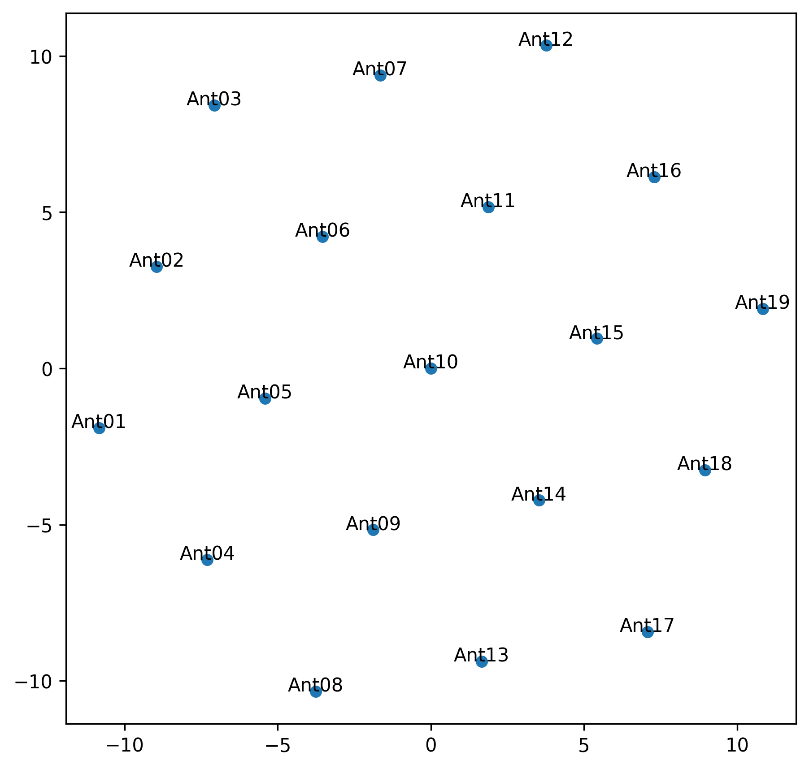
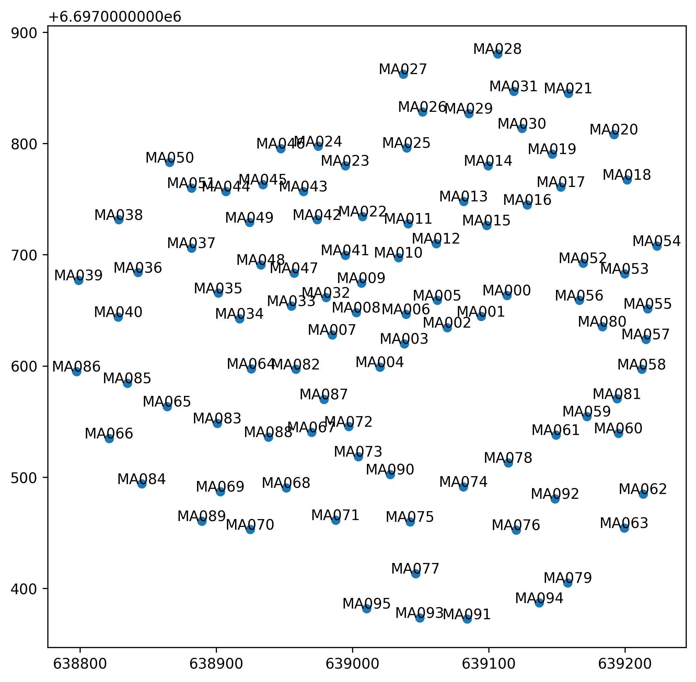

.. _array_configuration_doc:

Array Configuration
===================

The `NenuFAR <https://nenufar.obs-nancay.fr/en/homepage-en/>`_ low-frequency radio telescope can de viewed as a hierarchy of elements (i.e., the individual dipole antennas, the mini-arrays and the whole array).
In order to better capture these configurations, the associated parameters, while aiming at delivering the related physical properties, ``nenupy`` offers two main classes to represent this complexity: :class:`~nenupy.instru.nenufar.MiniArray` and :class:`~nenupy.instru.nenufar.NenuFAR`.

Both of these classes inherit from the base class :class:`~nenupy.instru.interferometer.Interferometer`, which is an abstract Python class.
Nonetheless, all derived classes share common methods and attributes.

.. seealso::

    Common :class:`~nenupy.instru.interferometer.Interferometer` methods to get physical quantities for a given array configuration are described in :ref:`instrument_properties_doc`.

MiniArray class
---------------

A `Mini-Array <https://nenufar.obs-nancay.fr/en/astronomer/#mini-arrays>`_ is a tile of 19 dipole `antennas <https://nenufar.obs-nancay.fr/en/astronomer/#antennas>`_. Upon NenuFAR's completion, there will be 96 of them forming the core of the instrument, and 6 other called the 'remote' ones to increase the resolution in imaging mode.

Mini-Array selection
^^^^^^^^^^^^^^^^^^^^

An instance of such Mini-Array is created as a :class:`~nenupy.instru.nenufar.MiniArray` object. The :attr:`~nenupy.instru.nenufar.MiniArray.index` attribute defines which Mini-Array is to be considered (out of the 96 + 6).
Below, the Mini-Array '10' is selected and its antenna names are printed.

.. code-block:: python

    >>> from nenupy.instru import MiniArray
    >>> ma = MiniArray(index=10)
    >>> ma.antenna_names
    array(['Ant01', 'Ant02', 'Ant03', 'Ant04', 'Ant05', 'Ant06', 'Ant07',
       'Ant08', 'Ant09', 'Ant10', 'Ant11', 'Ant12', 'Ant13', 'Ant14',
       'Ant15', 'Ant16', 'Ant17', 'Ant18', 'Ant19'], dtype='<U5')

.. seealso::

    :ref:`element_selection_sec`, to learn how to select given dipole antennas for a particular :class:`~nenupy.instru.nenufar.MiniArray` instance.

Rotation and plotting
^^^^^^^^^^^^^^^^^^^^^

Each Mini-Array is oriented differently compared to the others. This essential information is kept in the :attr:`~nenupy.instru.nenufar.MiniArray.rotation` attribute (as a :class:`~astropy.units.Quantity` object) and is used in determining the array imprint on the ground.
The distribution of array elements is displayed using the :meth:`~nenupy.instru.interferometer.Interferometer.plot` method:

.. code-block:: python

    >>> ma.rotation
    290°
    >>> ma.plot()

    Distribution of antennas belonging to Mini-Array 10.

NenuFAR class
-------------

`NenuFAR <https://nenufar.obs-nancay.fr/en/homepage-en/>`_ is an array of 96 so-called 'core' Mini-Arrays, plus 6 'remote' Mini-Arrays (for more details, see `NenuFAR Mini-Arrays Distribution <https://nenufar.obs-nancay.fr/en/astronomer/#global-distribution>`_).

NenuFAR instantiation
^^^^^^^^^^^^^^^^^^^^^

Several possibilities exist to create an instance of :class:`~nenupy.instru.nenufar.NenuFAR`, regarding the instrument configuration relevant to a given analysis:

* By default, :class:`~nenupy.instru.nenufar.NenuFAR` gets instantiated as the 'core' array, meaning that NenuFAR contains 96 Mini-Arrays (each of them composed of 19 dipole antennas).

    .. code-block:: python

        >>> from nenupy.instru import NenuFAR
        >>> nenufar = NenuFAR()
        >>> nenufar.size
        96

* In order to also include the 6 'remote' Mini-Arrays, the parameter :attr:`~nenupy.instru.nenufar.NenuFAR.include_remote_mas` can be set to ``True``.

    .. code-block:: python

        >>> from nenupy.instru import NenuFAR
        >>> nenufar = NenuFAR(include_remote_mas=True)
        >>> nenufar.size
        102

* Finally, in combination with the two previous initialization methods, it is also possible to set the number of dipole antennas each Mini-Arrays includes. This can be done by setting :attr:`~nenupy.instru.nenufar.NenuFAR.miniarrays_antenna` to any value accepted in antenna selection of the class :class:`~nenupy.instru.nenufar.MiniArray` (see also :ref:`element_selection_sec`).    

    .. code-block:: python

        >>> from nenupy.instru import NenuFAR
        >>> nenufar = NenuFAR(miniarrays_antenna=["Ant01", "Ant02", "Ant03"])
        >>> nenufar.size
        96

    .. note::

        Although setting specific Mini-Arrays antennas does not affect the global array distribution, instrument properties heavily depends on the number of antennas per Mini-Array (see :ref:`instrument_properties_doc` and :ref:`beam_simulation_doc`).

Such as :class:`~nenupy.instru.nenufar.MiniArray`, a :class:`~nenupy.instru.nenufar.NenuFAR` instance can be easily displayed using the :meth:`~nenupy.instru.interferometer.Interferometer.plot` method:

.. code-block:: python

    >>> from nenupy.instru import NenuFAR
    >>> nenufar = NenuFAR()
    >>> nenufar.plot()

    NenuFAR 'core' Mini-Arrays distribution.

Operations on arrays
--------------------

Once an instance of :class:`~nenupy.instru.nenufar.MiniArray` or :class:`~nenupy.instru.nenufar.NenuFAR` is produced, several operations can be performed to alter the resulting array distribution of elements.

.. _element_selection_sec:

Element selection
^^^^^^^^^^^^^^^^^

It is for example possible to select a sub-set of elements within an existing array, using the python indexing operator ``[]``.
This operation allows for four different types of input:

* Normal indexing using integers as selection indices over the array elements:

    .. code-block:: python
        :emphasize-lines: 2
        
        >>> from nenupy.instru import MiniArray
        >>> ma = MiniArray()[0, 1, 3]
        >>> ma.antenna_names
        array(['Ant01', 'Ant02', 'Ant04'], dtype='<U5')

* `Numpy <https://numpy.org/>`_ :class:`~numpy.ndarray` object, which enables ore complicated operations on the indexing list beforehand:

    .. code-block:: python
        :emphasize-lines: 4
        
        >>> from nenupy.instru import MiniArray
        >>> import numpy as np
        >>> ma_indices = np.concatenate((np.arange(3), np.arange(10, 12)))
        >>> ma = MiniArray()[ma_indices]
        >>> ma.antenna_names
        array(['Ant01', 'Ant02', 'Ant03', 'Ant11', 'Ant12'], dtype='<U5')

* Python `slice` notation:

    .. code-block:: python
        :emphasize-lines: 2
        
        >>> from nenupy.instru import MiniArray
        >>> ma = MiniArray()[3:9]
        >>> ma.antenna_names
        array(['Ant04', 'Ant05', 'Ant06', 'Ant07', 'Ant08', 'Ant09'], dtype='<U5')

* Antenna names, such as listed in :attr:`~nenupy.instru.interferometer.Interferometer.antenna_names`:

    .. code-block:: python
        :emphasize-lines: 2
        
        >>> from nenupy.instru import MiniArray
        >>> ma = MiniArray()["Ant02", "Ant18"]
        >>> ma.antenna_names
        array(['Ant02', 'Ant18'], dtype='<U5')

.. note::
    
    Errors possibly raised are:

    * `DuplicateAntennaError`: when an antenna is referenced more than once (e.g., ``MiniArray()[0, 0, 1]``) ;
    * `AntennaIndexError`: when the required index does not match the current state of the array distribution (e.g., ``MiniArray()[0, 1, 20]``) ;
    * `AntennaNameError`: when the required element name does not match any of the array element names (e.g., ``MiniArray()["Ant23"]``).

Array combinations
^^^^^^^^^^^^^^^^^^

Array combinations may be useful in some specific cases, or to ease the manipulation of :class:`~nenupy.instru.interferometer.Inteferometer` objects while programming.

Two :class:`~nenupy.instru.interferometer.Interferometer` instances are merged with the use of ``+`` operator.
This operation takes care of duplicated elements belong to both of the summed instances. 

    .. code-block:: python
        :emphasize-lines: 4
        
        >>> from nenupy.instru import MiniArray
        >>> ma_1 = MiniArray()["Ant01", "Ant02"]
        >>> ma_2 = MiniArray()["Ant18", "Ant19"]
        >>> combined_ma = ma_1 + ma_2
        >>> combined_ma.antenna_names
        array(['Ant01', 'Ant02', 'Ant18', 'Ant19'], dtype='<U5')

Array elements from one instance :class:`~nenupy.instru.interferometer.Interferometer` can be removed with the use of ``-`` operator.
Every element of the first instance which also belongs to the second instance is excluded.

    .. code-block:: python
        :emphasize-lines: 4
        
        >>> from nenupy.instru import MiniArray
        >>> ma_1 = MiniArray()["Ant01", "Ant02"]
        >>> ma_2 = MiniArray()["Ant02, Ant18", "Ant19"]
        >>> combined_ma = ma_1 - ma_2
        >>> combined_ma.antenna_names
        array(['Ant01'], dtype='<U5')
