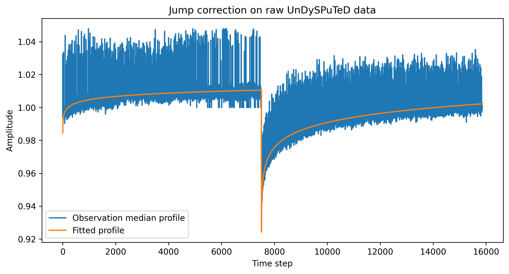
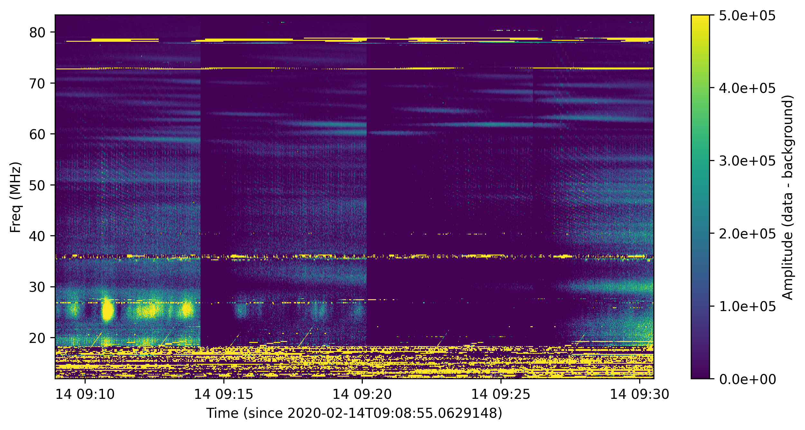
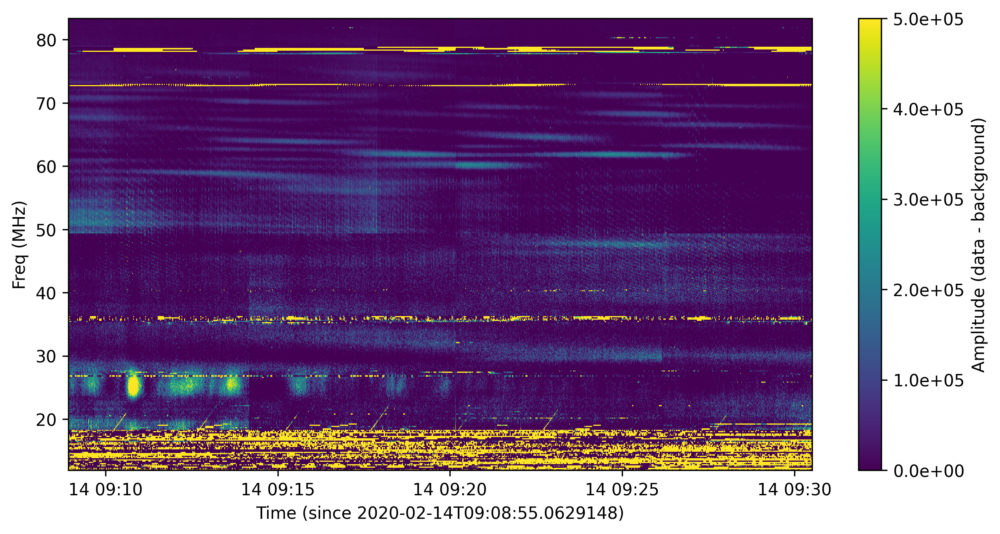
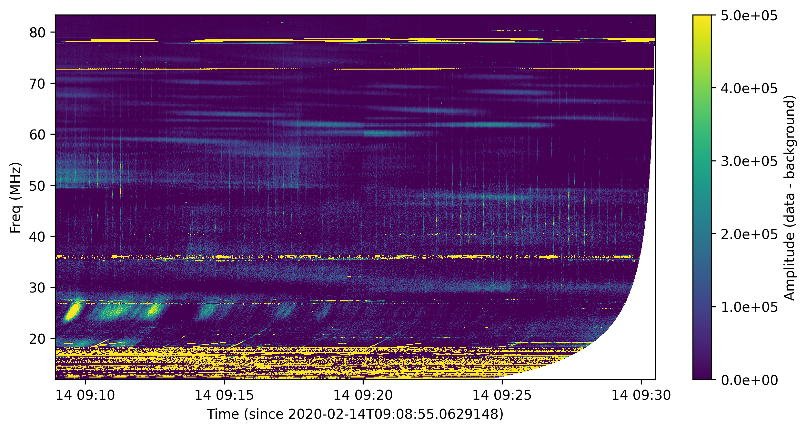

.. _undysputed_reading_doc:

UnDySPuTeD Time-Frequency Data (deprecated)
===========================================

:mod:`~nenupy.undysputed.dynspec.Dynspec` is the module designed to
read and analyze *UnDySPuTeD* DynSpec high-rate data. It
benefits from `Dask <https://docs.dask.org/en/latest/>`_, with
the possibility of reading and applying complex pipelines
to larger-than-memory data sets.
It replaces the original `nenupy-tf <https://github.com/AlanLoh/nenupy-tf>`_
module.

.. note::
    `nenupy` logger could be activated at will to enhance the verbosity:

    >>> import logging
    >>> logging.getLogger('nenupy').setLevel(logging.INFO)

UnDySPuTeD receiver
-------------------

*UnDySPuTeD* (stands for Unified Dynamic Spectrum Pulsar and
Time Domain receiver) is the receiver of the NenuFAR
beamformer mode, fed by the (up-to-)96 core Mini-Arrays (2
polarizations) from the *LANewBa* backend. 

DynSpec data
------------

The raw data flow from *LANewBa* consists of 195312.5 pairs
of complex X and Y values per second per beamlet. These data
are downsampled in channels per subband (of 195.3125 kHz)
numbered from 16 to 2048 channels, ``fftlen``, (to achieve a
frequency resolution of :math:`\delta \nu = 12 - 0.1\, \rm{kHz}`
respectively). After computation of cross and auto-correlations,
the data are downsampled again in time, integrating from 4 to 1024
spectra, ``nfft2int`` (implying a time resolution :math:`195312.5^{-1} \times \rm{fftlen} \times \rm{fft2int}`,
:math:`\delta t = 0.3 - 83.9\, \rm{ms}`).

.. seealso::
    `DynSpec data product <https://nenufar.obs-nancay.fr/en/astronomer/#data-products>`_

DynSpec data files
------------------

Each NenuFAR/*UnDySPuTeD*/DynSpec observation results in the
production of several proprietary formatted files (``'*.spectra'``),
each corresponding to an individual lane of the *UnDySPuTeD* receiver.
Depending on the observation configuration, the bandwidth and/or
the different observed beams (i.e., beamforming in different sky
directions) can be spread accross these files.

The class :class:`~nenupy.undysputed.dynspec.Dynspec` offers
the possibility to read and analyze all these observation files
at once, through an API aimed at minimizing user interaction
over complicated settings.

For the purpose of the following 'how-to' guide, a 1h-observation
of the famous pulsar `PSR B1919+21 <https://en.wikipedia.org/wiki/PSR_B1919%2B21>`_
is analyzed. :mod:`~nenupy.undysputed.dynspec.Dynspec` needs
first to be imported, as well as :mod:`~astropy.units` in order
to use physcial units (to avoid mistakes).
Attribute :attr:`~nenupy.undysputed.dynspec.Dynspec.lanefiles`
is filled with a `list` of all the available lane files (up to four)
in order to create ``ds``, an instance of
:class:`~nenupy.undysputed.dynspec.Dynspec`:

>>> from nenupy.undysputed import Dynspec
>>> import astropy.units as u
>>> ds = Dynspec(
        lanefiles=[
            'B1919+21_TRACKING_20200214_090835_0.spectra',
            'B1919+21_TRACKING_20200214_090835_1.spectra'
        ]
    )

.. note::
    :attr:`~nenupy.undysputed.dynspec.Dynspec.lanefiles` must contain
    files related to one specific observation (otherwise, a ``ValueError``
    is raised). It can be practical to automatically find all
    *DynSpec* files if they are stored within an observation folder:

    >>> from glob import glob
    >>> from os.path import join
    >>> obs_path = '/path/to/observation'
    >>> dynspec_files = glob(
            join(obs_path, '*.spectra')
        )

    and then filling in :attr:`~nenupy.undysputed.dynspec.Dynspec.lanefiles`
    with ``dynspec_files``.

Access to observation properties
--------------------------------

Once the two *DynSpec* files 'lazy'-read/loaded (i.e., without
being directly stored in memory), and before any data
selection to occur, it might be handy to check the data
properties.
Several getter attributes of :class:`~nenupy.undysputed.dynspec.Dynspec`
allow for taking an overall look at the data.

Time
^^^^

:attr:`~nenupy.undysputed.dynspec.Dynspec.tmin` and
:attr:`~nenupy.undysputed.dynspec.Dynspec.tmax` both return
:class:`~astropy.time.Time` object instances and give the
start and stop times of the observation (time can thus be
expressed in ISOT format, for example, simply by querying the
``.isot`` attribute of the :class:`~astropy.time.Time`
instance):

>>> ds.tmin.isot
'2020-02-14T09:08:55.0000000'
>>> ds.tmax.isot
'2020-02-14T10:07:54.9506330'

Native time resolution of the data can also be accessed
as a :class:`~astropy.units.Quantity` instance by querying
the :attr:`~nenupy.undysputed.dynspec.Dynspec.dt` attribute 
(wich can then be converted to any desired equivalent
unit):  

>>> ds.dt
0.04194304 s
>>> ds.dt.to(u.ms)
41.94304 ms

Frequency
^^^^^^^^^

:attr:`~nenupy.undysputed.dynspec.Dynspec.fmin` and
:attr:`~nenupy.undysputed.dynspec.Dynspec.fmax` are the
minimal and maximal recorded frequencies, independently of
the beam selection.

>>> ds.fmin
11.816406 MHz
>>> ds.fmax
83.691406 MHz

Native frequency resolution 
:attr:`~nenupy.undysputed.dynspec.Dynspec.df` is also an
instance of :class:`~astropy.units.Quantity` and can thus
be converted to any matching unit:

>>> ds.df
12207.031 Hz
>>> ds.df.to(u.MHz)
0.012207031 MHz

Beam
^^^^

Depending on the observation configuration, several beams may
be spread accross lane files. There could be as many beams as
available beamlet (i.e. 768 if the full 150 MHz bandwidth is
used, see `NenuFAR receivers <https://nenufar.obs-nancay.fr/en/astronomer/#receivers>`_).
They are recorded by their indices and summarized within the
:attr:`~nenupy.undysputed.dynspec.Dynspec.beams` atribute:

>>> ds.beams
array([0])

to help selecting available beam indices. On the current example,
only one beam has been recorded, hence the single index ``0``.

Configuring the data selection
------------------------------

>>> ds.time_range = [
        '2020-02-14T09:08:55.0000000',
        '2020-02-14T09:30:30.9506330'
    ]
>>> ds.freq_range = [
        10*u.MHz,
        90*u.MHz
    ]
>>> ds.beam = 0

Pipeline setup
--------------

Before getting the data, several processes may be set up and
therefore being used for converting raw data ('L0') to cleaned
and reduced data ('L1').

Bandpass correction
^^^^^^^^^^^^^^^^^^^

Reconstructed sub-bands may not display a flat bandpass due
to polyphase filter response. It may be usefull to correct
for this effect and reduce dynamic spectrum artefacts.
Several types of correction are implemented and can be set
with the :attr:`~nenupy.undysputed.dynspec.Dynspec.bp_correction`
attribute (see :attr:`~nenupy.undysputed.dynspec.Dynspec.bp_correction`
for more information regarding each correction efficiency).

>>> ds.bp_correction = 'standard'

Edge channels crop
^^^^^^^^^^^^^^^^^^

By construction, channels at the edges of each sub-band may suffer
from bad behaviors. One can thus set the attribute
:attr:`~nenupy.undysputed.dynspec.Dynspec.edge_channels_to_remove`
to any positive integer value :math:`n_{\rm chan}` (that should be
less than half of the subband channels content). The first and last
:math:`n_{\rm chan}` channels values of each sub-band are then set to `NaN`.

>>> ds.edge_channels_to_remove = 4

.. note::

    Since they are set to `NaN`, these flagged values do not
    interfere with any other methods of the :class:`~nenupy.undysputed.dynspec.Dynspec`
    class, especially the rebinning in which specific averaging
    methods are used (such as :meth:`~numpy.nanmean`).

Pointing jump correction
^^^^^^^^^^^^^^^^^^^^^^^^

Instrumental components used during analogical Mini-Array
introduction of antenna delays for pointing purposes may
induce < 1dB gain jumps. To ease correction of this effect,
analogical pointing orders are set to occur every 6 minutes.

A correction of these 6-minute jumps is implemented within
:mod:`~nenupy.undysputed.dynspec` and only requires the
boolean setting of the :attr:`~nenupy.undysputed.dynspec.Dynspec.jump_correction`
attribute:

>>> ds.jump_correction = True

The jumps are fitted with a function of the form:

.. math::
    f(t) = a \log_{10} (t) + b

Dedispersion
^^^^^^^^^^^^

`Pulsar <https://en.wikipedia.org/wiki/Pulsar>`_ or 
`Fast Radio Burst <https://en.wikipedia.org/wiki/Fast_radio_burst>`_
studies may require de-dispersion of the signal before averaging
and/or summing over the frequency axis.

A `Dispersion Measure <https://astronomy.swin.edu.au/cosmos/P/Pulsar+Dispersion+Measure>`_
value other than ``None`` input to the
:attr:`~nenupy.undysputed.dynspec.Dynspec.dispersion_measure` attribute
triggers the de-dispersion process of the dynamic spectrum by
correcting the data for frequency-dependent pulse delay
(see :func:`~nenupy.astro.astro_tools.dispersion_delay`).

>>> ds.dispersion_measure = 12.4 * u.pc / (u.cm**3)

.. warning::
    Dedispersion cannot benefit from `Dask <https://docs.dask.org/en/latest/>`_
    computing performances by construction (it would require
    smart n-dimensional array indexing which is not currently
    a Dask feature).
    Therefore, depending on data native sampling in time and
    frequency, a too large selection may lead to memory error.
    Users are encouraged to ask for smaller data chunks and
    combine them afterward.

Averaging
^^^^^^^^^

Averaging data might be quite useful in order to handle them
in an easier way by reducing their size. Data can be averaged
in time (with a :math:`\Delta t` given as input to the
:attr:`~nenupy.undysputed.dynspec.Dynspec.rebin_dt` attribute)
or in frequency (with a :math:`\Delta \nu` given as input to the
:attr:`~nenupy.undysputed.dynspec.Dynspec.rebin_df` attribute):

>>> ds.rebin_dt = 0.2 * u.s
>>> ds.rebin_df = 195.3125 * u.kHz

Either of these attribute can be set to ``None``, in which case
the data are not averaged on the corresponding dimension. 

Result examples
---------------

Raw data averaged
^^^^^^^^^^^^^^^^^

The first example follows exactly the previous steps,
although, aiming for raw data visulaization, the gain jump
correction and the de-dispersion processes are deactivated.
Stokes I data are averaged and returned thanks to the
:meth:`~nenupy.undysputed.dynspec.Dynspec.get` method and
stored in the ``result`` variable, which is a
:class:`~nenupy.beamlet.sdata.SData` instance.
The dynamic spectrum is displayed with `matplotlib` after
subtraction by a median background to enhance the features.

.. code-block:: python
    :emphasize-lines: 12,13
    
    >>> from nenupy.undysputed import Dynspec
    >>> import astropy.units as u
    >>> import matplotlib.pyplot as plt

    >>> ds = Dynspec(lanefiles=dysnpec_files)

    >>> ds.time_range = ['2020-02-14T09:08:55.0000000', '2020-02-14T09:30:30.9506330']
    >>> ds.freq_range = [10*u.MHz, 90*u.MHz]
    >>> ds.beam = 0

    >>> ds.bp_correction = 'standard'
    >>> ds.jump_correction = False
    >>> ds.dispersion_measure = None
    >>> ds.rebin_dt = 0.2 * u.s
    >>> ds.rebin_df = 195.3125 * u.kHz
    
    >>> result = ds.get(stokes='i')

    >>> background = np.nanmedian(result.amp, axis=0)
    >>> plt.pcolormesh(
            result.time.datetime,
            result.freq.to(u.MHz).value,
            result.amp.T - background[:, np.newaxis],
        )

Gain jump correction
^^^^^^^^^^^^^^^^^^^^

The previous example three significant 6-min jumps. They can
simply be corrected by setting :attr:`~nenupy.undysputed.dynspec.Dynspec.jump_correction`
to ``True``:

.. code-block:: python
    :emphasize-lines: 12
    
    >>> from nenupy.undysputed import Dynspec
    >>> import astropy.units as u
    >>> import matplotlib.pyplot as plt

    >>> ds = Dynspec(lanefiles=dysnpec_files)

    >>> ds.time_range = ['2020-02-14T09:08:55.0000000', '2020-02-14T09:30:30.9506330']
    >>> ds.freq_range = [10*u.MHz, 90*u.MHz]
    >>> ds.beam = 0

    >>> ds.bp_correction = 'standard'
    >>> ds.jump_correction = True
    >>> ds.dispersion_measure = None
    >>> ds.rebin_dt = 0.2 * u.s
    >>> ds.rebin_df = 195.3125 * u.kHz
    
    >>> result = ds.get(stokes='i')

    >>> background = np.nanmedian(result.amp, axis=0)
    >>> plt.pcolormesh(
            result.time.datetime,
            result.freq.to(u.MHz).value,
            result.amp.T - background[:, np.newaxis],
        )

De-dispersion
^^^^^^^^^^^^^

Finally, as these are `PSR B1919+21 <https://en.wikipedia.org/wiki/PSR_B1919%2B21>`_
data, with a known dispersion measure of
:math:`\mathcal{D}\mathcal{M} = 12.4\, \rm{pc}\,\rm{cm}^{-3}`,
they can be de-dispersed by setting
:attr:`~nenupy.undysputed.dynspec.Dynspec.dispersion_measure`
to the pulsar's value:

.. code-block:: python
    :emphasize-lines: 13

    >>> from nenupy.undysputed import Dynspec
    >>> import astropy.units as u
    >>> import matplotlib.pyplot as plt

    >>> ds = Dynspec(lanefiles=dysnpec_files)

    >>> ds.time_range = ['2020-02-14T09:08:55.0000000', '2020-02-14T09:30:30.9506330']
    >>> ds.freq_range = [10*u.MHz, 90*u.MHz]
    >>> ds.beam = 0

    >>> ds.bp_correction = 'standard'
    >>> ds.jump_correction = False
    >>> ds.dispersion_measure = 12.4 *u.pc / (u.cm**3)
    >>> ds.rebin_dt = 0.2 * u.s
    >>> ds.rebin_df = 195.3125 * u.kHz
    
    >>> result = ds.get(stokes='i')

    >>> background = np.nanmedian(result.amp, axis=0)
    >>> plt.pcolormesh(
            result.time.datetime,
            result.freq.to(u.MHz).value,
            result.amp.T - background[:, np.newaxis],
        )

The dynamic spectrum is now de-dispersed with two visible effects:

* The pulsar's pulses are now visible as vertical lines,
* The 'right-hand' part of the spectrum contains `~numpy.nan` values as data were shifted to compensate for the dispersion delay. 

