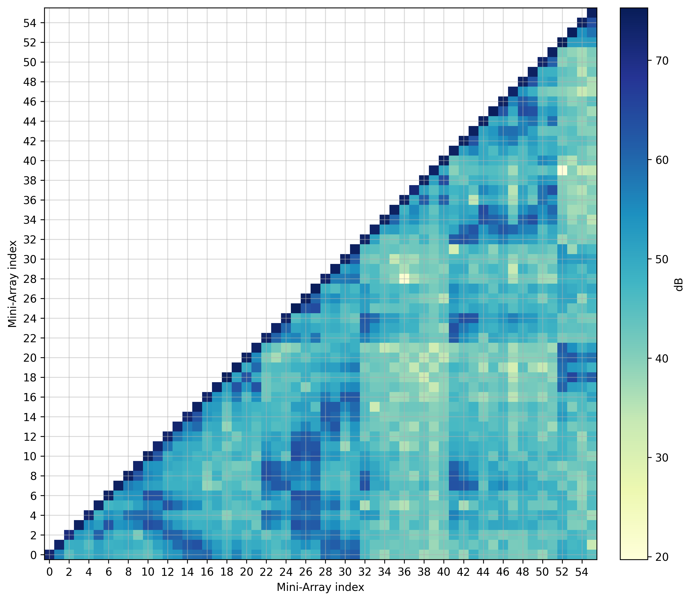
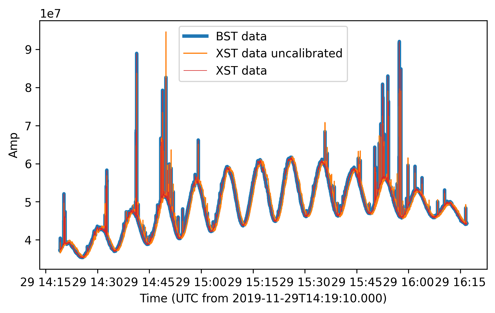
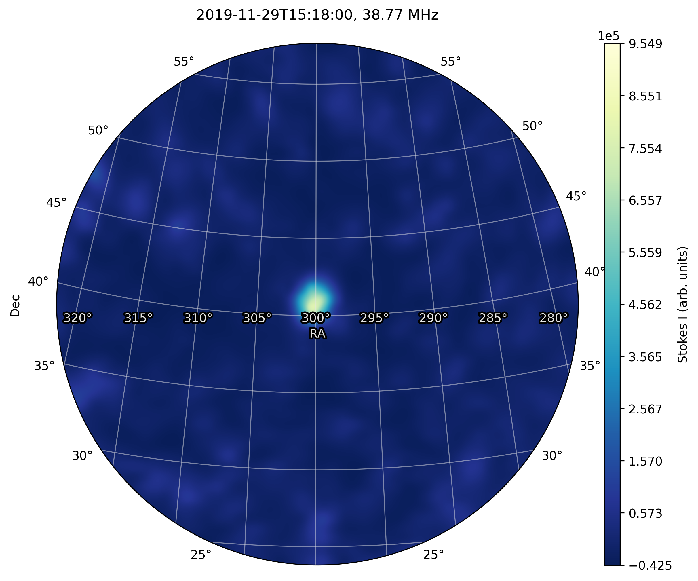
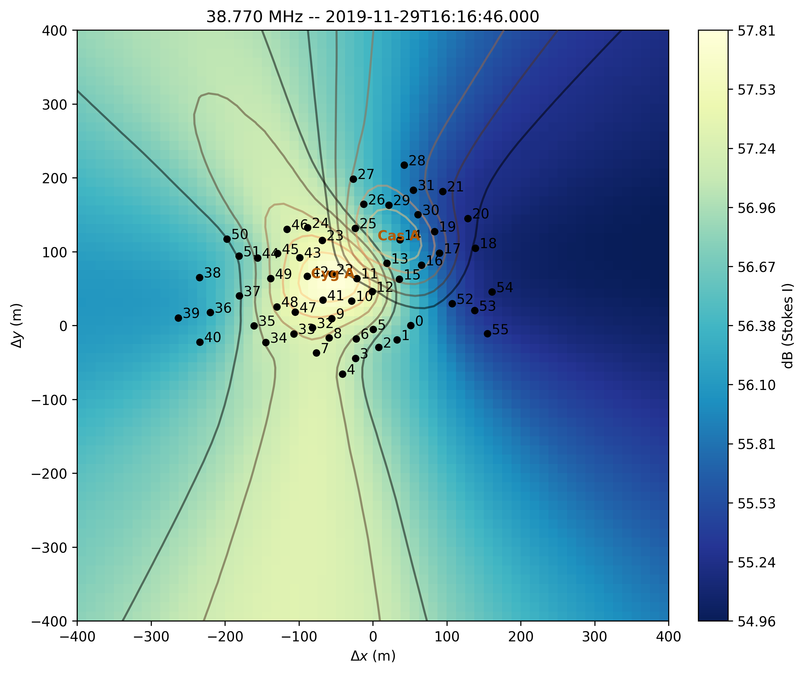
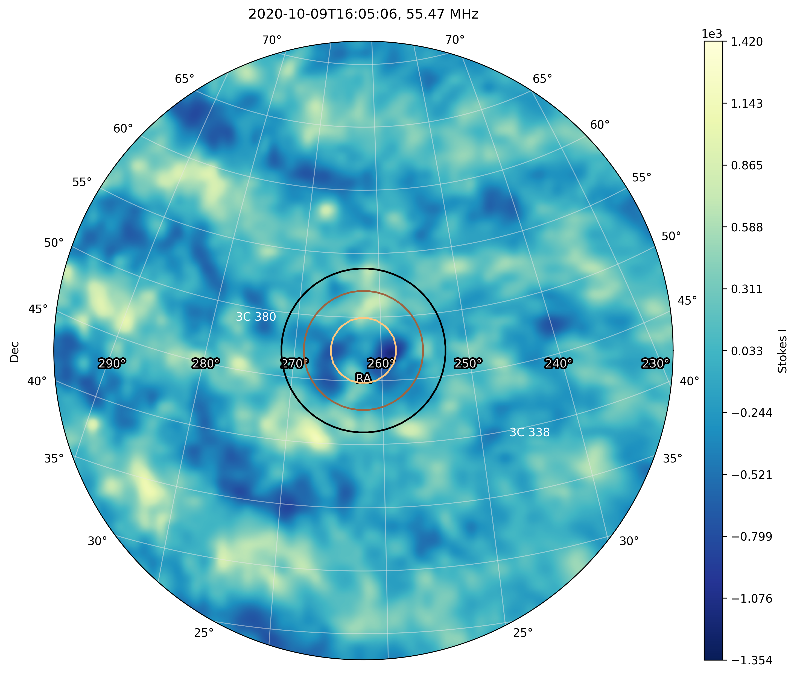
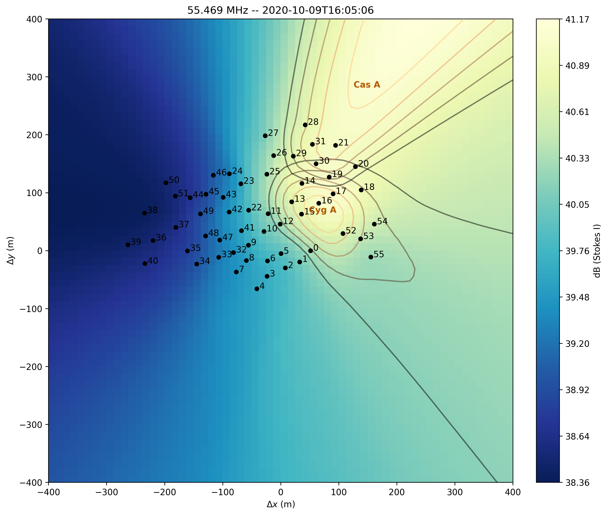

.. _xst_reading_doc:

Cross-Correlation STatistics (XST)
==================================

:class:`~nenupy.io.xst.XST`

XST selection
-------------

:meth:`~nenupy.io.xst.Crosslet.get`

.. code-block:: python

    from nenupy.io.xst import XST

    xst = XST("20191129_141900_XST.fits")

    xst_data = xst.get(
        polarization="XX",
        miniarray_selection=None,
        frequency_selection=">=20MHz",
        time_selection=">=2019-11-19T15:15:00"
    )

:class:`~nenupy.io.xst.XST_Slice`, :meth:`~nenupy.io.xst.XST_Slice.plot_correlaton_matrix`

.. code-block:: python

    xst_data.plot_correlaton_matrix()

    Cross-correlation matrix.

Beamforming from cross-correlations
-----------------------------------

.. code-block:: python

    from nenupy.io.bst import BST
    from nenupy.io.xst import XST

    bst = BST("20191129_141900_BST.fits")
    xst = XST("20191129_141900_XST.fits")

    bst_data = bst.get(frequency_selection="==40.234375MHz")

:meth:`~nenupy.io.xst.Crosslet.get_beamform`

.. code-block:: python

    from nenupy.astro.pointing import Pointing

    bf_cal = xst.get_beamform(
        pointing=Pointing.from_bst(bst, beam=0, analog=False),
        frequency_selection="==40.234375MHz",
        mini_arrays=bst.mini_arrays,
        calibration="default"
    )

.. code-block:: python

    import matplotlib.pyplot as plt

    fig = plt.figure(figsize=(7, 4))
    plt.plot(bst_data.time.datetime, bst_data.value, label="BST data", linewidth=3)
    plt.plot(bf_uncal.time.datetime, bf_uncal.value, label="XST data uncalibrated", linewidth=1)
    plt.plot(bf_cal.time.datetime, bf_cal.value, label="XST data", linewidth=0.5, color="tab:red")
    plt.legend()
    plt.xlabel(f"Time (UTC from {bst_data.time[0].isot})")
    plt.ylabel("Amp")

    BST data versus time, against re-constructed beamformed data from XST (uncalibrated or calibrated with the default table used to obtain the BST).
    The blue (BST) and orange (calibrated XST) curves are perfectly aligned as expected.

Image from XST
--------------

:meth:`~nenupy.io.xst.Crosslet.get_stokes`, :meth:`~nenupy.io.xst.XST_Slice.make_image`

:meth:`~nenupy.astro.sky.SkySliceBase.plot`

.. code-block:: python

    import astropy.units as u
    from astropy.coordinates import SkyCoord

    xst_data = xst.get_stokes(
        stokes="I",
        miniarray_selection=None,
        frequency_selection=">=20MHz",
        time_selection=">=2019-11-19T15:15:00"
    )

    cyg_a = SkyCoord.from_name("Cyg A")

    im = xst_data.make_image(
        resolution=1*u.deg,
        fov_radius=20*u.deg,
        phase_center=cyg_a,
        stokes="I"
    )

    im[0, 0, 0].plot(
        center=cyg_a,
        radius=17*u.deg,
        colorbar_label="Stokes I (arb. units)",
        figsize=(8, 8),
    )

    Cygnus A image obtained from XST data.

Near-field imprint from XST
---------------------------

:meth:`~nenupy.io.xst.Crosslet.get_stokes`, :meth:`~nenupy.io.xst.XST_Slice.make_nearfield`

:class:`~nenupy.io.xst.TV_Nearfield`, :meth:`~nenupy.io.xst.TV_Nearfield.save_png`

.. code-block:: python
    :emphasize-lines: 13

    from nenupy.io.xst import TV_Nearfield

    xst_data = xst.get_stokes(
        stokes="I",
        miniarray_selection=None,
        frequency_selection=">=20MHz",
        time_selection="==2019-11-29T16:16:46.000"
    )

    radius = 400*u.m
    npix = 64
    nf, source_imprint = xst_data.make_nearfield(
        radius=radius,
        npix=npix,
        sources=["Cyg A", "Cas A", "Sun"]
    )

    nearfield = TV_Nearfield(
        nearfield=nf,
        source_imprints=source_imprint,
        npix=npix,
        time=xst_data.time[0],
        frequency=np.mean(xst_data.frequency),
        radius=radius,
        mini_arrays=xst_data.mini_arrays,
        stokes="I"
    )

    nearfield.save_png(
        figsize=(8, 8)
    )

    XST near-field.

NenuFAR TV
----------

:class:`~nenupy.io.xst.NenufarTV`

.. code-block:: python

    from nenupy.io.xst import NenufarTV

    tv = NenufarTV("/path/to/nenufarTV.dat")

TV Image
^^^^^^^^

:meth:`~nenupy.io.xst.NenufarTV.compute_nenufar_tv`

.. code-block:: python

    tv_image = tv.compute_nenufar_tv(
        sources=["Cyg A", "Cas A"],
        stokes="I"
    )
    tv_image.save_png()

    NenuFAR-TV image.

TV Near-field
^^^^^^^^^^^^^

:meth:`~nenupy.io.xst.NenufarTV.compute_nearfield_tv`

.. code-block:: python

    tv_nearfield = tv.compute_nearfield_tv(
        sources=["Cyg A", "Cas A"],
        stokes="I"
    )
    tv_nearfield.save_png()

:class:`~nenupy.io.xst.TV_Nearfield`, :meth:`~nenupy.io.xst.TV_Nearfield.save_png`

    NenuFAR-TV near-field.

