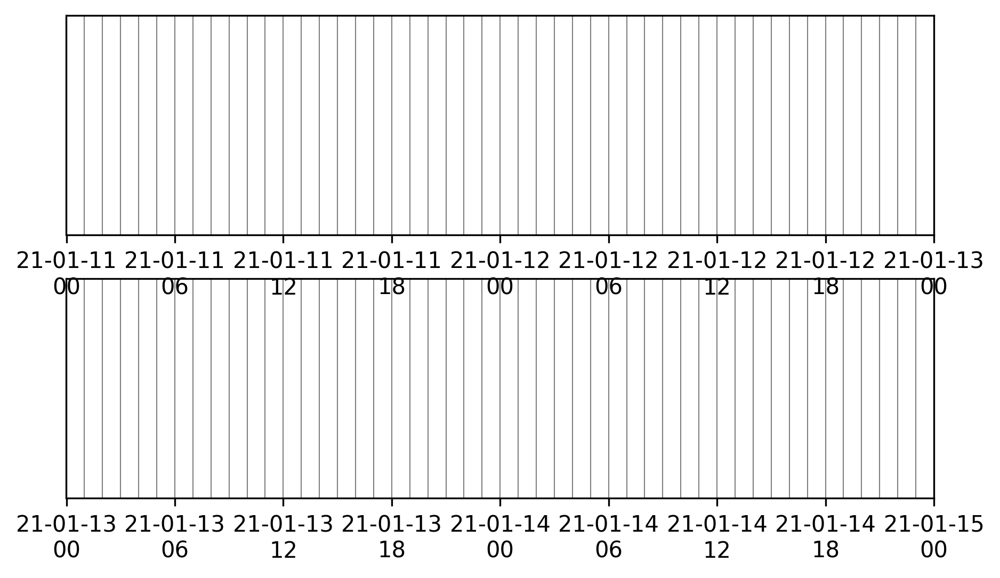

.. _scheduling_doc:

Observation Scheduling
======================

Efficient observation scheduling for any telescope is a challenge.
This is an assignment problem for which a series of tasks, each with its own constraints, needs to be planned.

Computationnaly, this is a *NP-hard* problem: a solution is easy to verify (i.e., it can be done in a polynomial number of steps) but it is difficult to solve/find the optimal solution (i.e., possibly involving an exponential number of steps).
Let's assume that a planning consists of :math:`n_{\rm slots}` time slots.
Without any prior, the number of combinations :math:`N_c` to fit :math:`k_{\rm obs}` observations in this planning would be:

.. math::

    N_c \propto \frac{n_{\rm slots}!}{(n_{\rm slots} - k_{\rm obs})!}

:math:`N_c` becomes gigantic quickly.
As an example, let's consider :math:`k_{\rm obs} = 20` observations to schedule over 30 days.
Each day is divided with a 1-hour granularity, implying :math:`n_{\rm slots} = 30 \times 24 = 720` time slots.
These are low numbers compared to reality, and nonetheless amount to :math:`N_c = 10^{57}` observation combinations to check for.

To solve this problem, ``nenupy`` offers the :mod:`~nenupy.schedule` module, which provides heuristic algorithms to reduce the number of checks to perform.
In addition, a dedicated *genetic algorithm* has been developped in order to further optimize the observation scheduling for `NenuFAR <https://nenufar.obs-nancay.fr/en/astronomer/>`_.

The :mod:`~nenupy.schedule` module consists of many different objects definitions that are needed to be loaded:

.. code-block:: python

    >>> from nenupy.schedule import (
    >>>     Schedule,
    >>>     ObsBlock,
    >>>     ReservedBlock,
    >>>     ESTarget,
    >>>     SSTarget,
    >>>     Constraints,
    >>>     ElevationCnst,
    >>>     AzimuthCnst,
    >>>     MeridianTransitCnst,
    >>>     LocalTimeCnst,
    >>>     TimeRangeCnst
    >>> )

Other useful packages are loaded as well:

.. code-block:: python

    >>> from astropy.time import Time, TimeDelta
    >>> import astropy.units as u

Schedule object
---------------

The framework object governing observation scheduling is :class:`~nenupy.schedule.schedule.Schedule`.
The arguments ``time_min`` and ``time_max`` define the planning time range edges.
``dt`` is the time granularity, or the time slot duration, at which the observations will be scheduled. 

.. code-block:: python

    >>> schedule = Schedule(
    >>>     time_min=Time('2021-01-11 00:00:00'),
    >>>     time_max=Time('2021-01-15 00:00:00'),
    >>>     dt=TimeDelta(3600, format='sec')
    >>> )
    >>> schedule.plot(days_per_line=2)

A :class:`~nenupy.schedule.schedule.Schedule` can be displayed with the :meth:`~nenupy.schedule.schedule.Schedule.plot`, for quick visualization of its status.
The time slots are separated by vertical lines.

    Empty planning.

.. warning::

    The number of time slots, resulting from ``time_min``, ``time_max`` and ``dt`` values, highly impacts the computing time.

Reserved time slots
^^^^^^^^^^^^^^^^^^^

For some reason, some time slots within the :class:`~nenupy.schedule.schedule.Schedule` may be unavailable for observation programming (because of telescope maintenance, other observations already booked, ...).
To represent this, a :class:`~nenupy.schedule.obsblocks.ReservedBlock` instance can be created and inserted in the schedule using the :class:`~nenupy.schedule.schedule.Schedule.insert` method:

.. code-block:: python
    
    >>> schedule = Schedule(
    >>>     time_min=Time('2021-01-11 00:00:00'),
    >>>     time_max=Time('2021-01-15 00:00:00'),
    >>>     dt=TimeDelta(3600, format='sec')
    >>> )
    >>> maintenance = ReservedBlock(
    >>>     time_min=Time('2021-01-12 05:00:00'),
    >>>     time_max=Time('2021-01-13 16:00:00')
    >>> )
    >>> schedule.insert(maintenance)
    >>> schedule.plot(days_per_line=2)

The schedule visualization displays such reserved blocks as hatched grey time windows.

    Empty planning with a reserved block inserted.

Virtual Control Room bookings
^^^^^^^^^^^^^^^^^^^^^^^^^^^^^

NenuFAR time allocation is made thanks to time windows booking attribution to a given scientific project.
If one wants to schedule observations outside of these booking periods, the current booking can be dwonloaded through the `VCR planning <https://gui-nenufar.obs-nancay.fr/Planning/>`_ as a CSV file.
This file can then be used to instantiates a :class:`~nenupy.schedule.obsblocks.ReservedBlock` object via the :class:`~nenupy.schedule.obsblocks.ReservedBlock.from_VCR` method.

.. code-block:: python 

    >>> schedule = Schedule(
    >>>     time_min=Time('2021-11-15 00:00:00'),
    >>>     time_max=Time('2021-11-20 00:00:00'),
    >>>     dt=TimeDelta(3600, format='sec')
    >>> )
    >>> reserved = ReservedBlock.from_VCR(file_name=".../2021-11-12_booking.csv")
    >>> schedule.insert(reserved)
    >>> schedule.plot(days_per_line=1)

    Five-days NenuFAR planning for which all the active allocated time as been set as 'unavailable for further observation planning'.

.. _observation_request_sec:

Observation request
-------------------

Once the global planning configuration has been set, the user may define the observations to schedule.

Observation block
^^^^^^^^^^^^^^^^^

Observation requests are defined as :class:`~nenupy.schedule.obsblocks.ObsBlock` instances.
Later, they will be distributed efficiently in the schedule while taking into account observing constraints.

A minimal set of parameters are required during an :class:`~nenupy.schedule.obsblocks.ObsBlock` instantiation:

* the ``name`` of the observation, for further reference,
* the NenuFAR scientific ``program``,
* a celestial target (either fixed :class:`~nenupy.schedule.targets.ESTarget` in the equatorial grid or from the Solar System :class:`~nenupy.schedule.targets.SSTarget`),
* the requested ``duration`` of the observation.

.. code-block:: python

    >>> vira = ObsBlock(
    >>>     name='Virgo A',
    >>>     program='es00',
    >>>     target=ESTarget.fromName('Vir A'),
    >>>     duration=TimeDelta(3600, format='sec')
    >>> )

.. note:: 
    Observation blocks will be booked in the schedule according to their :attr:`~nenupy.schedule.obsblocks.ObsBlock.duration` on an integer number of time slots defined by :attr:`~nenupy.schedule.schedule.Schedule.dt`.

Combining observation blocks
^^^^^^^^^^^^^^^^^^^^^^^^^^^^

:class:`~nenupy.schedule.obsblocks.ObsBlock` objects accept ``+`` and ``*`` operations.
This enable observation block requests to be appended and duplicated, respectively.
Note, that it is computationnaly more efficient to use the duplicate block option  (``*``) instead of creating an other block with the same target and constraints. 

.. code-block:: python

    >>> vira = ObsBlock(
    >>>     name='Virgo A',
    >>>     program='es00',
    >>>     target=ESTarget.fromName('Vir A'),
    >>>     duration=TimeDelta(3600, format='sec'),
    >>> )
    >>> cyga = ObsBlock(
    >>>     name='Cyg A',
    >>>     program='es00',
    >>>     target=ESTarget.fromName('Cyg A'),
    >>>     duration=TimeDelta(3600, format='sec'),
    >>> )
    >>> my_observations = vira*2 + cyga*3

Observation constraints
-----------------------

Automatic scheduling of astronomical observations relies on the definition of constraints that govern identification of optimal time periods to observe a given celestial target.
The different classes implemented in the :mod:`~nenupy.schedule.constraints` module allow for an easy way of specifying these constraints.

Available constraints
^^^^^^^^^^^^^^^^^^^^^

Each :class:`~nenupy.schedule.constraints.Constraint` object is `callable` and requires an argument of type :class:`~nenupy.schedule.targets.ESTarget` or  :class:`~nenupy.schedule.targets.SSTarget` in order to evaluate the constraint's 'score' over a given time range.

Available constraints are:

.. autosummary::

    ~nenupy.schedule.constraints.ElevationCnst
    ~nenupy.schedule.constraints.MeridianTransitCnst
    ~nenupy.schedule.constraints.AzimuthCnst
    ~nenupy.schedule.constraints.LocalTimeCnst
    ~nenupy.schedule.constraints.TimeRangeCnst

Adding constraints
^^^^^^^^^^^^^^^^^^

.. code-block:: python
    :emphasize-lines: 6

    >>> vira = ObsBlock(
    >>>     name='Virgo A',
    >>>     program='es00',
    >>>     target=ESTarget.fromName('Vir A'),
    >>>     duration=TimeDelta(3600, format='sec'),
    >>>     constraints=Constraints(ElevationCnst(elevationMin=10))
    >>> )

.. code-block:: python

    >>> constraints = Constraints(ElevationCnst(10), MeridianTransitCnst())
    >>> vira = ObsBlock(
    >>>     name='Virgo A',
    >>>     program='es00',
    >>>     target=ESTarget.fromName('Vir A'),
    >>>     duration=TimeDelta(3600, format='sec'),
    >>>     constraints=constraints
    >>> )

Evaluating contraints on a schedule
^^^^^^^^^^^^^^^^^^^^^^^^^^^^^^^^^^^

.. code-block:: python

    >>> schedule = Schedule(
    >>>     time_min=Time('2021-11-15 00:00:00'),
    >>>     time_max=Time('2021-11-19 00:00:00'),
    >>> )
    >>> vira = ObsBlock(
    >>>     name='Virgo A',
    >>>     program='es00',
    >>>     target=ESTarget.fromName('Vir A'),
    >>>     duration=TimeDelta(3600*4, format='sec'),
    >>> )
    >>> schedule.insert(vira)
    >>> schedule.book( optimize=False )

.. code-block:: python

    >>> schedule.observation_blocks[0].constraints.plot()

    TBW.

:class:`~nenupy.schedule.constraints.Constraints`

.. code-block:: python
    :emphasize-lines: 10

    >>> schedule = Schedule(
    >>>     time_min=Time('2021-11-15 00:00:00'),
    >>>     time_max=Time('2021-11-19 00:00:00'),
    >>> )
    >>> vira = ObsBlock(
    >>>     name='Virgo A',
    >>>     program='es00',
    >>>     target=ESTarget.fromName('Vir A'),
    >>>     duration=TimeDelta(3600*4, format='sec'),
    >>>     constraints=Constraints(ElevationCnst(20), AzimuthCnst(100))
    >>> )
    >>> schedule.insert(vira)
    >>> schedule.book( optimize=False )

    TBW.

.. code-block:: python

    >>> schedule.plot(days_per_line=2)

    TBW.

.. code-block:: python

    >>> schedule.observation_blocks[0].plot()

    TBW.

Scheduling in practice
----------------------

.. code-block:: python

    >>> schedule = Schedule(
    >>>     time_min=Time('2021-11-17 00:00:00'),
    >>>     time_max=Time('2021-11-18 00:00:00'),
    >>>     dt=TimeDelta(60*30, format='sec')
    >>> )
    >>> sun = ObsBlock(
    >>>     name='Sun observation',
    >>>     program='es11',
    >>>     target=SSTarget.fromName('Sun'),
    >>>     duration=TimeDelta(2*3600, format='sec'),
    >>>     constraints=Constraints( ElevationCnst(elevationMin=12) )
    >>> )
    >>> schedule.insert(
    >>>     ReservedBlock(
    >>>         time_min=Time('2021-11-17 08:00:00'),
    >>>         time_max=Time('2021-11-17 10:00:00')
    >>>     )
    >>> )

Deterministic algorithm
^^^^^^^^^^^^^^^^^^^^^^^

.. code-block:: python

    >>> schedule.insert(sun)
    >>> schedule.book( optimize=False )
    >>> schedule.plot()

    TBW.

.. code-block:: python
    :emphasize-lines: 1

    >>> schedule.insert(sun * 2)
    >>> schedule.book( optimize=False )
    >>> schedule.plot()

    TBW.

.. code-block:: python
    :emphasize-lines: 1

    >>> schedule.insert(sun * 3)
    >>> schedule.book( optimize=False )
    >>> schedule.plot()

.. code-block:: text

    2021-11-13 12:24:55 | INFO: Evaluating observation block constraints over the schedule...
    2021-11-13 12:24:55 | INFO: 3 observation blocks have been successfully evaluated.
    2021-11-13 12:24:55 | INFO: Fitting 3 observation blocks...
    2021-11-13 12:24:55 | WARNING: <ObsBlock> #2 'Sun observation' cannot be scheduled.
    2021-11-13 12:24:55 | INFO: 2/3 observation blocks scheduled (0 impossible to fit).

.. figure:: ../_images/obs_images/deterministic_3_sun.png
    :width: 450
    :align: center

    TBW.

Genetic algorithm
^^^^^^^^^^^^^^^^^

.. code-block:: python
    :emphasize-lines: 2

    >>> schedule.insert(sun * 3)
    >>> schedule.book( optimize=True )
    >>> schedule.plot()

    TBW.

.. code-block:: python

    >>> from astropy.coordinates import Angle
    >>> schedule = Schedule(
    >>>     time_min=Time('2021-11-17 00:00:00'),
    >>>     time_max=Time('2021-11-18 00:00:00'),
    >>>     dt=TimeDelta(10*30, format='sec')
    >>> )
    >>> cas_a = ObsBlock(
    >>>     name="Cas A",
    >>>     program="ES10",
    >>>     target=ESTarget.fromName("Cas A"),
    >>>     duration=TimeDelta(2*3600, format='sec'),
    >>>     constraints=Constraints(LocalTimeCnst(
    >>>         hMin=Angle(18, unit="h"),
    >>>         hMax=Angle(9, unit="h"))
    >>>     )
    >>> )
    >>> ncp = ObsBlock(
    >>>     name="NCP",
    >>>     program="ES01",
    >>>     target=ESTarget.fromName("North Celestial Pole"),
    >>>     duration=TimeDelta(4*3600, format='sec'),
    >>>     constraints=Constraints(LocalTimeCnst(
    >>>         hMin=Angle(20, unit="h"),
    >>>         hMax=Angle(6, unit="h"))
    >>>     )
    >>> )
    >>> pulsar = ObsBlock(
    >>>     name="PSR J0953+0755",
    >>>     program='es03',
    >>>     target=ESTarget.fromName("PSR J0953+0755"),
    >>>     duration=TimeDelta(40*60, format='sec'),
    >>>     constraints = Constraints(
    >>>         ElevationCnst(0),
    >>>         TimeRangeCnst(
    >>>             time_min=Time('2021-11-17 05:00:00'),
    >>>             time_max=Time('2021-11-17 09:00:00')),
    >>>         MeridianTransitCnst())
    >>> )
    >>> pulsars = pulsar * 2
    >>> mars = ObsBlock(
    >>>     name="Mars",
    >>>     program="ES06",
    >>>     target=SSTarget.fromName("Mars"),
    >>>     duration=TimeDelta(1.5*3600, format='sec'),
    >>>     constraints=Constraints( MeridianTransitCnst() )
    >>> )
    >>> jupiter = ObsBlock(
    >>>     name="Jupiter",
    >>>     program="ES07",
    >>>     target=SSTarget.fromName("Jupiter"),
    >>>     duration=TimeDelta(2*3600, format='sec'),
    >>>     constraints=Constraints( MeridianTransitCnst() )
    >>> )
    >>> sun = ObsBlock(
    >>>     name="Sun",
    >>>     program="ES11",
    >>>     target=SSTarget.fromName("Sun"),
    >>>     duration=TimeDelta(2*3600, format='sec'),
    >>>     constraints=Constraints( ElevationCnst(10), MeridianTransitCnst() )
    >>> )
    >>> cyg_x3 = ObsBlock(
    >>>     name="Cyg X-3",
    >>>     program="ES04",
    >>>     target=ESTarget.fromName("Cyg X-3"),
    >>>     duration=TimeDelta(1.5*3600, format='sec'),
    >>>     constraints=Constraints( MeridianTransitCnst() )
    >>> )
    >>> my_observations = cas_a + ncp  + cyg_x3 + jupiter + mars + sun + pulsars
    >>> schedule.insert(my_observations)
    >>> ga = schedule.book(
    >>>     optimize=True, # Computes the booking using the GA algorithm
    >>>     population_size=100, # Number of individuals per generation
    >>>     generation_max=1000, # Stops the evolution after 1000 generations
    >>>     max_stagnating_generations=-1, # Stops the evolution if the best score has not increased over N gen.
    >>>     score_threshold=1., # Stops the evolution if the best score is above this value
    >>>     random_individuals=10, # Adds individuals with random genomes at each generation
    >>>     crossover='TPCO', # Defines the cross-over method
    >>>     selection='TNS' # Defines the parent selection method
    >>> )
    >>> schedule.plot(
    >>>     figsize=(10, 4),
    >>>     figname="/Users/aloh/Documents/GitHub/nenupy/docs/_images/obs_images/genetic_big.png"
    >>> )

    TBW.

.. code-block:: python

    >>> ga.plot()

    TBW.

Schedule export
^^^^^^^^^^^^^^^

.. code-block:: python

    >>> schedule.export()

.. code-block:: text

    Table length=8
    obsid   name             program   start                     stop                      score
    int64   str14            str4      object                    object                    float64
    1       NCP              es01      2021-11-17T01:00:00.000   2021-11-17T05:00:00.000   1.0
    6       PSR J0953+0755   es03      2021-11-17T05:05:00.000   2021-11-17T05:45:00.000   0.666
    7       PSR J0953+0755   es03      2021-11-17T05:45:00.000   2021-11-17T06:25:00.000   1.0
    4       Mars             es06      2021-11-17T09:55:00.000   2021-11-17T11:25:00.000   1.0
    5       Sun              es11      2021-11-17T11:25:00.000   2021-11-17T13:25:00.000   1.0
    2       Cyg X-3          es04      2021-11-17T15:25:00.000   2021-11-17T16:55:00.000   1.0
    3       Jupiter          es07      2021-11-17T16:55:00.000   2021-11-17T18:55:00.000   1.0
    0       Cas A            es10      2021-11-17T18:55:00.000   2021-11-17T20:55:00.000   1.0

:class:`~astropy.table.Table`

