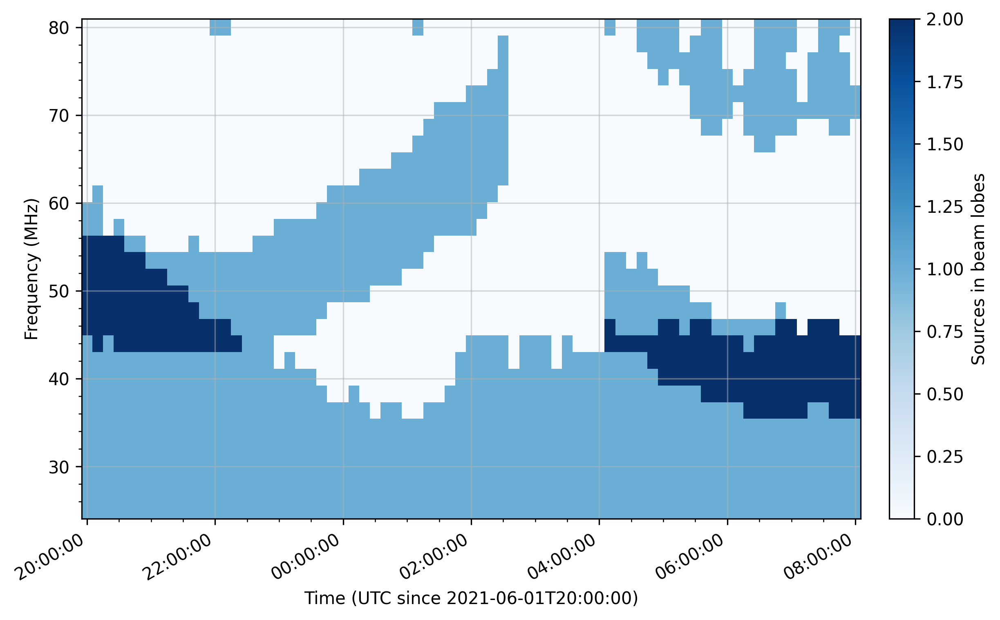
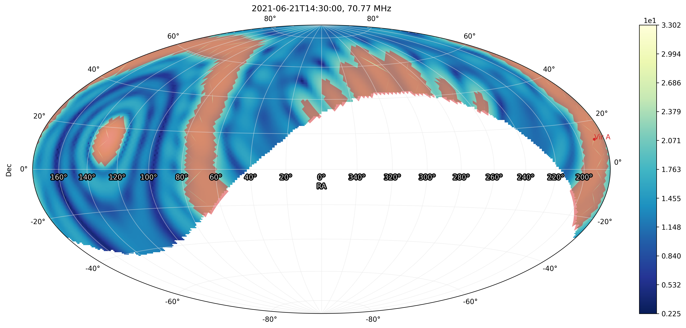

.. _src_in_lobes_doc:

Bright Sources Contamination
============================

As `NenuFAR <https://nenufar.obs-nancay.fr/en/astronomer/>`_ `Mini-Arrays <https://nenufar.obs-nancay.fr/en/astronomer/#mini-arrays>`_ consist of hexagonal tiles of dipole antennas (which are analog-phased), the element spacing causes spatial aliasing effects known as **grating lobes**.
These are basically copies of the primary beam (aimed at the target celestial position), with intensities that can even exceed it for some configurations, while combined with the anntenna radiation pattern (maximal at the local zenith).
In order to dampen this effect, the Mini-Arrays are rotated with respect to each other (see `Mini-Array distribution <https://nenufar.obs-nancay.fr/en/astronomer/#global-distribution>`_), and coherently summed for *beamforming* observations.

.. seealso::

    :ref:`beam_simulation_doc` to better visualize the NenuFAR beam shape.

Nonetheless, bright radio sources could still fall within the NenuFAR grating lobes during the course of an observation.
This results in specific artefacts such as time-frequency 'granularities' seen in dynamic spectra obtained from beamforming observations or causes visibilities mixing for imaging observations.

:ref:`Predicting <predicting_contamination_sec>` such contamination may be helpful while scheduling NenuFAR observations.
Alternatively, *a posteriori* :ref:`identification <contamination_identification_sec>`` of artefacts origin may ease scientific analysis.
The module :mod:`nenupy.schedule.contamination` aims at addressing both issues.

For the following examples illustrated in this page, a few packages should be loaded: 

.. code-block:: python
    
    from astropy.time import Time, TimeDelta
    import astropy.units as u
    import numpy as np

Then, some ``nenupy`` objects are required, namely :class:`~nenupy.astro.pointing.Pointing` (see :ref:`pointing_doc`) :class:`~nenupy.astro.target.FixedTarget` (see :ref:`target_doc`), :class:`~nenupy.io.bst.BST` and :class:`~nenupy.schedule.contamination.BeamLobes`:

.. code-block:: python
    :emphasize-lines: 1

    from nenupy.schedule.contamination import BeamLobes
    from nenupy.instru import NenuFAR_Configuration
    from nenupy.astro.pointing import Pointing
    from nenupy.astro.target import FixedTarget
    from nenupy.io.bst import BST

.. _predicting_contamination_sec:

Source contamination prediction
-------------------------------

While planning a NenuFAR observation, it may be useful to check whether the data will be contaminated by strong radio sources that are not the main observation target.
Then, careful selection of time and frequency ranges could eventually overcome artefact issues and ease scientific analysis.

Contamination in tracking observation
^^^^^^^^^^^^^^^^^^^^^^^^^^^^^^^^^^^^^

As an example, a 12-hours tracking observation of the source 3C 380 is considered.
Finding out when to observe this object at `NenuFAR <https://nenufar.obs-nancay.fr/en/astronomer/>`_'s location is straightforward.
Best observing conditions are when the source is at its highest elevation, at the meridian transit:

.. code-block:: python

    src_3c380 = FixedTarget.from_name("3C 380")
    src_3c380.next_meridian_transit( Time("2021-06-01 12:00:00") )

3C 380 next meridian transit (after ``2021-06-01 12:00:00"``) occurs at ``2021-06-02 01:38:17``.
Knowing the exposure time (12 hours), and setting a simulation time precision ``dt`` of 10 minutes, the number of time steps can be computed: 

.. code-block:: python

    dt = TimeDelta(10*60, format="sec")
    total_duration = TimeDelta(12*3600, format="sec")
    time_steps = int(total_duration/dt) + 1

From that, the time and frequency arrays on which the simulation will be computed are set:

.. code-block:: python

    times = Time("2021-06-01T20:00:00") + np.arange(time_steps)*dt
    frequencies = np.linspace(25, 80, 30)*u.MHz

.. warning::

    The simulation computing time is obviously very dependent on the number of time and frequency steps.
    As a general rule of thumbs, a time precision of 10 minutes and a frequency precision of 2 MHz are more than enough.
    Going to smaller values would result in longer computing times without increasing the output precision by a comparable amount. 

A tracking :class:`~nenupy.astro.pointing.Pointing` is instantiated, as further described in :ref:`pointing_doc`:

.. code-block:: python

    pointing = Pointing.target_tracking(
        target=src_3c380,
        time=times,
        duration=dt
    )

The simulation is performed at the instantiation of :class:`~nenupy.schedule.contamination.BeamLobes`.
Besides the time/frequeny/pointing parameters, the :attr:`~nenupy.schedule.contamination.BeamLobes.miniarray_rotations` argument controls which of the six possible Mini-Array rotations to include in the simulation (by default, if ``None``, all rotations are considered).

.. code-block:: python

    grating_lobes = BeamLobes(
        time=times,
        frequency=frequencies,
        pointing=pointing,
        miniarray_rotations=None
    )

Once the simulation is done, meaning the array factors for the selected Mini-Array rotations, `Multi-Order Coverage objects <https://cds-astro.github.io/mocpy/>`_ (MOCs) can be computed.
The :meth:`~nenupy.schedule.contamination.BeamLobes.compute_moc` method takes as argument the ``maximum_ratio`` as the threshold above which a sky region, `HEALPix <https://healpix.jpl.nasa.gov/>`_ tesselated, should be included in the 'grating lobe MOC'.
For instance, a value of ``0.5`` would mean that every HEALPix cell whose value is greater than :math:`{\rm max}(\mathcal{F}_{\rm MA})/2` is considered as being part of the grating lobe region, where :math:`\mathcal{F}_{\rm MA}` is the Mini-Array array factor.

.. code-block:: python

    grating_lobes.compute_moc(maximum_ratio=0.4)

The next step consists in cross-matching the computed MOC (over times and frequencies) with a list of bright sources.
The method :meth:`~nenupy.schedule.contamination.BeamLobes.sources_in_lobes` accepts a list of source names, computes another MOC out of their positions (with respect to time if Solar System sources are included) and finds the intersection between the two MOCs.
It outputs a :class:`~nenupy.schedule.contamination.SourceInLobes` object, that can be visualized using its :meth:`~nenupy.schedule.contamination.SourceInLobes.plot` method:

.. code-block:: python

    src_contamination = grating_lobes.sources_in_lobes(["Cas A", "Cyg A", "Vir A", "Sun"])
    src_contamination.plot()

    Time-frequency distribution of bright sources crossing the NenuFAR grating lobes during the tracking observation of 3C 380.

.. note::

    Instead of selecting an arbitrary list of sources, one could also directly use the Global Sky Model (*Oliveira et al., 2008*).
    Applying temperature thresholds result in sky coverages including bright sources as well as diffuse emission.
    The method :meth:`~nenupy.schedule.contamination.BeamLobes.gsm_in_lobes` is designed to perfom this task (as a replacement for :meth:`~nenupy.schedule.contamination.BeamLobes.sources_in_lobes`) and is sometimes way more accurate in the contamination prediction.

Contamination in transit observation
^^^^^^^^^^^^^^^^^^^^^^^^^^^^^^^^^^^^

The very same procedure could be applied to any kind of :class:`~nenupy.astro.pointing.Pointing`, especially for transit observations.

Let's consider a transit observation of the source Virgo A.
The closest meridian transit time can be computed (in order to know when to start observing):

.. code-block:: python

    vira = FixedTarget.from_name("Vir A")
    vira.next_meridian_transit( Time("2021-06-21 00:00:00") )

Then, time and frequency arrays are defined as previously explained.
The difference lies in the usage of :meth:`~nenupy.astro.pointing.Pointing.target_transit` (see :ref:`transit_pointing_sec` for more details).

.. code-block:: python

        dt = TimeDelta(10*60, format="sec")
        total_duration = TimeDelta(12*3600, format="sec")
        time_steps = int(total_duration/dt)
        times = Time("2021-06-21 12:30:00") + np.arange(time_steps)*dt
        frequencies = np.linspace(20, 80, 40)*u.MHz
        pointing = Pointing.target_transit(
            target=vira,
            t_min=Time("2021-06-21 00:00:00"),
            duration=total_duration,
            dt=dt
        )

The array factor is simulated and a MOC is generated for values above 40% of the maximal value.

.. code-block:: python

    grating_lobes = BeamLobes(
        time=times,
        frequency=frequencies,
        pointing=pointing,
        miniarray_rotations=None
    )
    grating_lobes.compute_moc(0.4)

Here, for illustration purposes, Virgo A is also selected as the unique source whose presence in NenuFAR grating lobes is to be checked.

.. code-block:: python

    src_contamination = grating_lobes.sources_in_lobes(
        ["Vir A"]
    )
    src_contamination.plot()

    Time-frequency distribution of Virgo A crossing the NenuFAR grating lobes during its transit observation.
    The typical '`Atari <https://fr.wikipedia.org/wiki/Atari>`_' pattern arises as Virgo A passes through the 'grating lobes ring' as well as the primary beam.

To further understand the shape of this graph, one could also plot the simulated NenuFAR array factor on the sky using the :meth:`~nenupy.schedule.contamination.BeamLobes.plot` method.
Below, such a plot is made for a time-frequency point that shows Virgo A as within the grating lobes MOC.

.. code-block:: python

    grating_lobes.plot(
        time=Time("2021-06-21 14:30:00"),
        frequency=70*u.MHz,
        decibel=True
    )

    Simulated array factor. The 'grating lobes MOC' is overplotted as a transparent red sky region.
    For this time and frequency, Virgo A is indeed within this region (right-hand part of the map).

Selecting Mini-Array rotations
^^^^^^^^^^^^^^^^^^^^^^^^^^^^^^

Each NenuFAR Mini-Array is `rotated <https://nenufar.obs-nancay.fr/en/astronomer/#global-distribution>`_ at a specific angle with respect to the others.
Although this smooths out the grating lobes influence in comparison to the main lobe, the array remains sensitive to some sky regions far from the target direction.
If a bright source falls within those grating lobes, its intensity can still be higher than the observation target.

One could prevent this by selecting time windows and/or frequency ranges where strong radio sources stay away from NenuFAR sensitivity pattern.
Alternatively, a less conservative (but finer-tuned) approach could be adopted, by removing the Mini-Arrays creating grating lobes at undesired positions. 

As an example, a tracking observation is simulated around a meridian transit of Virgo A:

.. code-block:: python

    vira = FixedTarget.from_name("Vir A")
    vira_transit = vira.next_meridian_transit( Time("2021-12-15 12:00:00") )

    exposure = TimeDelta(4*3600, format="sec")
    dt = TimeDelta(10*60, format="sec")
    time_steps = int(np.ceil(exposure/dt))

    start_time = vira_transit - exposure/2

    times = start_time + np.arange(time_steps)*dt
    frequencies = np.linspace(20, 80, 30)*u.MHz

    pointing = Pointing.target_tracking(
        target=vira,
        time=times,
        duration=dt
    )

The source contamination is computed such as previously described with th addition of the ``miniarray_rotations`` argument.
The latter takes a list of rotations (integer values, multiples of 10) to consider.
In the following example, all the Mini-Arrays with a rotation values that could reduce to :math:`0^{\circ}\, {\rm mod}\, 60^{\circ}` are considered.

.. note::

    One could quickly get the NenuFAR Mini-Arrays that are rotated to :math:`x^{\circ}\, {\rm mod}\, 60^{\circ}` using the :func:`~nenupy.instru.instrument_tools.miniarrays_rotated_like` function:

    .. code-block:: python

        from nenupy.instru import miniarrays_rotated_like
        miniarrays_rotated_like([0])

.. code-block:: python
    :emphasize-lines: 5

    grating_lobes = BeamLobes(
        time=times,
        frequency=frequencies,
        pointing=pointing,
        miniarray_rotations=[0]
    )
    grating_lobes.compute_moc(0.4)
    src_contamination = grating_lobes.sources_in_lobes(
        ["Cyg A", "Cas A"]
    )
    src_contamination.plot()

    Time-frequency distribution of bright sources falling with the grating lobes of NenuFAR Mini-Arrays with a rotation of :math:`0^{\circ}\, {\rm mod}\, 60^{\circ}` during the tracking observation of Vir A.

Then, the same steps could be reproduced, while modifying the selection on the Mini-Array rotation (this time :math:`10^{\circ}\, {\rm mod}\, 60^{\circ}`).

.. code-block:: python
    :emphasize-lines: 5

    grating_lobes = BeamLobes(
        time=times,
        frequency=frequencies,
        pointing=pointing,
        miniarray_rotations=[10]
    )
    grating_lobes.compute_moc(0.4)
    src_contamination = grating_lobes.sources_in_lobes(
        ["Cyg A", "Cas A"]
    )
    src_contamination.plot()

    Time-frequency distribution of bright sources falling with the grating lobes of NenuFAR Mini-Arrays with a rotation of :math:`10^{\circ}\, {\rm mod}\, 60^{\circ}` during the tracking observation of Vir A.

Doing that for all the possible rotations (i.e., :math:`\{ 0, 10, 20, 30, 40, 50 \}^{\circ}\, \rm{mod}\, 60^{\circ}`) gives the observation scheduler the tool to possibly filter out the Mini-Arrays allowing source contamination in some interesting time-frequency zones.

.. code-block:: python

    grating_lobes.plot(
        time=Time("2021-12-16 06:10:00"),
        frequency=78*u.MHz
    )

    Array factor of the Mini-Arrays whose rotation is :math:`10^{\circ}\, {\rm mod}\, 60^{\circ}`. At 80 MHz, Cyg A is within a grating lobe.

.. _contamination_identification_sec:

Source contamination identification
-----------------------------------

:class:`~nenupy.io.bst.BST`

.. code-block:: python

    bst = BST("20211206_000000_BST.fits", beam=0)
    freq_min = bst.frequencies.min()
    freq_max = bst.frequencies.max()
    time_min = bst.time[0]
    time_max = bst.time[-1]

:meth:`~nenupy.astro.pointing.Pointing.from_bst`

.. code-block:: python

    pointing = Pointing.from_bst(bst, beam=0, analog=True)

.. code-block:: python

    dt = TimeDelta(10*60, format="sec")
    total_duration = time_max - time_min
    time_steps = int(np.ceil(total_duration/dt)) + 1
    times = time_min + np.arange(time_steps)*dt
    frequencies = np.linspace(freq_min, freq_max, 40)

.. code-block:: python

    grating_lobes = BeamLobes(
        time=times,
        frequency=frequencies,
        pointing=pointing,
        miniarray_rotations=None
    )
    grating_lobes.compute_moc(0.4)

.. code-block:: python

    src_contamination = grating_lobes.sources_in_lobes(
        ["Cyg A", "Cas A", "Vir A", "Tau A", "Her A", "Hydra A"]
    )

.. code-block:: python

    src_contamination.plot()

    blabla.

.. code-block:: python

    data = bst.get(beam=0)
    vals = src_contamination.value
    vals[vals >= 1] = 1
    data.plot(
        hatched_overlay=(src_contamination.time, src_contamination.frequency, vals),
        vmax=88
    )

    blabla.