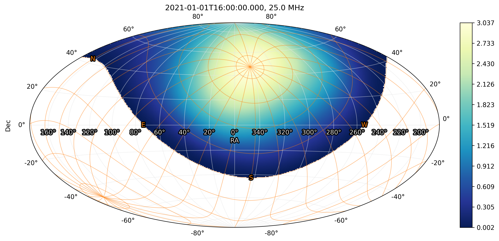
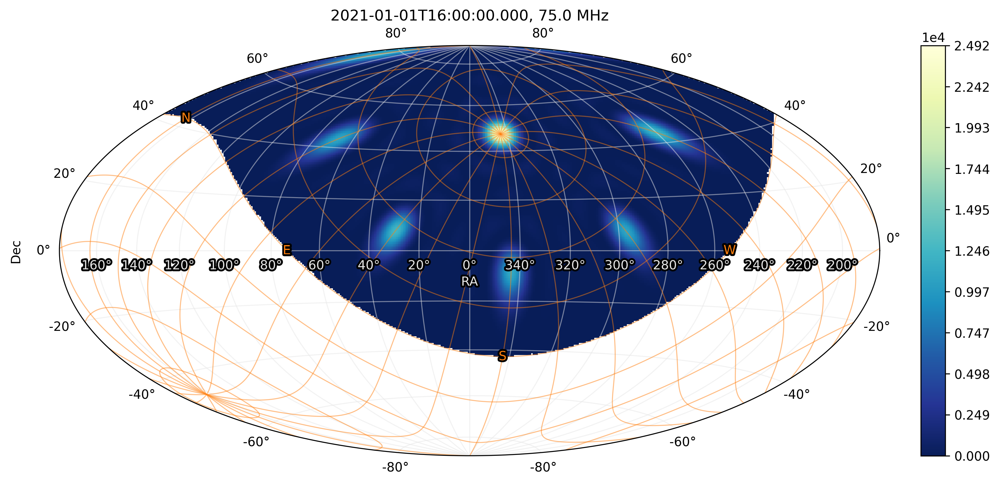
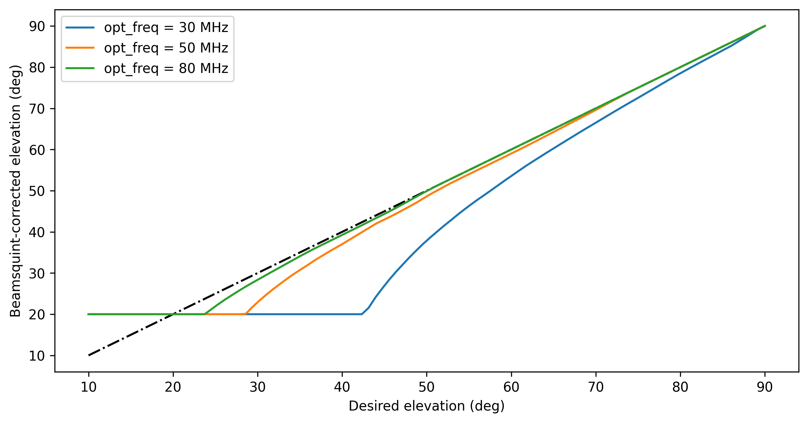
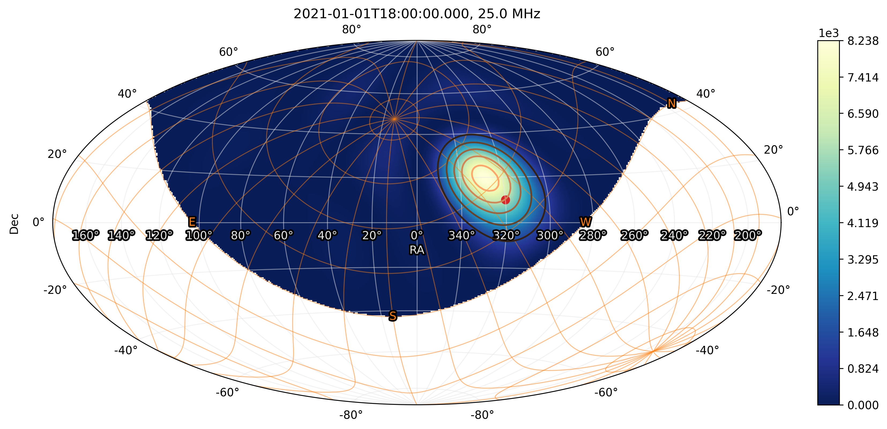
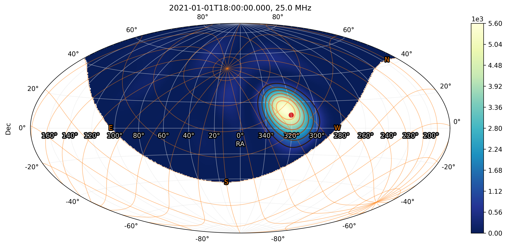
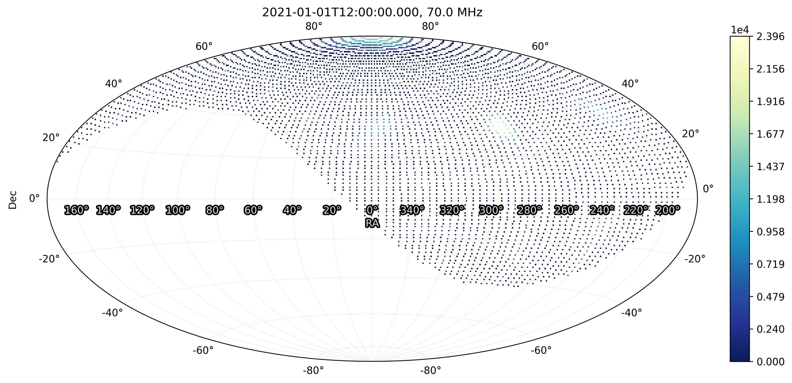
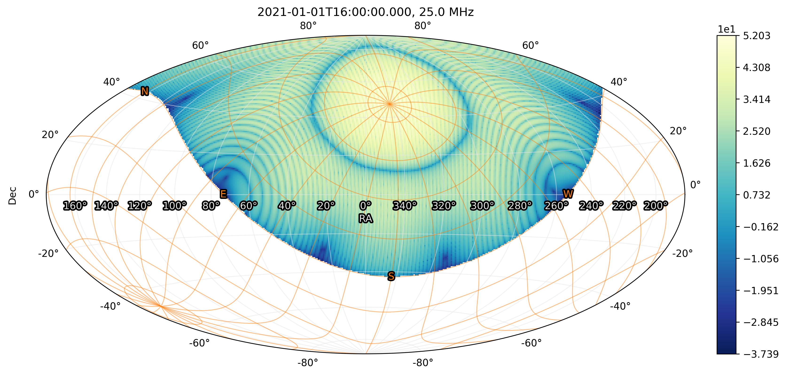
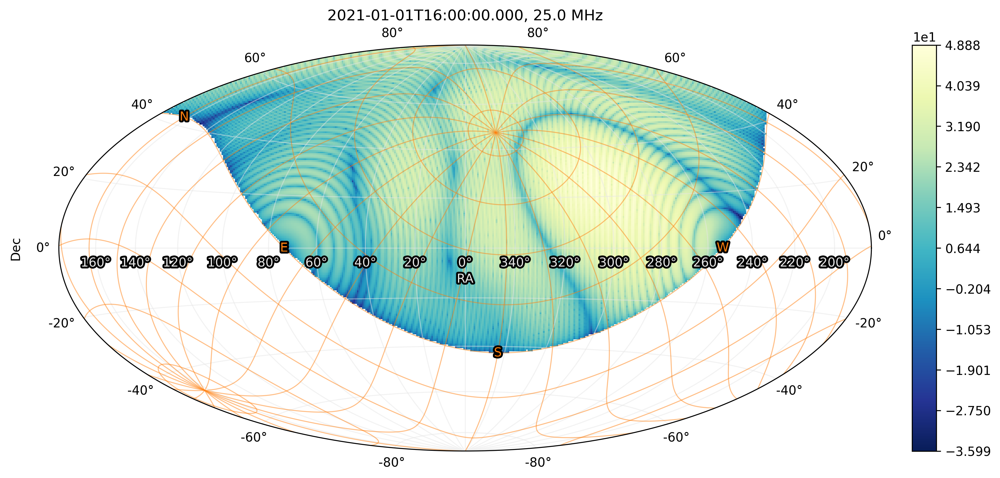
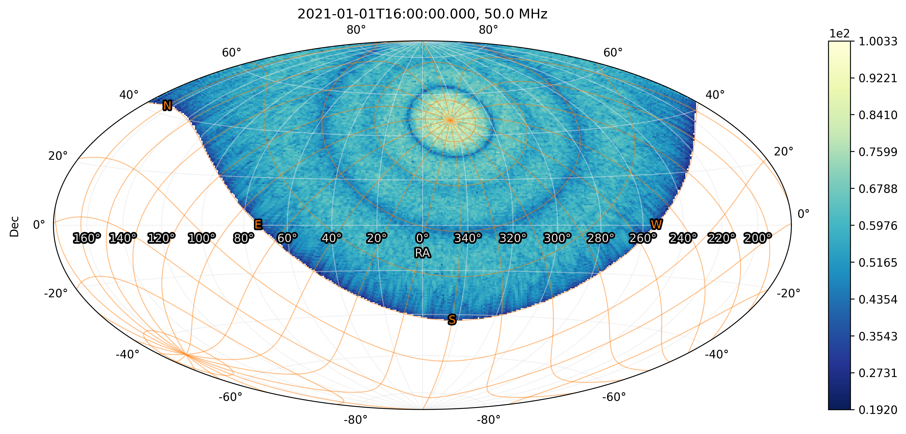

.. _beam_simulation_doc:

NenuFAR Beam Simulation
=======================

`NenuFAR <https://nenufar.obs-nancay.fr/en/astronomer/>`_ instrument simulations represent a core feature of ``nenupy``.
They are used for the commissioning work, for the :ref:`obs_simulation_doc` (in data quality assesment and features identification), and also for skymodel preparation (as input for imaging calibration).
This page describes the :ref:`beam_simulation_principle_sec` to learn the main mandatory steps and the general philosophy of beam simulation.
Then, in the following are detailed hierarchically the methods to simulate the :ref:`antenna_beam_sec`, the :ref:`miniarray_beam_sec`, and the :ref:`nenufar_beam_sec`.

Several ``nenupy`` modules are rquired in order to perform bam simulation:

.. code-block:: python

    >>> from nenupy.instru import MiniArray, NenuFAR, Polarization, NenuFAR_Configuration
    >>> from nenupy.astro.sky import HpxSky
    >>> from nenupy.astro.pointing import Pointing
    >>> from nenupy.astro.target import ExtraSolarTarget, SolarSystemTarget

And below are few other generic packages that are useful to load:

.. code-block:: python

    >>> from astropy.time import Time, TimeDelta
    >>> import astropy.units as u
    >>> import numpy as np

.. _beam_simulation_principle_sec:

Beam simulation principle
-------------------------

The beam simulation involves a few steps:

* An instrument array should be created (of type :class:`~nenupy.instru.interferometer.Interferometer`), which, in the `NenuFAR <https://nenufar.obs-nancay.fr/en/astronomer/>`_ case, means instantiation of either :class:`~nenupy.instru.nenufar.MiniArray` or :class:`~nenupy.instru.nenufar.NenuFAR`. The array element can be configured as desired (see :ref:`array_configuration_doc` for more details):

    .. code-block:: python

        >>> instrument = NenuFAR()

* Instrumental :class:`~nenupy.astro.pointing.Pointing` should be described (see :ref:`pointing_doc` for more details and pointing options):

    .. code-block:: python
        
        >>> simulation_dt = TimeDelta(1800, format="sec")
        >>> simulation_times = Time("2021-01-01 12:00:00") + np.arange(12)*simulation_dt
        >>> zenith = Pointing.zenith_tracking(
                time=simulation_times,
                duration=simulation_dt
            )

* Then, the requested simulation output should be precised, as a :class:`~nenupy.astro.sky.Sky` (or :class:`~nenupy.astro.sky.HpxSky`) instance (see :ref:`sky_doc`). The simulation will then be performed for each :attr:`~nenupy.astro.sky.Sky.time`, :attr:`~nenupy.astro.sky.Sky.frequency`, :attr:`~nenupy.astro.sky.Sky.polarization` and :attr:`~nenupy.astro.sky.Sky.coordinates`:
  
    .. code-block:: python

        >>> whole_sky = HpxSky(
                resolution=0.5*u.deg,
                frequency=np.array([25, 50, 75])*u.MHz,
                polarization=Polarization.NW,
                time=simulation_times
            )

* Finally, the simulation is made using :meth:`nenupy.instru.nenufar.MiniArray.beam` or :meth:`nenupy.instru.nenufar.NenuFAR.beam` (with ``sky`` and ``pointing`` arguments filled with inputs previously defined). Note that the bulk of the computation is not yet performed, for the simulation (stored in the :attr:`~nenupy.astro.sky.Sky.value` attribute) is a `dask.array.Array` object:

    .. code-block:: python

        >>> simulated_beam = instrument.beam(sky=whole_sky, pointing=zenith)

* The results are stored in the ``simulated_beam`` variable in this example which is of the same type as ``whole_sky``. The shape is ``(time, frequency, polarization, coordinates)``:

    .. code-block:: python

        >>> simulated_beam.value
                Array	            Chunk
        Bytes	54.00 MiB	        4.50 MiB
        Shape	(12, 3, 1, 196608)	(1, 3, 1, 196608)
        Count	192 Tasks	        12 Chunks
        Type	float64	            numpy.ndarray

.. _antenna_beam_sec:

Antenna radiation pattern
-------------------------

The `NenuFAR antenna <https://nenufar.obs-nancay.fr/en/astronomer/#antennas>`_ radiation pattern depends on the selected polarization (defined while instantiating :class:`~nenupy.astro.sky.Sky`).
There are two available polarization values, defined as within the `enum` class :class:`~nenupy.instru.nenufar.Polarization`: :attr:`~nenupy.instru.nenufar.Polarization.NW` and :attr:`~nenupy.instru.nenufar.Polarization.NE`. 

In the example below, the ``antenna`` variable is created from instantiating :class:`~nenupy.instru.nenufar.MiniArray` with only one antenna.
The ``antenna_response`` is computed using :meth:`~nenupy.instru.nenufar.MiniArray.beam`.
A :meth:`~nenupy.astro.sky.SkySliceBase.plot` is made from a slice on the :class:`~nenupy.astro.sky.HpxSky` object (``[8, 0, 0]`` means 9th time steps, first frequency value, first polarization value).
Whenever an operation is performed on such selection, the computation is run:

.. code-block:: python

    >>> antenna = MiniArray()["Ant10"]
    >>> antenna_response = antenna.beam(sky=whole_sky, pointing=zenith)
    >>> antenna_response[8, 0, 0].plot(altaz_overlay=True)

.. note:: 
    The zenithal pointing has no effect here since the individual NenuFAR antenna are not steerable.

    NenuFAR antenna radiation pattern, polarization NW, 25 MHz, as seen from Nançay. Only the sky above the horizon is represented.
    The horizontal coordinates are displayed as an orange grid.

.. _miniarray_beam_sec:

Mini-Array response
-------------------

The NenuFAR `Mini-Array <https://nenufar.obs-nancay.fr/en/astronomer/#mini-arrays>`_ response can be computed in the same way.
After instantiating :class:`~nenupy.instru.nenufar.MiniArray`, the :meth:`~nenupy.instru.nenufar.MiniArray.beam` method is called.
This time, the :meth:`~nenupy.astro.sky.SkySliceBase.plot` from a different slice, where the third frequency index is selected (corresponding to 75 MHz): 

.. code-block:: python

    >>> ma = MiniArray()
    >>> beam = ma.beam(sky=whole_sky, pointing=zenith)
    >>> beam[8, 2, 0].plot(altaz_overlay=True)

    NenuFAR Mini-Array radiation pattern, polarization NW, 75 MHz, as seen from Nançay. Only the sky above the horizon is represented.
    The horizontal coordinates are displayed as an orange grid.

.. _beam_squint_simu_sec:

Beam squint correction
^^^^^^^^^^^^^^^^^^^^^^

Radio phased array are affected by *beam squint*.
The combination between the antenna response (maximal at zenith) and the array factor of an antenna distribution can shift the maximal sensitivity towards greater elevations.
To correct this effect, the Mini-Array pointing elevation is shifted a little bit lower than desired (this is done by the method :meth:`~nenupy.instru.nenufar.MiniArray.beamsquint_correction`).

    Beamsquint-corrected elevation vs. desired elevation.
    The correction is frequency-dependent and is greater at low elevation. 

To visualize this effect, a tracking on a given ``source`` position is set. And the simulation is performed over the entire sky (``whole_sky``).

.. code-block:: python

    >>> source = SkyCoord(320, 10, unit="deg")
    >>> source_tracking = Pointing.target_tracking(
            target=FixedTarget(coordinates=source),
            time=Time("2021-01-01 18:00:00")
        )
    >>> whole_sky = HpxSky(
            resolution=0.5*u.deg,
            frequency=25*u.MHz,
            polarization=Polarization.NW,
            time=Time("2021-01-01 18:00:00")
        )
    >>> ma = MiniArray()

The beamsquint correction is first deactivated thanks to :class:`~nenupy.instru.nenufar.NenuFAR_Configuration`.
The following figure shows that the Mini-Array beam maximal sensitivity is located at a higher elevation with respect to the ``source`` position.

.. code-block:: python
    :emphasize-lines: 2

    >>> conf = NenuFAR_Configuration(
            beamsquint_correction=False,
        )
    >>> beam = ma.beam(sky=whole_sky, pointing=source_tracking, configuration=conf)
    >>> beam[0, 0, 0].plot(
            altaz_overlay=True,
            scatter=(source, 50, "tab:red"),
            contour=(beam[0,0,0].value.compute(), None, "copper")
        )

    Mini-Array beam simulation at 25 MHz. The beamsquint correction is **deactivated**.
    The ``source`` position is marked as a red dot.
    Horizontal coordinates are represented as an orange grid.

For comparison, the beamsquint correction is activated (default mode).
The correction frequency ``beamsquint_frequency`` is set to match the observing frequency.

.. code-block:: python
    :emphasize-lines: 2,3

    >>> conf = NenuFAR_Configuration(
            beamsquint_correction=True,
            beamsquint_frequency=30*u.MHz
        )
    >>> beam = ma.beam(sky=whole_sky, pointing=source_tracking, configuration=conf)
    >>> beam[0, 0, 0].plot(
            altaz_overlay=True,
            scatter=(source, 50, "tab:red"),
            contour=(beam[0,0,0].value.compute(), None, "copper")
        )

With the correction in place, the Mini-Array beam peaks closer to the apparent ``source`` position.

    Mini-Array beam simulation at 25 MHz. The beamsquint correction is **activated**.
    The ``source`` position is marked as a red dot.
    Horizontal coordinates are represented as an orange grid.

Discrete beam simulation
^^^^^^^^^^^^^^^^^^^^^^^^

All the above examples have been run with a :class:`~nenupy.astro.sky.HpxSky` sky as input.
That is, using a `HEALPix <https://healpix.jpl.nasa.gov/>`_ representation of the entire sky (see :ref:`healpix_sky_sec`).
Sometimes, however, a reduced number of and/or more specifics coordinates are needed.

The class :class:`~nenupy.astro.sky.Sky` is an alternative, where the user can set the desired coordinates for which the beam simulation should be performed.
This is particularly true for sky model alteration during the imaging calibration process.

.. code-block:: python

    >>> from astropy.coordinates import SkyCoord
    >>> # Observation times
    >>> dt = TimeDelta(1800, format="sec")
    >>> obs_times = Time("2021-01-01 12:00:00") + np.arange(12)*dt
    >>> # North Celestial Pole tracking
    >>> ncp = FixedTarget.from_name("North Celestial Pole")
    >>> ncp_tracking = Pointing.target_tracking(
            target=ncp,
            time=obs_times,
            duration=dt
        )
    >>> # Discrete sky grid
    >>> ra, dec = np.meshgrid(
            np.linspace(0, 360, 100),
            np.linspace(-90, 90, 100)
        )
    >>> sky = Sky(
            coordinates=SkyCoord(ra, dec, unit="deg").ravel(), # it needs to be 1D
            time=obs_times,
            frequency=70*u.MHz,
            polarization=Polarization.NW
        )
    >>> # Array definition
    >>> ma = MiniArray()
    >>> # Beam simulation and plotting
    >>> beam = ma.beam(sky=sky, pointing=ncp_tracking)
    >>> beam[0, 0, 0].plot()

    Mini-Array beam simulation of a North Celestial Pole tracking made on a grid of custom sky positions.

.. _nenufar_beam_sec:

NenuFAR array beam
------------------

Finally, beam simulation of the NenuFAR array can be performed, providing that a :class:`~nenupy.instru.nenufar.NenuFAR` instance is created.
The method :meth:`~nenupy.instru.nenufar.NenuFAR.beam` is used.

Sub-set of NenuFAR array
^^^^^^^^^^^^^^^^^^^^^^^^

Any :class:`~nenupy.instru.nenufar.NenuFAR` configuration is accepted.
For instance, the following example details the beam simulation of NenuFAR consisting of only two Mini-Arrays (namely ``040`` et ``055``).
These two Mini-Arrays are roughly located on an East-West axis, implying that the array factor should display North-South stripes (see the figure below).

.. code-block:: python

    >>> nenufar = NenuFAR()["MA040", "MA055"]
    >>> beam = nenufar.beam(sky=whole_sky, pointing=zenith)
    >>> beam[8, 0, 0].plot(altaz_overlay=True, decibel=True)

    Beam simulation of NenuFAR with only two Mini-Arrays.

Often during NenuFAR *beamforming* observations, the analog pointing is different from the numerical one.
It is therefore possible to give another :class:`~nenupy.astro.pointing.Pointing` object to the :meth:`~nenupy.instru.nenufar.NenuFAR.beam` method via its argument ``analog_pointing``.
Below, an arbitrary pointing ``other_pointing``, away from the numerical pointing (which produces the North-South stripes), is given.
The Mini-Array response is then different than the one above.

.. code-block:: python
    :emphasize-lines: 10

    >>> other_pointing = Pointing.target_tracking(
            target=FixedTarget(coordinates=SkyCoord(300, 20, unit="deg")),
            time=simulation_times,
            duration=simulation_dt
        )
    >>> nenufar = NenuFAR()["MA040", "MA055"]
    >>> beam = nenufar.beam(
            sky=whole_sky,
            pointing=zenith,
            analog_pointing=other_pointing
        )
    >>> beam[8, 0, 0].plot(altaz_overlay=True, decibel=True)

    Beam simulation of NenuFAR with only two Mini-Arrays.
    An arbitrary pointing towards :math:`(\alpha=300^{\circ}, \delta=20^{\circ}` has been set for the anaog pointing.

Whole NenuFAR core response
^^^^^^^^^^^^^^^^^^^^^^^^^^^

The 96 core Mini-Array response can be computed in a straightforward manner:

.. code-block:: python

    >>> nenufar = NenuFAR()
    >>> beam = nenufar.beam(sky=whole_sky, pointing=zenith)
    >>> beam[8, 1, 0].plot(altaz_overlay=True, decibel=True)

    Zenith beam simulation with 96 Mini-Arrays at 50 MHz.

Example (tracking Cygnus A)
^^^^^^^^^^^^^^^^^^^^^^^^^^^

This last example brings everything that has been discussed previousy together and aims at understanding the slicing of the output simulation.
A simulation of the whole NenuFAR core array is performed over 3 time steps, 2 frequency values and 1 polarization.

.. code-block:: python

    >>> # 3 time steps, separated by 2 hours
    >>> dt = TimeDelta(7200, format="sec")
    >>> times = Time("2021-01-01 12:00:00") + np.arange(3)*dt
    >>> # Cygnus A tracking
    >>> cyga = FixedTarget.from_name("Cygnus A")
    >>> cyga_tracking = Pointing.target_tracking(
            target=cyga,
            time=times,
            duration=dt
        )
    >>> # HEALPix sky definition at two frequencies, one polarization
    >>> whole_sky = HpxSky(
            resolution=0.5*u.deg,
            frequency=np.array([50, 75])*u.MHz,
            polarization=Polarization.NW,
            time=times
        )
    >>> # Instantiation of the full NenuFAR core array
    >>> nenufar = NenuFAR()
    >>> # Beam simulation
    >>> beam = nenufar.beam(sky=whole_sky, pointing=cyga_tracking)

Slicing the ``beam`` object as ``[time, frequency, polarization]`` gives access to the various time and frequency values contained in the simulation:

+------------------------------------------------+------------------------------------------------+
| .. code-block:: python                         | .. code-block:: python                         |
|                                                |                                                |
|   >>> beam[0, 0, 0].plot(decibel=True)         |   >>> beam[0, 1, 0].plot(decibel=True)         |
|                                                |                                                |
|                                                |                                                |
| .. figure:: ../_images/simu_images/beam_1.png  | .. figure:: ../_images/simu_images/beam_2.png  |
|   :align: center                               |   :align: center                               |
|                                                |                                                |
+------------------------------------------------+------------------------------------------------+
| .. code-block:: python                         | .. code-block:: python                         |
|                                                |                                                |
|   >>> beam[1, 0, 0].plot(decibel=True)         |   >>> beam[1, 1, 0].plot(decibel=True)         |
|                                                |                                                |
|                                                |                                                |
| .. figure:: ../_images/simu_images/beam_3.png  | .. figure:: ../_images/simu_images/beam_4.png  |
|   :align: center                               |   :align: center                               |
|                                                |                                                |
+------------------------------------------------+------------------------------------------------+
| .. code-block:: python                         | .. code-block:: python                         |
|                                                |                                                |
|   >>> beam[2, 0, 0].plot(decibel=True)         |   >>> beam[2, 1, 0].plot(decibel=True)         |
|                                                |                                                |
|                                                |                                                |
| .. figure:: ../_images/simu_images/beam_5.png  | .. figure:: ../_images/simu_images/beam_6.png  |
|   :align: center                               |   :align: center                               |
|                                                |                                                |
+------------------------------------------------+------------------------------------------------+