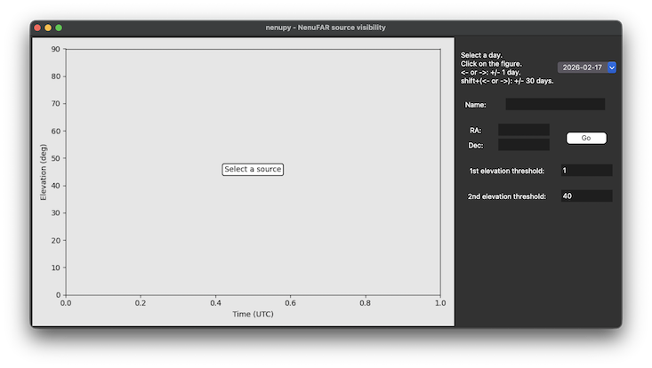
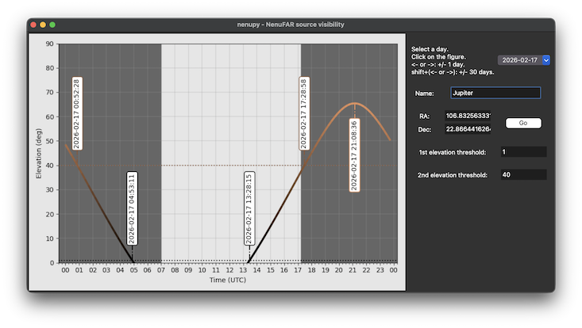
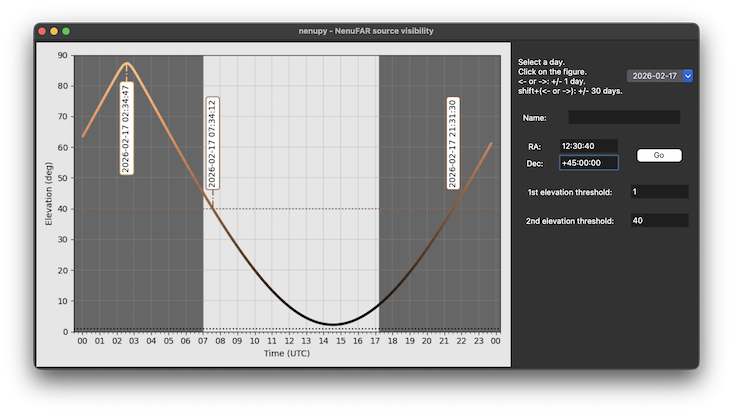
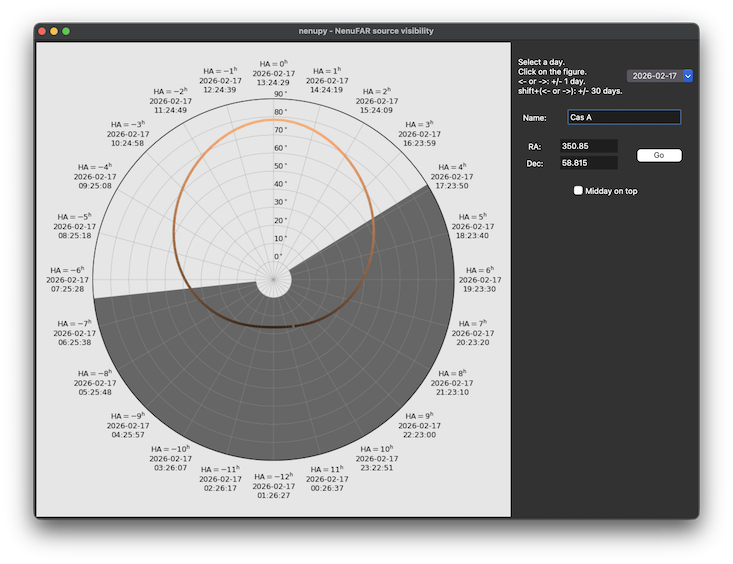

.. _srcvis_doc:

Source Visibility Interface
===========================

`nenupy` offers a graphical interface to ease the display of astronomical source visibility as seen from Nançay.
Once the package is installed, the user should be able to call the script ``nenupy_src_vis`` from anywhere:

.. code-block::

    nenupy_src_vis

    The interface allows the user to select a specific day in the calendar (upper right corner).
    Once a source is selected, the user can either modify the calendar value or use left and right arrows to move a day backward or forward (click on the figure first).
    Holding the shift key while pressing left or right arrow shifts the date by 30 days to quickly jump through months.

    A source can be selected by simply entering its name.
    The script recognizes any Solar System main objects and `SIMBAD <https://simbad.cds.unistra.fr/simbad/sim-fid>`_ identifiers.
    In this example, after filling in the text "Jupiter" and clicking Enter, the panel displays the elevation of Jupiter as seen from Nançay over the selected day.
    The shaded areas correspond to time periods when the Sun is below the horizon.

    One can otherwise fill in astronomical coordinates (either in decimal or sexagesimal format) and click Go.
    Timing information is displayed in the panel.
    Namely, the meridian transit time is shown, as well as the times at which the source elevation crosses user defined thresholds (by default 1 and 40 degrees).

One can also call the script with the option ``polar`` to rather display a polar plot.

.. code-block::

    nenupy_src_vis -p polar

    The source path accross the selected day is displayed in elevation versus hour angle.
    The shaded grey area indicates the period when the Sun is below the horizon.
    The user can choose between displaying the hour angle origin at the top of the plot or the middle of the selected day (click Midday on top).
    Moving backward of forward using arrows is still possible.