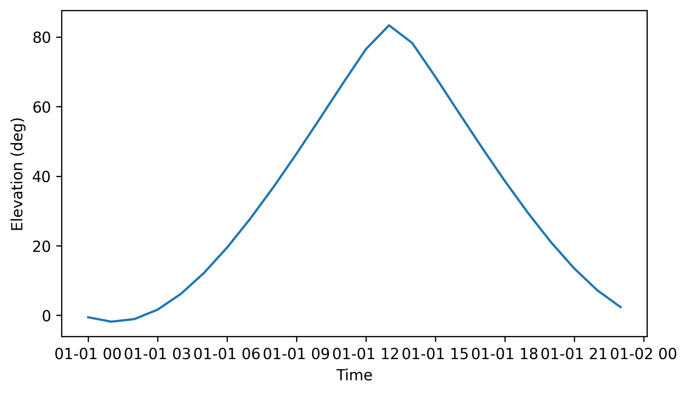
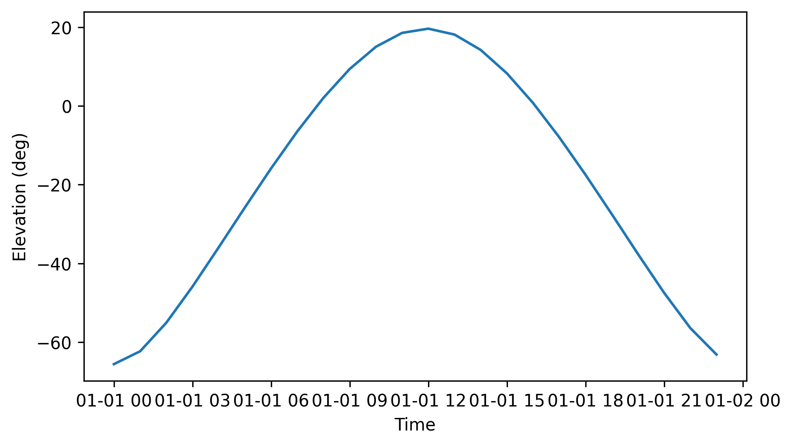
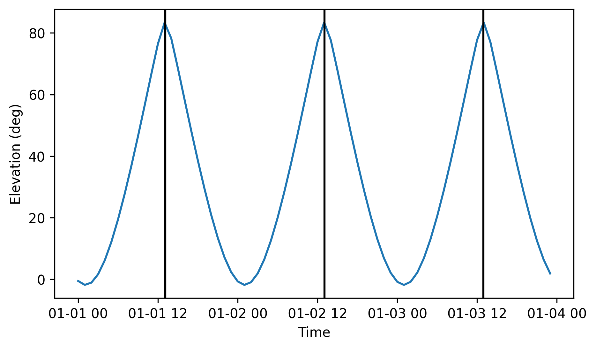
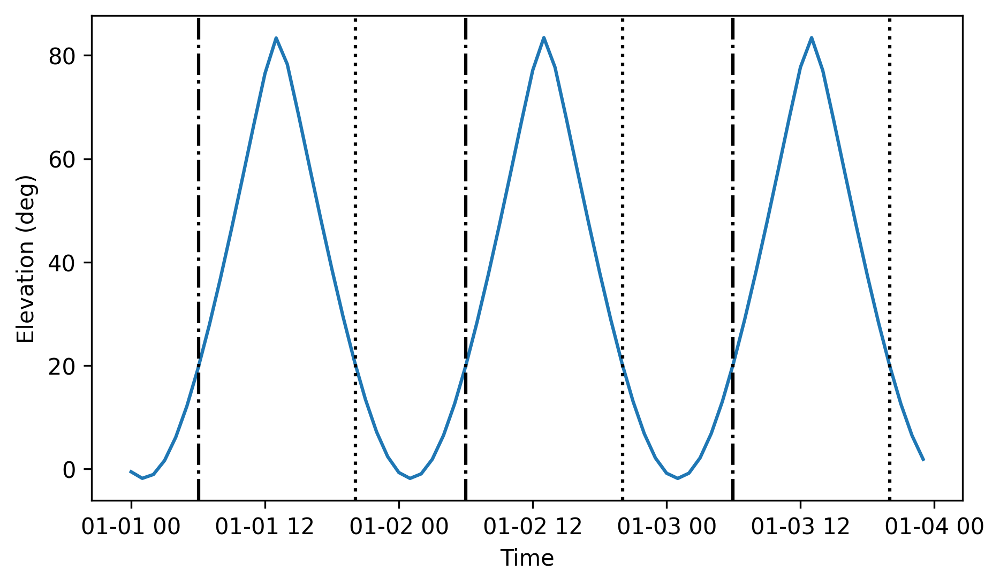

.. _target_doc:

Astronomical Targets
====================

Astronomical targets are handled distinctively according to their apparent position in the sky.
Therefore, they are treated in :ref:`fixed_source_sec` and :ref:`solar_system_source_sec` thanks to two object classes: :class:`~nenupy.astro.target.FixedTarget` and :class:`~nenupy.astro.target.SolarSystemTarget` respectively.
Both of these objects inherit from the abstract class :class:`~nenupy.astro.target.Target`.

.. warning::
    :class:`~nenupy.astro.target.FixedTarget` and :class:`~nenupy.astro.target.SolarSystemTarget` are well suited to describe individual targets.
    Dealing with multiple sky positions at once are better represented by :class:`~nenupy.astro.sky.Sky` objects, see :ref:`sky_doc`.

For the purpose of this page examples, a few packages should be loaded first:

.. code-block:: python
    
    >>> from nenupy.astro.target import FixedTarget, SolarSystemTarget
    >>> from astropy.time import Time, TimeDelta
    >>> from astropy.coordinates import SkyCoord
    >>> import astropy.units as u
    >>> import numpy as np
    >>> import matplotlib.pyplot as plt

Source types
------------

Dealing with apparent source positions at `NenuFAR <https://nenufar.obs-nancay.fr/en/homepage-en/>`_ site, as well as computing :ref:`beam_simulation_doc` within the ``nenupy`` framework is managed using :class:`~nenupy.astro.target.Target` objects.

.. _fixed_source_sec:

Fixed sources
^^^^^^^^^^^^^

For sources that are fixed in the equatorial grid, an instance of :class:`~nenupy.astro.target.FixedTarget` can be created:

* for an arbitrary position in the sky:

    .. code-block:: python

        >>> source = FixedTarget(coordinates=SkyCoord(300, 45, unit="deg"))
        >>> source.is_circumpolar
        True
    
    where :attr:`~nenupy.astro.target.Target.is_circumpolar` can quickly tells if a source is circumpolar as seen from Nançay location,

* for a known source using the classmethod :meth:`~nenupy.astro.target.FixedTarget.from_name` (with a name that could be resolved by `Simbad <http://simbad.u-strasbg.fr/simbad/>`_):

    .. code-block:: python

        >>> cyg_a = FixedTarget.from_name("Cyg A") 
        >>> cyg_a.coordinates
        <SkyCoord (ICRS): (ra, dec) in deg
            (299.86815191, 40.73391574)>

Horizontal coordinates are computed and accessed through the :attr:`~nenupy.astro.target.FixedTarget.horizontal_coordinates` attributes, providing that :attr:`~nenupy.astro.target.Target.time` as been properly filled.
In the example below, the variable ``times`` consists of a time range of 24 steps, separated by one hour, starting from 2021-01-01.
An :class:`~nenupy.astro.target.FixedTarget` instance is created at the position of Cygnus A, using this time range.
The source elevation with respect to time can then easily be displayed:

.. code-block:: python

    >>> times = Time("2021-01-01 00:00:00") + np.arange(24)*TimeDelta(3600, format="sec") 
    >>> cyg_a = FixedTarget.from_name("Cyg A", time=times)
    >>> plt.plot(times.datetime, cyg_a.horizontal_coordinates.alt)

    Cygnus A elevation vs. time as seen from NenuFAR on 2021-01-01.

.. _solar_system_source_sec:

Solar System objects
^^^^^^^^^^^^^^^^^^^^

The Solar System planets and the Sun are not fixed in the equatorial grid and therefore require a distinct class able to handle the variations in sky positions over time.
The :class:`astropy.coordinates.solar_system_ephemeris` are used to compute these positions.
An instance of :class:`~nenupy.astro.target.SolarSystemTarget` can be initialized with the classmethod :meth:`~nenupy.astro.target.SolarSystemTarget.from_name` for simplicity:

.. code-block:: python

    >>> times = Time("2021-01-01 00:00:00") + np.arange(24)*TimeDelta(3600, format="sec") 
    >>> sun = SolarSystemTarget.from_name("Sun", time=times)
    >>> plt.plot(times.datetime, sun.horizontal_coordinates.alt)

As in :ref:`fixed_source_sec`, the Sun elevation is plotted against the time:

    Sun elevation vs. time as seen from NenuFAR on 2021-01-01.

Knowing the apparent sky position of the Sun or any planet is straightforward:

.. code-block:: python

    >>> jupiter = SolarSystemTarget.from_name("Jupiter", time=Time("2021-11-18 16:00:00"))
    >>> jupiter.horizontal_coordinates
    <SkyCoord (AltAz: obstime=['2021-11-18 16:00:00.000'], location=(4323914.96644279, 165533.66845052, 4670321.74854012) m, pressure=0.0 hPa, temperature=0.0 deg_C, relative_humidity=0.0, obswl=1.0 micron): (az, alt) in deg
    [(151.83875283, 23.68067178)]>

.. _ephemerides_sec:

Ephemerides
-----------

Since both :class:`~nenupy.astro.target.FixedTarget` and :class:`~nenupy.astro.target.SolarSystemTarget` classes are sub-classes of :class:`~nenupy.astro.target.Target`, objects of these types are granted access to a range of methods bringing additional information on their ephemerides.
Namely, these are:

.. autosummary::

    ~nenupy.astro.target.Target.meridian_transit
    ~nenupy.astro.target.Target.next_meridian_transit
    ~nenupy.astro.target.Target.previous_meridian_transit
    ~nenupy.astro.target.Target.azimuth_transit
    ~nenupy.astro.target.Target.rise_time
    ~nenupy.astro.target.Target.next_rise_time
    ~nenupy.astro.target.Target.previous_rise_time
    ~nenupy.astro.target.Target.set_time
    ~nenupy.astro.target.Target.next_set_time
    ~nenupy.astro.target.Target.previous_set_time

Meridian transit
^^^^^^^^^^^^^^^^

Knowing the time of the meridian crossing is useful because it gives an indication on when the source is at its highest position in the sky (i.e., well suited for observations: `NenuFAR <https://nenufar.obs-nancay.fr/en/homepage-en/>`_ antennas greatest sensitivity, low atmospheric effects, and the human activities not in the field of view).
:meth:`~nenupy.astro.target.Target.meridian_transit` is the method to call for.
The meridian transit time is computed iteratively on smaller and smaller time windows, until the required ``precision`` is reached.
The example below illustrates how to compute the Sun meridian transit time occuring within a time slot ranging from ``t_min`` to ``t_min + duration``:

.. code-block:: python

    >>> sun = SolarSystemTarget.from_name("Sun")
    >>> sun.meridian_transit(
            t_min=Time("2021-11-04 00:00:00"),
            duration=TimeDelta(86400, format="sec")
        )
    <Time object: scale='utc' format='iso' value=['2021-11-04 11:34:46.659']>

.. note::
    The output of :meth:`~nenupy.astro.target.Target.meridian_transit` is a :class:`~astropy.time.Time` array because there can possibly be several transit times between ``t_min`` and ``t_min + duration``. 

Two related methods (:meth:`~nenupy.astro.target.Target.next_meridian_transit` and :meth:`~nenupy.astro.target.Target.previous_meridian_transit`) are used to know the previous or next meridian transit time with respect to ``time``:

.. code-block:: python

    >>> sun = SolarSystemTarget.from_name("Sun")
    >>> sun.next_meridian_transit(time=Time("2021-11-04 00:00:00"))

    <Time object: scale='utc' format='iso' value=2021-11-04 11:34:46.770>

.. code-block:: python

    >>> sun = SolarSystemTarget.from_name("Sun")
    >>> sun.previous_meridian_transit(time=Time("2021-11-04 00:00:00"))

    <Time object: scale='utc' format='iso' value=2021-11-03 11:34:45.664>

Azimuth transit
^^^^^^^^^^^^^^^

Sometimes, the computation of the transit time at a specific azimuth (other than the meridian plan) is required.
The method :meth:`~nenupy.astro.target.Target.azimuth_transit` allows the user to give as input any ``azimuth`` value (as :class:`~astropy.units.Quantity` objects):

.. code-block:: python
    :emphasize-lines: 5

    >>> sun = SolarSystemTarget.from_name("Sun")
    >>> sun.azimuth_transit(
            t_min=Time("2021-11-04 00:00:00"),
            duration=TimeDelta(86400, format="sec"),
            azimuth=200*u.deg
        )

    <Time object: scale='utc' format='iso' value=['2021-11-04 12:49:54.389']>
    
If the source does not cross the required ``azimuth`` between ``t_min`` and ``t_min + duration``, then an empty object is returned:

.. code-block:: python
    :emphasize-lines: 5

    >>> sun = SolarSystemTarget.from_name("Sun")
    >>> sun.azimuth_transit(
            t_min=Time("2021-11-04 00:00:00"),
            duration=TimeDelta(86400, format="sec"),
            azimuth=10*u.deg
        )

    <Time object: scale='utc' format='jd' value=[]>

.. note::
    All the methods previously mentionned (:meth:`~nenupy.astro.target.Target.meridian_transit`, :meth:`~nenupy.astro.target.Target.next_meridian_transit`, :meth:`~nenupy.astro.target.Target.previous_meridian_transit`, :meth:`~nenupy.astro.target.Target.azimuth_transit`)
    can be tweaked with a ``precision`` argument, which reflects the smallest time window used while searching for transit times.
    By default, this argument is set to 5 seconds, but this can be modified and the results may vary accordingly:

    * example with 1 minute precision:
 
       .. code-block:: python
            :emphasize-lines: 4

            >>> sun = SolarSystemTarget.from_name("Sun")
            >>> sun.next_meridian_transit(
                    time=Time("2021-11-04 00:00:00"),
                    precision=TimeDelta(60, format="sec")
                )

            <Time object: scale='utc' format='iso' value=2021-11-04 11:34:03.418>
    
    * example with 1 second precision:
  
        .. code-block:: python
            :emphasize-lines: 4

            >>> sun = SolarSystemTarget.from_name("Sun")
            >>> sun.next_meridian_transit(
                    time=Time("2021-11-04 00:00:00"),
                    precision=TimeDelta(1, format="sec")
                )

            <Time object: scale='utc' format='iso' value=2021-11-04 11:34:47.477>

Multiple transits
^^^^^^^^^^^^^^^^^

:meth:`~nenupy.astro.target.Target.meridian_transit` and :meth:`~nenupy.astro.target.Target.azimuth_transit` (as well as :meth:`~nenupy.astro.target.Target.rise_time` and :meth:`~nenupy.astro.target.Target.set_time`, see :ref:`rise_set_sec`) will return as many ouptuts as there are occurences within the time window looked upon (i.e., between ``t_min`` and ``t_min + duration``).
Therefore, searching for the Sun meridian transit times over two days returns a :class:`~astropy.time.Time` array of two elements:

.. code-block:: python

    >>> sun = SolarSystemTarget.from_name("Sun")
    >>> two_days = TimeDelta(48*3600, format="sec")
    >>> sun.meridian_transit(t_min=Time("2021-11-04 00:00:00"), duration=two_days)

    <Time object: scale='utc' format='iso' value=['2021-11-04 11:34:46.770' '2021-11-05 11:34:47.876']>

In the example below, a time range over a three-day period is created and stored in the variable ``times``.
The radio source Cygnus A is instantiated (as an :class:`~nenupy.astro.target.FixedTarget` object), while setting its :attr:`~nenupy.astro.target.FixedTarget.time` attribute to ``times``.
The meridian transit times are computed using :meth:`~nenupy.astro.target.Target.meridian_transit` and stored in ``transits``.
Finally, a plot is made to show Cygnus A elevation while highlighting the transit times just found:

.. code-block:: python
    :emphasize-lines: 8

    >>> # Define the time range
    >>> time_steps = 72
    >>> three_days = TimeDelta(72*3600, format="sec")
    >>> times = Time("2021-01-01 00:00:00") + np.arange(time_steps)*three_days/time_steps

    >>> # Compute the meridian transit times
    >>> cyg_a = FixedTarget.from_name("Cyg A", time=times)
    >>> transits = cyg_a.meridian_transit(t_min=times[0], duration=three_days)

    >>> # Plot the elevation vs. time, and the transit times as vertical lines
    >>> plt.plot( times.datetime, cyg_a.horizontal_coordinates.alt)
    >>> for transit in transits:
    >>>     plt.axvline(transit.datetime, color="black")
    >>> plt.xlabel("Time")
    >>> plt.ylabel("Elevation (deg)")

    Cygnus A elevation vs. time (blue curve). The meridian transit times are displayed as vertical black lines.

.. _rise_set_sec:

Rise and set times
^^^^^^^^^^^^^^^^^^

Computing rise and set times of a :class:`~nenupy.astro.target.Target` instance is done in a similar fashion.
Below, the methods :meth:`~nenupy.astro.target.Target.rise_time` and :meth:`~nenupy.astro.target.Target.set_time` are used to compute the rise and set time of Cygnus A above and below an ``elevation`` of 20 deg.

.. code-block:: python
    :emphasize-lines: 8, 9

    >>> # Define the time range
    >>> time_steps = 72
    >>> three_days = TimeDelta(72*3600, format="sec")
    >>> times = Time("2021-01-01 00:00:00") + np.arange(time_steps)*three_days/time_steps

    >>> # Compute the rise and set times where the elevation crosses 20 deg
    >>> cyg_a = FixedTarget.from_name("Cyg A", time=times)
    >>> rises = cyg_a.rise_time(times[0], elevation=20*u.deg, duration=three_days)
    >>> sets = cyg_a.set_time(times[0], elevation=20*u.deg, duration=three_days)

    >>> # Plot the elevation vs. time, and the crossing times as vertical lines
    >>> plt.plot(times.datetime, cyg_a.horizontal_coordinates.alt)
    >>> for r in rises:
    >>>     plt.axvline(r.datetime, color="black", linestyle='-.')
    >>> for s in sets:
    >>>     plt.axvline(s.datetime, color="black", linestyle=':')

    Cygnus A elevation vs. time (blue curve).
    The rise times when the source goes above an elevation of 20 deg are highlighted as dashed-dotted vertical black lines.
    The set times when the source goes below an elevation of 20 deg are highlighted as dotted vertical black lines.

