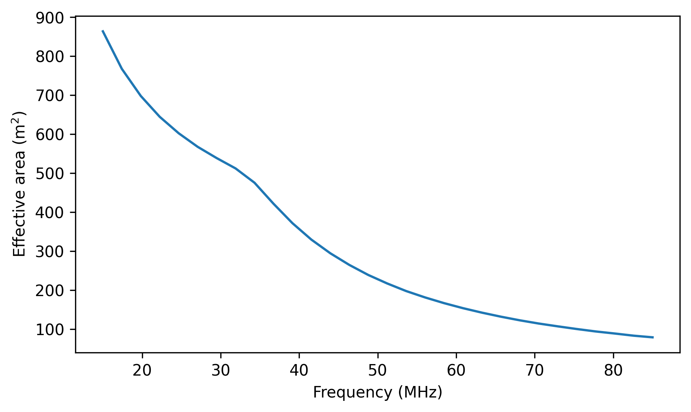
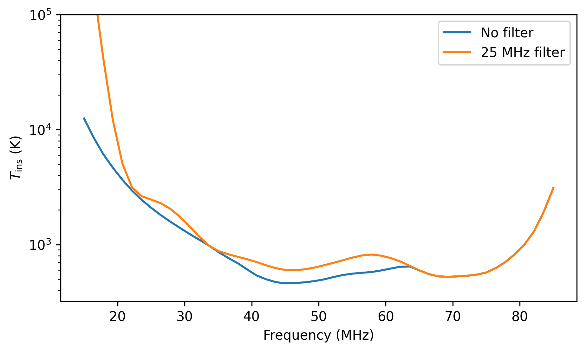
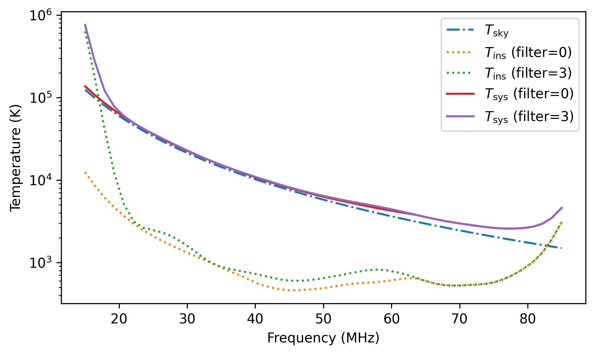
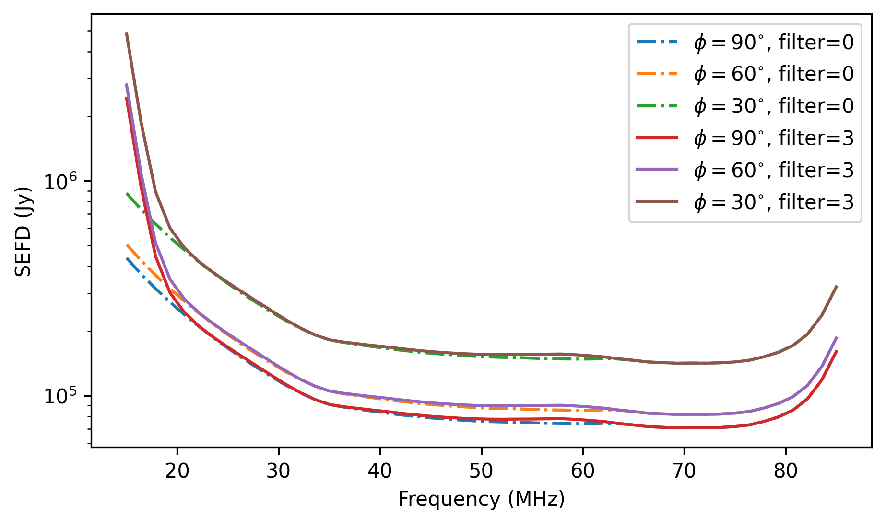
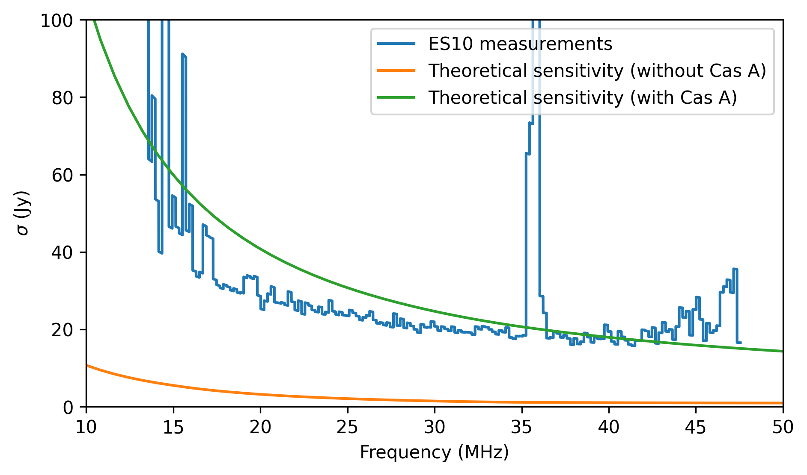
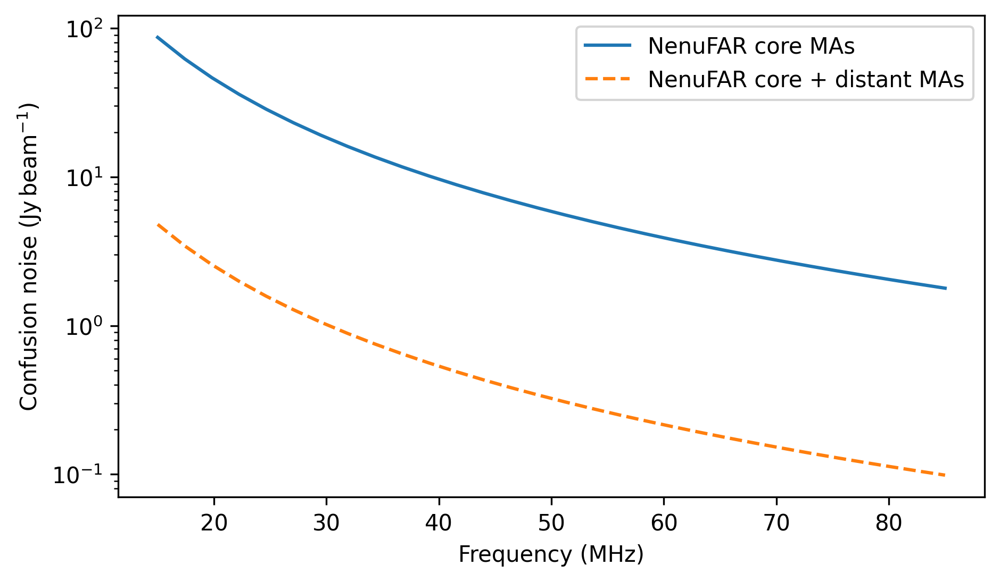

.. _instrument_properties_doc:

Instrument Properties
=====================

Objects of type :class:`~nenupy.instru.nenufar.MiniArray`, :class:`~nenupy.instru.nenufar.NenuFAR` (inheriting from :class:`~nenupy.instru.interferometer.Interferometer`) have access to a variety of methods that deliver instrumental properties.
The latter relies heavily on physical quantities. Therefore, the :mod:`astropy.units` is prefered and all *quantity-like* inputs in ``nenupy`` are assumed to be instances of.
The packages and modules used for the remaining of this page are first imported:

.. code-block:: python

    >>> from nenupy.instru import MiniArray, NenuFAR
    >>> import astropy.units as u
    >>> import numpy as np

Various array configurations (both at the Mini-Array or the NenuFAR level) are used throughout the following examples.

.. seealso::
    
    :ref:`array_configuration_doc` for a detailed explanation on how to set up array objects.

Angular resolution
------------------

The angular resolution of an interferometric array depends on the observing wavelength and the length of the maximum physical separation of the antennas in the array (or largest baseline).
This can be computed with the :meth:`~nenupy.instru.interferometer.Interferometer.angular_resolution` method.
Full beam width at half maximum (in beamformer mode) or angular resolution (in imaging mode) characteristics of NenuFAR can be found in Table 2 of `this page <https://nenufar.obs-nancay.fr/en/astronomer/#mini-arrays>`_.

Mini-Array beam width
^^^^^^^^^^^^^^^^^^^^^

The `Mini-Array <https://nenufar.obs-nancay.fr/en/astronomer/#mini-arrays>`_ angular resolution (which is also related to the field of view in imaging mode) is:

.. code-block:: python

    >>> ma = MiniArray(index=0)
    >>> ma.angular_resolution(frequency=50*u.MHz)
    15.615311°

Modifying the array antenna distribution (see :ref:`element_selection_sec`) has a direct impact on the result.
Below, only two nearby antennas are selected for the Mini-Array `00`.
Evaluated at the same ``frequency``, the angular resolution is much higher than the full Mini-Array antenna distribution which includes larger baselines:

.. code-block:: python

    >>> ma = MiniArray(index=0)["Ant09", "Ant10"]
    >>> ma.angular_resolution(frequency=50*u.MHz)
    62.461246°

Getting a range of results is straightforward as the output of :meth:`~nenupy.instru.interferometer.Interferometer.angular_resolution` has the same shape of the ``frequency`` input:

.. code-block:: python

    >>> ma = MiniArray()
    >>> ma.angular_resolution(frequency=[15, 27, 48, 85]*u.MHz)
    [52.051038, 28.917243, 16.265949, 9.1854773]°

NenuFAR array angular resolution
^^^^^^^^^^^^^^^^^^^^^^^^^^^^^^^^

This usage is similarly applied to :class:`~nenupy.instru.nenufar.NenuFAR` instance, either in 'core' cofiguration (compact core of 96 Mini-Arrays):

.. code-block:: python

    >>> nenufar_core = NenuFAR()
    >>> nenufar_core.angular_resolution(frequency=[15, 27, 48, 85]*u.MHz)
    [2.1118006, 1.1732225, 0.65993768, 0.37267069]°

or in 'remote' configuration (with the addition of the 6 remote Mini-Arrays) which improves considerably the angular resolution:

.. code-block:: python

    >>> nenufar_remote = NenuFAR(include_remote_mas=True)
    >>> resolutions = nenufar_remote.angular_resolution(frequency=[15, 27, 48, 85]*u.MHz)
    >>> resolutions.to(u.arcmin)
    [19.312458, 10.729143, 6.0351432, 3.4080808]'

Since the output of :meth:`~nenupy.instru.interferometer.Interferometer.angular_resolution` is a :class:`~astropy.units.Quantity` object, unit conversions can be performed in a simple manner, as shown above.

.. note::

    Results of :meth:`~nenupy.instru.interferometer.Interferometer.angular_resolution` does not include the ``1.22`` factor (:math:`\theta \simeq 1.22 \frac{\lambda}{D}`).
    The latter is often use to represent the position of the first null of the Airy diffraction pattern (which does not fully correspond to the NenuFAR or the Mini-Array radiation pattern).
    Instead, the output is simply :math:`\theta = \frac{\lambda}{D}`.

.. _effective_area_sec:

Effective area
--------------

Computing the effective area of NenuFAR does depend on the hierarchical element level of interest.

Antenna effective area
^^^^^^^^^^^^^^^^^^^^^^

With a bottom-up approach, the smallest element, the dipole antenna, can be considered while selecting a single antenna from a :class:`~nenupy.instru.nenufar.MiniArray` instance.
Then, asking for :meth:`~nenupy.instru.nenufar.MiniArray.effective_area` gives:

.. code-block:: python

    >>> antenna = MiniArray()["Ant10"]
    >>> antenna.effective_area(frequency=[15, 27, 48, 85]*u.MHz)
    [133.10199, 41.117441, 13.009539, 4.1531393]m2

Mini-Array effective area
^^^^^^^^^^^^^^^^^^^^^^^^^

Next on the line is the full Mini-Array, for which the effective area computation is done while using a grid to take into account the potential overlaps between individual antenna effective areas (more frequent the lower the frequency):

.. code-block:: python

    >>> ma = MiniArray()
    >>> ma.effective_area(frequency=[15, 27, 48, 85]*u.MHz)
    [863.77425, 568.4938, 247.12258, 78.99406]m2

The figure below highlights the effect of the individual antenna effective are overlaps.
The curve gets steeper above around 35 MHz (for which the antenna effective area radius: :math:`\sqrt{ \lambda^2 / 3 \pi }` roughly corresponds to half of the antenna separation) since there are no more overlaps at higher frequencies.

    Mini-Array effective area vs. frequency.

NenuFAR effective area
^^^^^^^^^^^^^^^^^^^^^^

Then, determining the effective area of NenuFAR 'core' or NenuFAR 'core + remote' is done with :meth:`~nenupy.instru.nenufar.NenuFAR.effective_area` (which belongs to :class:`~nenupy.instru.nenufar.NenuFAR`):

.. code-block:: python

    >>> nenufar_core = NenuFAR()
    >>> nenufar_core.effective_area(frequency=[15, 27, 48, 85]*u.MHz)
    [82922.328, 54575.405, 23723.768, 7583.4298]m2

.. code-block:: python

    >>> nenufar_remote = NenuFAR(include_remote_mas=True)
    >>> nenufar_remote.effective_area(frequency=[15, 27, 48, 85]*u.MHz)
    [88104.973, 57986.368, 25206.503, 8057.3941]m2

In addition to the ``frequency`` parameter, ``elevation`` can also be filled in, in order to take into account the projection effect as seen from a sky position that is not the local zenith:

.. code-block:: python

    >>> nenufar = NenuFAR()
    >>> nenufar.effective_area(frequency=48*u.MHz, elevation=60*u.deg)
    20534.83m2

Noise and sensitivity
---------------------

Instrument temperature
^^^^^^^^^^^^^^^^^^^^^^

NenuFAR instrument temperature can be computed thanks to the :func:`~nenupy.instru.instrument_tools.instrument_temperature` function.
The values come from observation measurements and depend on the bandwidth high-pass filter applied.

Below, is computed the instrument temperature for the two available filters (namely ``0`` and ``3`` which correspond to 'no filter' and '25 MHz high-pass filter').

.. code-block:: python
    :emphasize-lines: 3,4

    >>> from nenupy.instru import instrument_temperature
    >>> frequencies = np.linspace(15, 85, 50)*u.MHz
    >>> t_ins_no_filter = instrument_temperature(frequency=frequencies, lna_filter=0)
    >>> t_ins_25mhz_filter = instrument_temperature(frequency=frequencies, lna_filter=3)    
    >>> plt.plot(frequencies, t_ins_no_filter, label="No filter")
    >>> plt.plot(frequencies, t_ins_25mhz_filter, label="25 MHz filter")

    NenuFAR instrument temperature computed for the two available filters.

.. note::

    All the methods involving th computation of :func:`~nenupy.instru.instrument_tools.instrument_temperature` do accept ``lna_filter`` as argument.
    This is true for :meth:`~nenupy.instru.interferometer.Interferometer.system_temperature`, :meth:`~nenupy.instru.interferometer.Interferometer.sefd` and :meth:`~nenupy.instru.interferometer.Interferometer.sensitivity`.

System temperature
^^^^^^^^^^^^^^^^^^

The *system temperature* represents the added noise of the system, which is a combination of several contributions.
The :meth:`~nenupy.instru.interferometer.Interferometer.system_temperature` does simply consider the instrument and the sky temperatures, the latter being dominated by the Galactic emission at NenuFAR frequencies.

.. code-block:: python

    >>> from nenupy.astro import sky_temperature
    >>> ma = MiniArray()
    >>> frequencies = np.linspace(15, 85, 50)*u.MHz
    >>> t_sys_0 = ma.system_temperature(frequency=frequencies, lna_filter=0)
    >>> t_ins_0 = ma.instrument_temperature(frequency=frequencies, lna_filter=0)
    >>> t_sys_3 = ma.system_temperature(frequency=frequencies, lna_filter=3)
    >>> t_ins_3 = ma.instrument_temperature(frequency=frequencies, lna_filter=3)
    >>> t_sky = sky_temperature(frequency=frequencies)

    Sky temperature (:math:`T_{\rm sky}`), instrument temperature (:math:`T_{\rm ins}`, for both filters) and the resulting system temperature (:math:`T_{\rm sys} = T_{\rm sky} + T_{\rm ins}`).

System equivalent flux density
^^^^^^^^^^^^^^^^^^^^^^^^^^^^^^

The System Equivalent Flux Density (or SEFD), is defined as the flux density (in Jy) of a radio source that doubles the system temperature.

.. code-block:: python

    >>> ma = MiniArray()
    >>> frequencies = np.linspace(15, 85, 50)*u.MHz
    >>> sefd_90_0 = ma.sefd(frequency=frequencies, elevation=90*u.deg, lna_filter=0)
    >>> sefd_60_0 = ma.sefd(frequency=frequencies, elevation=60*u.deg, lna_filter=0)
    >>> sefd_30_0 = ma.sefd(frequency=frequencies, elevation=30*u.deg, lna_filter=0)
    >>> sefd_90_3 = ma.sefd(frequency=frequencies, elevation=90*u.deg, lna_filter=3)
    >>> sefd_60_3 = ma.sefd(frequency=frequencies, elevation=60*u.deg, lna_filter=3)
    >>> sefd_30_3 = ma.sefd(frequency=frequencies, elevation=30*u.deg, lna_filter=3)

    Mini-Array SEFD for different elevations :math:`\phi` and filters.

Sensitivity
^^^^^^^^^^^

Computing the sensitivity, or thermal noise, of NenuFAR is done using the :meth:`~nenupy.instru.interferometer.Interferometer.sensitivity` method.
It requires having a predefined array (either :meth:`~nenupy.instru.nenufar.MiniArray` or :meth:`~nenupy.instru.nenufar.NenuFAR`).
Specificities of the observation (such as the integration time, the bandwidth, the elevation) are given as inputs.
Another required piece of information is the observing mode, as NenuFAR can either perform *beamformed* or *imaging* observations.
This precision is added thanks to :class:`~nenupy.instru.interferometer.ObservingMode` (an `~enum.Enum` object with values ``BEAMFORMING`` and ``IMAGING``).

.. code-block:: python

    >>> from nenupy.instru.interferometer import ObservingMode
    >>> ma = MiniArray()
    >>> ma.sensitivity(
    >>>     frequency=50*u.MHz,
    >>>     mode=ObservingMode.BEAMFORMING,
    >>>     dt=3600*u.s,
    >>>     df=25*u.MHz,
    >>>     elevation=70*u.deg,
    >>>     efficiency=1.,
    >>>     decoherence=1.,
    >>>     lna_filter=0
    >>> )
    0.19055667 Jy

.. warning::

    By default, the underlying method :meth:`~nenupy.instru.interferometer.Interferometer.system_temperature` assumes that the sky is dominated by the Galactic emission.
    However, this may not be a valid statement while a bright source is directly observed (such as A-team members).   
    This would yield to unaccurate noise estimations.

In order to derive more precise noise estimation in the case of a pointing towards a bright source, it is mandatory to fill in the ``source_spectrum`` argument of :meth:`~nenupy.instru.interferometer.Interferometer.sensitivity`.
This argument requires a `callable` object that takes as input ``frequency`` (of type :class:`astropy.units.Quantity`) and returns the spectrum of the target source in Janskys (also of type :class:`astropy.units.Quantity`).

As an example, we define such a function based on `De Gasperin et al. (2020) <https://arxiv.org/pdf/2002.10431.pdf>`_ which returns the spectrum of the A-team source Cas A with respect to ``frequency``.
The ``0.7`` factor has been added to better fit the UTR-2 measurements at low frequency.

.. code-block:: python

    >>> def casa_spectrum(frequency: u.Quantity) -> u.Quantity:
    >>>     """ Cas A spectrum """
    >>>     a0 = 3.3584
    >>>     a1 = -0.7518
    >>>     a2 = -0.0347
    >>>     a3 = -0.0705
    >>>     log_nu = np.log10(frequency.to(u.GHz).value)
    >>>     return 0.7 * np.power(10, (a0 + a1*log_nu + a2*log_nu**2 + a3*log_nu**3) )*u.Jy

Then a :class:`~nenupy.instru.nenufar.NenuFAR` instance is created, for which the array only contains 56 Mini-Arrays (see :ref:`array_configuration_doc`).
The sensitivity is computed while filling in the configuration of an observation made by the `NenuFAR 'Science Key Program' <https://nenufar.obs-nancay.fr/en/astronomer/#news>`_ ES10 ('Radio recombination lines').
The function describing this particular observation target spectrum, previously defined, is also inserted.

.. code-block:: python

    >>> nenufar = NenuFAR()[:56]
    >>> rms = nenufar.sensitivity(
    >>>     frequency=np.linspace(10, 50, 50)*u.MHz,
    >>>     mode=ObservingMode.BEAMFORMING,
    >>>     dt=1.953*u.h,
    >>>     df=190.7*u.Hz,
    >>>     elevation=60*u.deg,
    >>>     efficiency=1,
    >>>     decoherence=1.,
    >>>     source_spectrum={"Cas A": casa_spectrum}
    >>> )

The following figure shows the result of the theoretical sensitivity ``rms`` (evaluated with or without the incorporation of Cas A spectrum).
It is plotted against on-sky measurements of ES10.
The addition of Cas A spectrum does provide a more realistic noise estimation.

    Theoretical sensitivity of NenuFAR (orange and green curves).
    Noise measurement (blue curve, courtesy of ES10 'Radio recombination lines' team).

Confusion noise
^^^^^^^^^^^^^^^

The confusion noise can be directly evaluated using the method :meth:`~nenupy.instru.interferometer.Interferometer.confusion_noise`:

.. code-block:: python

    >>> frequencies = np.linspace(15, 85, 30)*u.MHz
    >>> nenufar_core = NenuFAR()
    >>> nenufar_core_distant = NenuFAR(include_remote_mas=True)
    >>> nc_core = nenufar_core.confusion_noise(frequency=frequencies)
    >>> nc_core_distant = nenufar_core_distant.confusion_noise(frequency=frequencies)

    Confusion noise evaluated for NenuFAR, considering either the core Mini-Arrays only (blue curve) or the core and the distant Mini-Arrays (orange dashed curve). 

