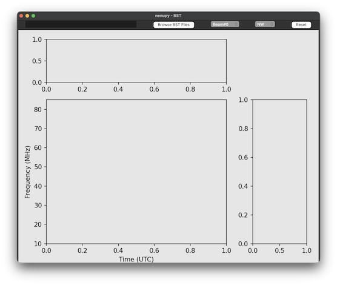
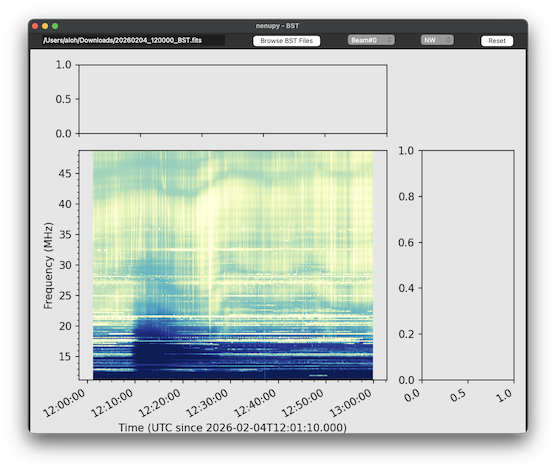
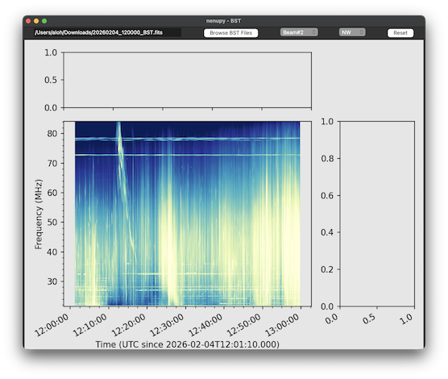
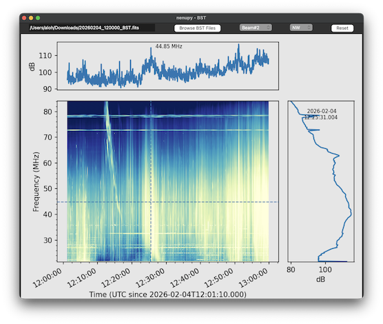
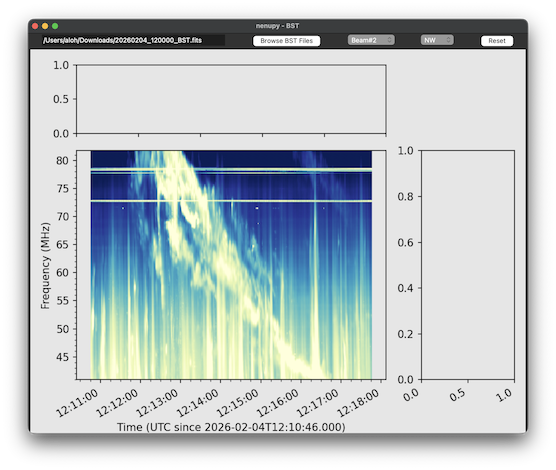

.. _bst_reading_doc:

Beamlet STatistics (BST)
========================

`NenuFAR <https://nenufar.obs-nancay.fr/en/astronomer>`_ delivers BST statistical data from the *LaNewBA* receiver.
Beamlet STatistics (BST) are the beamlet outputs per polarization averaged at 1 s resolution

BST reading interface
---------------------

`nenupy` offers a graphical interface to ease quick reading of a BST file.
Once the package is installed, the user should be able to call the script ``nenupy_bst_vis`` from anywhere:

.. code-block::

    nenupy_bst_vis

    BST reading interface, one can either enter the path toward the BST file to open or select a file in your working environment.

    Once the BST file is selected, the first digital beam recording is shown in NW polarization.

    It is possible to set the digital beam value (here #2) and the polarization channel. The content of the dynamic spectrum is automatically updated.

    A right click displays both time and frequency profiles at the corresponding position in the dynamic spectrum.

    Left click, then drag and drop motion allows to zoom in a particular time and frequency region.
    The button 'Reset' enables to go back to the full original dynamic spectrum.

BST reading
-----------

:class:`~nenupy.io.bst.BST`

.. code-block:: python

    from nenupy.io.bst import BST

    bst = BST("/path/to/BST.fits")

BST data selection
------------------

.. code-block:: python

    data = bst.get(
        frequency_selection="<=52MHz",
        time_selection=">=2022-01-24T11:08:10 & <2022-01-24T11:14:08",
        polarization="NW",
        beam=8
    )

``data`` is a :class:`~nenupy.io.io_tools.ST_Slice` object.
See ... for this class usage.

