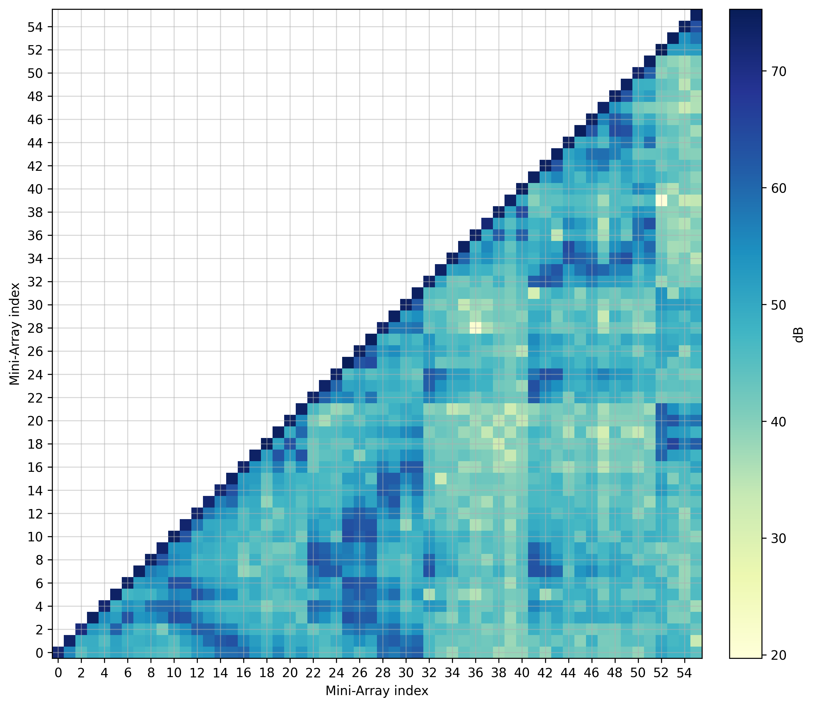
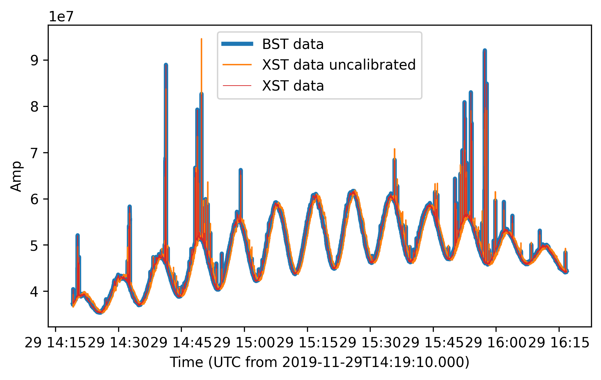
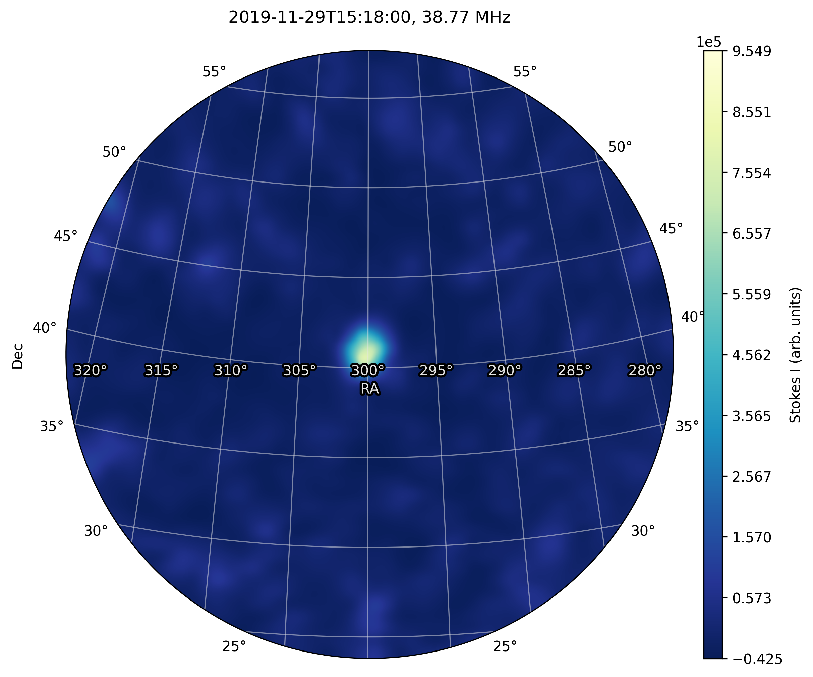
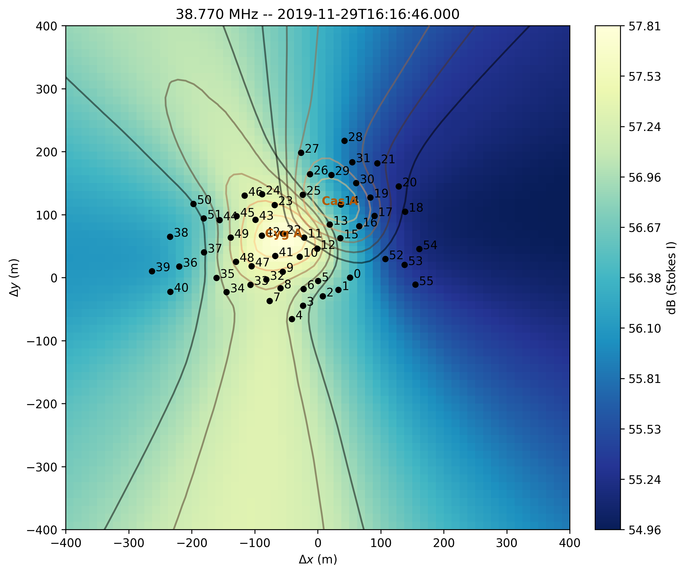
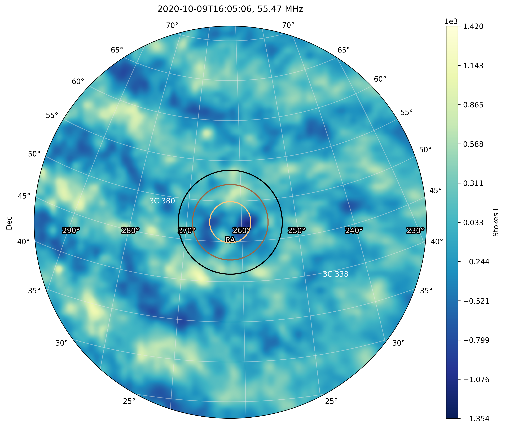
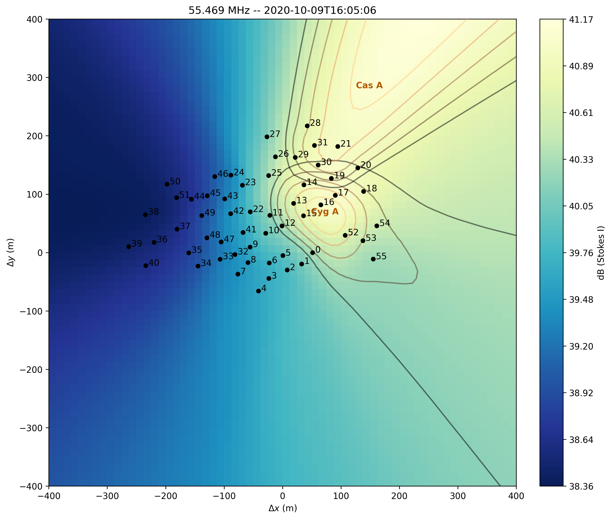

.. _xst_reading_doc:

Cross-Correlation STatistics (XST)
==================================

`NenuFAR <https://nenufar.obs-nancay.fr/en/astronomer/>`_ produces
cross-correlation statistics data called `XST <https://nenufar.obs-nancay.fr/en/astronomer/#data-products>`_
that can be converted to Measurement Set format suited for radio
imaging softwares (this is the 'proto-imager' mode, in contrast
with the proper imager mode using data from the `NICKEL correlator <https://nenufar.obs-nancay.fr/en/astronomer/#receivers>`_).

When NenuFAR does not observe in XST mode, the cross-correlations
are saved with 10 sec integration time and 16 sub-bands of
195.3125 kHz in 5-min exposure time binary files.
They are immediately converted in images to be displayed as the
`NenuFAR-TV <https://nenufar.obs-nancay.fr/nenufar-tv/>`_ and near-field images are also produced.

NenuFAR Cross-Correlation Statistics come in two flavours,
namely XST FITS files and NenuFAR-TV binary files.
They can be read and analyzed by :class:`~nenupy.io.xst.XST`
and :class:`~nenupy.io.xst.NenufarTV` respectively.
Both classes inherit from the base class :class:`~nenupy.io.xst.Crosslet`,
which contains the methods to extract, and perform basic imaging
and beamforming operations.

XST selection
-------------

Reading a NenuFAR XST file is straightforward with :class:`~nenupy.io.xst.XST`.
The general information may be displayed using :meth:`~nenupy.io.xst.XST.info`,
and some specific file type dependent properties may be accessed by
dedicated attributes, such as :attr:`~nenupy.io.xst.XST.mini_arrays`:

.. code-block:: python

    >>> from nenupy.io.xst import XST

    >>> xst = XST(".../nenupy/tests/test_data/XST.fits")
    >>> xst.info()
    file: '.../nenupy/tests/test_data/XST.fits'
    frequency (1, 16): 68.5546875 MHz -- 79.296875 MHz
    time (1,): 2020-02-19T18:00:03.000 -- 2020-02-19T18:00:03.000
    data: (1, 16, 6105)

    >>> xst.mini_arrays
    array([ 0,  2,  3,  4,  5,  6,  7,  8,  9, 10, 11, 12, 13, 14, 15, 16, 17,
       18, 19, 20, 21, 22, 23, 24, 25, 26, 27, 28, 29, 30, 31, 32, 33, 34,
       35, 36, 37, 38, 39, 40, 41, 42, 43, 44, 45, 46, 47, 48, 49, 50, 51,
       52, 53, 54, 55], dtype='>i2')

Data selection can then be applied either using :meth:`~nenupy.io.xst.XST.get`
or :meth:`~nenupy.io.xst.XST.get_stokes` methods. The former accesses
the raw cross-correlations stored in the FITS files (namely the
polarizations "XX", "XY", "YX" and "YY"), the latter adds a Stokes
parameter computation layer.

.. code-block:: python

    >>> from nenupy.io.xst import XST

    >>> xst = XST(".../nenupy/tests/test_data/XST.fits")
    >>> xx_data = xst.get(
            polarization="XX",
            miniarray_selection=None,
            frequency_selection=">=20MHz",
            time_selection=">=2020-02-19T18:00:00"
        )

Both methods return an instance of the class :class:`~nenupy.io.xst.XST_Slice`
which contains the methods to further process the data, as well as plotting
tools such as :meth:`~nenupy.io.xst.XST_Slice.plot_correlaton_matrix`:

.. code-block:: python

    >>> xx_data.plot_correlaton_matrix()

    Cross-correlation matrix.

.. _xst_beamforming_doc:

Beamforming from cross-correlations
-----------------------------------

XST contain recorded amplitude and phase data for each baseline
involved in the observation. Hence their ability to be converted
to beamformed statistics data (or BST) at will.
This can in particular be done for any subset of Mini-Arrays in
any pointing direction allowing for numerous potential array
configurations available at once with a single XST observation,
rather than performing a multi-pointing beam BST observation
(at the cost of Sub-band number).

To demonstrate this property, the following considers a single
NenuFAR observation data acquired simultaneously in BST and XST.
The files are loaded using :class:`~nenupy.io.xst.BST` and :class:`~nenupy.io.xst.XST`:

.. code-block:: python

    >>> from nenupy.io.bst import BST
    >>> from nenupy.io.xst import XST

    >>> bst = BST("20191129_141900_BST.fits")
    >>> xst = XST("20191129_141900_XST.fits")

    >>> bst_data = bst.get(frequency_selection="==40.234375MHz", polarization="NW")

Beamforming the cross-correlation data is done using the
:meth:`~nenupy.io.xst.Crosslet.get_beamform` method.
The phasing direction must be provided.
Hence, to compare the BST and XST data, a :class:`~nenupy.astro.pointing.Pointing`
object is created directly from the metadata stored in the BST file 
using :meth:`~nenupy.astro.pointing.Pointing.from_bst`.
Similarly, the same Mini-Arrays and polarization are selected.
Finally, the ``calibration`` table is specified ('default' value
enables the calibration table used during the BST observation).

.. code-block:: python

    >>> from nenupy.astro.pointing import Pointing

    >>> bf_cal = xst.get_beamform(
            pointing=Pointing.from_bst(bst, beam=0, analog=False),
            frequency_selection="==40.234375MHz",
            mini_arrays=bst.mini_arrays,
            polarization="NW",
            calibration="default"
        )

To compare the result, the selected BST data, the beamformed data 
using the calibration table and without using it (setting
``calibration="none"`) are displayed together:

.. code-block:: python

    >>> import matplotlib.pyplot as plt

    >>> fig = plt.figure(figsize=(7, 4))
    >>> plt.plot(bst_data.time.datetime, bst_data.value, label="BST data", linewidth=3)
    >>> plt.plot(bf_uncal.time.datetime, bf_uncal.value, label="XST data uncalibrated", linewidth=1)
    >>> plt.plot(bf_cal.time.datetime, bf_cal.value, label="XST data", linewidth=0.5, color="tab:red")
    >>> plt.legend()
    >>> plt.xlabel(f"Time (UTC from {bst_data.time[0].isot})")
    >>> plt.ylabel("Amp")

    BST data versus time, against re-constructed beamformed data from XST (uncalibrated or calibrated with the default table used to obtain the BST).
    The blue (BST) and red (calibrated XST) curves are perfectly aligned as expected.

Image from XST
--------------

:meth:`~nenupy.io.xst.Crosslet.get_stokes`, :meth:`~nenupy.io.xst.XST_Slice.make_image`

:meth:`~nenupy.astro.sky.SkySliceBase.plot`

.. code-block:: python

    import astropy.units as u
    from astropy.coordinates import SkyCoord

    xst_data = xst.get_stokes(
        stokes="I",
        miniarray_selection=None,
        frequency_selection=">=20MHz",
        time_selection=">=2019-11-19T15:15:00"
    )

    cyg_a = SkyCoord.from_name("Cyg A")

    im = xst_data.make_image(
        resolution=1*u.deg,
        fov_radius=20*u.deg,
        phase_center=cyg_a,
        stokes="I"
    )

    im[0, 0, 0].plot(
        center=cyg_a,
        radius=17*u.deg,
        colorbar_label="Stokes I (arb. units)",
        figsize=(8, 8),
    )

    Cygnus A image obtained from XST data.

Near-field imprint from XST
---------------------------

:meth:`~nenupy.io.xst.Crosslet.get_stokes`, :meth:`~nenupy.io.xst.XST_Slice.make_nearfield`

:class:`~nenupy.io.xst.TV_Nearfield`, :meth:`~nenupy.io.xst.TV_Nearfield.save_png`

.. code-block:: python
    :emphasize-lines: 13

    from nenupy.io.xst import TV_Nearfield

    xst_data = xst.get_stokes(
        stokes="I",
        miniarray_selection=None,
        frequency_selection=">=20MHz",
        time_selection="==2019-11-29T16:16:46.000"
    )

    radius = 400*u.m
    npix = 64
    nf, source_imprint = xst_data.make_nearfield(
        radius=radius,
        npix=npix,
        sources=["Cyg A", "Cas A", "Sun"]
    )

    nearfield = TV_Nearfield(
        nearfield=nf,
        source_imprints=source_imprint,
        npix=npix,
        time=xst_data.time[0],
        frequency=np.mean(xst_data.frequency),
        radius=radius,
        mini_arrays=xst_data.mini_arrays,
        stokes="I"
    )

    nearfield.save_png(
        figsize=(8, 8)
    )

    XST near-field.

NenuFAR TV
----------

:class:`~nenupy.io.xst.NenufarTV`

.. code-block:: python

    from nenupy.io.xst import NenufarTV

    tv = NenufarTV("/path/to/nenufarTV.dat")

TV Image
^^^^^^^^

:meth:`~nenupy.io.xst.NenufarTV.compute_nenufar_tv`

.. code-block:: python

    tv_image = tv.compute_nenufar_tv(
        sources=["Cyg A", "Cas A"],
        stokes="I"
    )
    tv_image.save_png()

    NenuFAR-TV image.

TV Near-field
^^^^^^^^^^^^^

:meth:`~nenupy.io.xst.NenufarTV.compute_nearfield_tv`

.. code-block:: python

    tv_nearfield = tv.compute_nearfield_tv(
        sources=["Cyg A", "Cas A"],
        stokes="I"
    )
    tv_nearfield.save_png()

:class:`~nenupy.io.xst.TV_Nearfield`, :meth:`~nenupy.io.xst.TV_Nearfield.save_png`

    NenuFAR-TV near-field.

