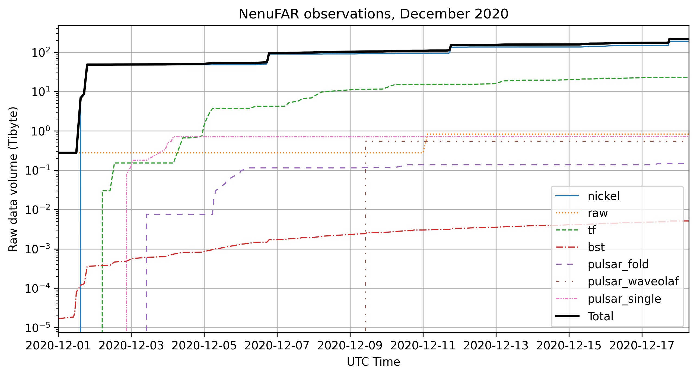

.. _obs_config_doc:

Observation Configuration
=========================

`NenuFAR <https://nenufar.obs-nancay.fr/en/astronomer/>`_
is a versatile low-frequency radio telescope. Several
observing modes are available, as represented by the 
diversity of its `receivers <https://nenufar.obs-nancay.fr/en/astronomer/#receivers>`_.
Observations are configured thanks to text files
called *parsets* in which the details of the instrumental set-up,
the observation mode(s),
the data sampling parameters,
the operations applied on the data, etc. are listed.

The :mod:`~nenupy.observation.obs_config` module aims at
handling these different observing configurations as well
as providing estimation on the data volume output by
*NenuFAR* in one or several given set-up(s).

NenuFAR Receiver setup
----------------------

Manual setting
^^^^^^^^^^^^^^

The various `receivers <https://nenufar.obs-nancay.fr/en/astronomer/#receivers>`_
configurations may be set 'manually'. In such case, the user
needs to fill in the different parameters relevant to
characterize the observation with the desired receiver.

For instance, say one is interested in performing an observation
and wants to estimate the volume of the most basic *NenuFAR* data
output: the *Beamlet Statistics* (or *BST*) FITS files. Instanciating
an 'empty' :class:`~nenupy.observation.obs_config.BSTConfig` object
and printing it gives a quicklook of all the properties one may want
to modify, as well as their current values that are set by default:

.. code-block:: python

    >>> from nenupy.observation import BSTConfig
    >>> bstconf = BSTConfig()
    >>> print(bstconf)
    Backend configuration of type 'BSTConfig'
        Properties: 'nSubBands=768', 'nPolars=2', 'durationSec=0'

.. note::
    At any time, the user may query the receiver parameters
    by printing the corresponding instance.

.. seealso::
    The other receivers dedicated classes are listed in :ref:`obs_config_class_summary`.

Attribute values can be directly set to the user preferences
to update the status of the current :class:`~nenupy.observation.obs_config.BSTConfig`
instance:

.. code-block:: python

    >>> bstconf.durationSec = 1800

Alternatively, the object can be initialized with specific
property values given as keyword arguments:

.. code-block:: python

    >>> bstconf = BSTConfig(durationSec=1800)

Finally, to compute an estimation of the data volume 
(returned as a :class:`~astropy.units.Quantity` object):

.. code-block:: python

    >>> bstconf.volume
    10.546875 Mibyte

    >>> vol = bstconf.volume
    >>> vol.to('Gibyte')
    0.010299683Gibyte

.. warning::
    The *beamformer* receivers allow for multi-beams observations. These
    properties cannot be set manually in a straightforward way.
    Instead, it is recommended to either treat each individual beam
    separately or to instanciate the relevant objects with a parset file.

Setting from Parset file
^^^^^^^^^^^^^^^^^^^^^^^^

The most convenient way to set a given receiver's properties
associated to as specific observation is to initialize the
corresponding object instance from the observation *parset*:

.. code-block:: python

    >>> from nenupy.observation import BSTConfig
    >>> bstconf = BSTConfig.fromParset('/path/to/observation.parset')

Calling the class method ``fromParset`` automatically loads the given file
as a :class:`~nenupy.observation.parset.Parset`. The contained instrumental
information is parsed and the properties relevant to the receiver class
are used to initialize the object instance.

If an observation is configured to use the multi-beams capability of
*NenuFAR*, the receiver properties will take that into account 
and the data volume estimation will then be computed accordingly.

.. warning::
    At the current stage of development, the *NenuFAR* configuration files
    called *parset user*
    (ending with ``'.parset_user'``) are not supported.

Observation setup
-----------------

Rather than configuring each receiver individually, one might be
interested in setting all of the *NenuFAR* receivers at once, from one
or several *parset* file(s).
This is achieved using the :class:`~nenupy.observation.obs_config.ObsConfig`
class which stores information on all available receivers and update their
configuration parameters according to what is described in the *parset* file(s).

Single observation
^^^^^^^^^^^^^^^^^^

In the case of a single observation, described by a unique *parset* file
(namely ``'/path/to/observation.parset'`` in the following example),
an instance of :class:`~nenupy.observation.obs_config.ObsConfig` is
simply created using the class method
:meth:`~nenupy.observation.obs_config.ObsConfig.fromParset`:

.. code-block:: python

    >>> from nenupy.observation import ObsConfig
    >>> obsconf = ObsConfig.fromParset('/path/to/observation.parset')

The variable called ``obsconf`` of type :class:`~nenupy.observation.obs_config.ObsConfig`
now contains attributes named after
the various *NenuFAR* receivers. Every one of these attributes is a
list (of only one element in this case) of corresponding configuration
class instances:

.. code-block:: python

    >>> type(obsconf.tf[0])
    nenupy.observation.obs_config.TFConfig

    >>> type(obsconf.nickel[0])
    nenupy.observation.obs_config.NICKELConfig

Querying :attr:`~nenupy.observation.obs_config.ObsConfig.volume` returns
a dictionnary composed of the *NenuFAR* receivers as keys and their
corresponding raw data volume estimations for the current observation:

.. code-block:: python

    >>> obsconf.volume
    {'nickel': <Quantity 0. Gibyte>,
        'raw': <Quantity 0. Gibyte>,
        'tf': <Quantity 56.57784641 Gibyte>,
        'bst': <Quantity 9.4921875 Mibyte>,
        'pulsar_fold': <Quantity 0. Gibyte>,
        'pulsar_waveolaf': <Quantity 0. Gibyte>,
        'pulsar_single': <Quantity 0. Gibyte>}

List of observations
^^^^^^^^^^^^^^^^^^^^

Conveniently, it is also possible to initialize an
:class:`~nenupy.observation.obs_config.ObsConfig` object
from a list of several *parset* files.
In order to do that, one simply needs to call the
:meth:`~nenupy.observation.obs_config.ObsConfig.fromParsetList`
class method:

.. code-block:: python

    >>> from nenupy.observation import ObsConfig
    >>> obsconf = ObsConfig.fromParsetList(
            [
                '/path/to/observation_1.parset',
                '/path/to/observation_2.parset',
                '/path/to/observation_3.parset'
            ]
        )

Querying the :attr:`~nenupy.observation.obs_config.ObsConfig.volume`
attribute returns a dictionnary with the summed estimated raw
data volumes for all the *NenuFAR* receivers over all the
observations described by the *parset* files:

.. code-block:: python

    >>> obsconf.volume
    {'nickel': <Quantity 726.41601562 Gibyte>,
        'raw': <Quantity 282.88923204 Gibyte>,
        'tf': <Quantity 1093.13987195 Gibyte>,
        'bst': <Quantity 264.4921875 Mibyte>,
        'pulsar_fold': <Quantity 11.50373708 Gibyte>,
        'pulsar_waveolaf': <Quantity 558.79404545 Gibyte>,
        'pulsar_single': <Quantity 61.29266694 Gibyte>}

To get the total estimated raw data volume for a specific
receiver, and convert its unit to *Terabytes* for instance, on can
do:

.. code-block:: python

    >>> obsconf.volume['tf'].to('Tibyte')
    1.0675194 Tibyte

Assuming ``dec2020_parset_list`` is a list of parsets asociated with
the past observations done in December 2020, plotting the cumulative
estimated raw data volume is also eased by the method
:meth:`~nenupy.observation.obs_config.ObsConfig.plotCumulativeVolume`:

.. code-block:: python

    >>> from nenupy.observation import ObsConfig
    >>> obsconf = ObsConfig.fromParsetList(dec2020_parset_list)
    >>> obsconf.plotCumulativeVolume(
            title='NenuFAR observations, December 2020',
            scale='log'
        )

.. _obs_config_class_summary:

Classes summary
---------------

.. autosummary::
    :nosignatures:

    ~nenupy.observation.obs_config.ObsConfig
    ~nenupy.observation.obs_config.BSTConfig
    ~nenupy.observation.obs_config.NICKELConfig
    ~nenupy.observation.obs_config.TFConfig
    ~nenupy.observation.obs_config.RAWConfig
    ~nenupy.observation.obs_config.PulsarFoldConfig
    ~nenupy.observation.obs_config.PulsarWaveConfig
    ~nenupy.observation.obs_config.PulsarSingleConfig
