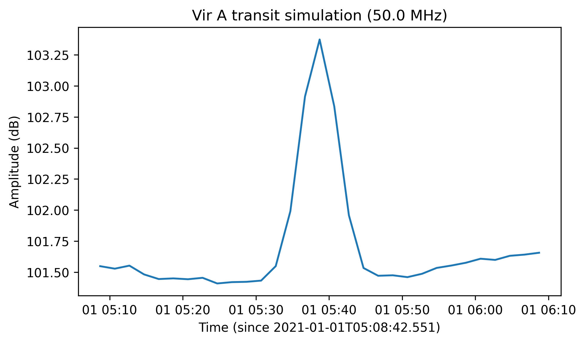

.. _obs_simulation_doc:

Observation Simulations
=======================

.. code-block:: python

    >>> from nenupy.astro.target import FixedTarget
    >>> from nenupy.astro.skymodel import HpxGSM
    >>> from nenupy.instru import NenuFAR
    
    >>> from astropy.time import Time, TimeDelta
    >>> import astropy.units as u
    >>> import numpy as np

.. _time_profile_simulation_sec:

Time profile
------------

.. code-block:: python

    >>> vira = FixedTarget.from_name("Vir A")

.. code-block:: python

    >>> vira_transit = vira.next_meridian_transit(Time("2021-01-01 00:00:00"))
    >>> vira_transit
    <Time object: scale='utc' format='iso' value=2021-01-01 05:38:42.551>
    >>> dt = TimeDelta(2*60, format="sec")
    >>> times = vira_transit - TimeDelta(1800, format="sec") + np.arange(31)*dt

.. code-block:: python

    >>> vira_transit_pointing = Pointing.target_transit(
            target=vira,
            t_min=Time("2021-01-01 00:00:00"),
            duration=TimeDelta(7200, format="sec"),
            azimuth=180*u.deg
        )
    >>> analog_pointing = Pointing.target_tracking(
            target=vira,
            time=times,
            duration=dt,
        )
    >>> whole_sky = HpxSky(
            resolution=0.5*u.deg,
            frequency=50*u.MHz,
            polarization=Polarization.NW,
            time=times
        )
    >>> nenufar = NenuFAR()
    >>> beam = nenufar.beam(
            sky=whole_sky, 
            pointing=vira_transit_pointing,
            analog_pointing=analog_pointing
        )

.. code-block:: python

    >>> skymodel = HpxGSM.shaped_like(beam)

.. code-block:: python

    >>> sky_through_beam = beam * skymodel
    >>> print(sky_through_beam)
    <class 'nenupy.astro.sky.HpxSky'> instance
        value: (12, 1, 1, 196608)
            * time: (12,)
            * frequency: (1,)
            * polarization: (1,)
            * coordinates: (196608,)

.. code-block:: python

    >>> profile = np.nanmean(sky_through_beam.value, axis=(1, 2, 3))

.. code-block:: python

    >>> plt.plot(times.datetime, 10*np.log10(t_profile))
    >>> plt.ylabel("Amplitude (dB)")
    >>> plt.xlabel(f"Time (since {times[0].isot})")
    >>> plt.title(f"Vir A transit simulation ({beam.frequency[0]})")

    Blbla.

