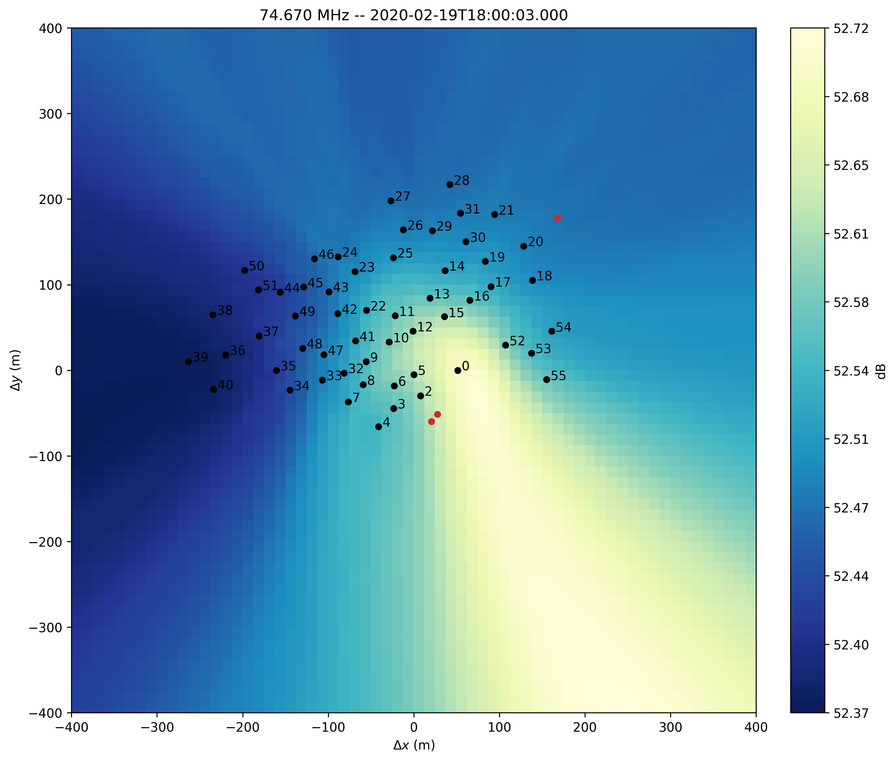
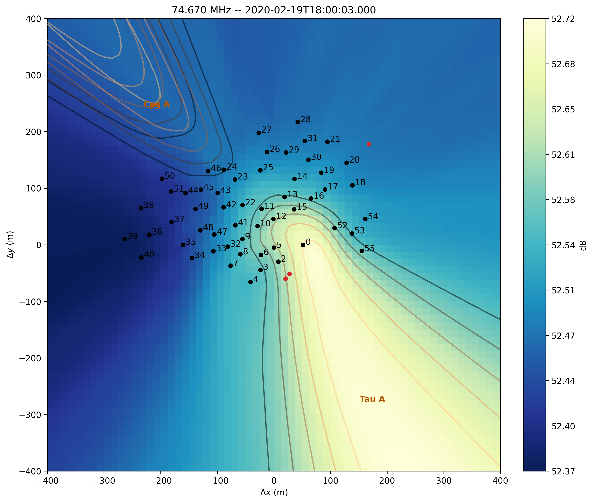
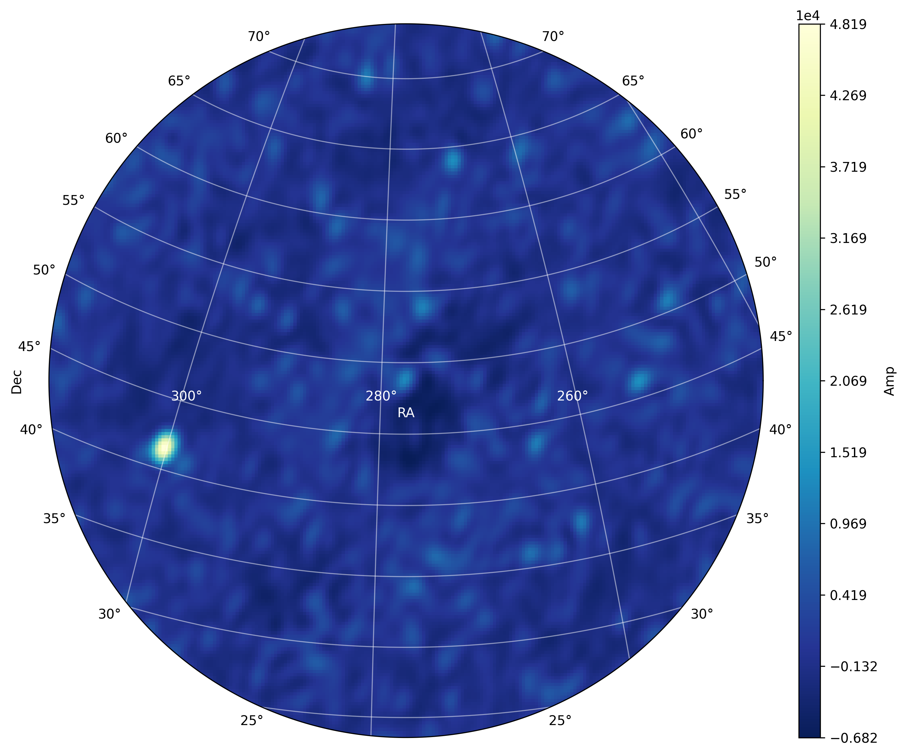

.. _tuto_tv:

XST Imaging
===========

`NenuFAR<https://nenufar.obs-nancay.fr/en/astronomer/>`_ produces cross-correlation statistics data called XST that can be converted to Measurement Set format suited for radio imaging softwares (this is the 'proto-imager' mode, in contrast with the proper imager mode using data from the NICKEL correlator).

When NenuFAR does not observe in XST mode, the cross-correlations are saved with 10 sec integration time and 16 sub-bands of 195.3125 kHz in 5-min exposure time binary files. They are immediately converted in images to be displayed as the NenuFAR-TV and near-field images are also produced.

NenuFAR Cross-Correlation Statistics come in two flavours, namely XST FITS files and NenuFAR-TV binary files. They can be read and analyzed by :class:`~nenupy.crosslet.xstdata.XST_Data` and :class:`~nenupy.crosslet.tvdata.TV_Data` respectively. Both classes inherit from the base class :class:`~nenupy.crosslet.crosslet.Crosslet`, which contains the methods to image and beamform (see :ref:`tuto_beamforming` tutorial) the data.

The following demonstrates how to open XST-like files and analyze them to compute a near-field image and an image such as outputed for the NenuFAR-TV display.

.. warning::
    The following operations are designed to suit small data sets, typically of the NenuFAR-TV file volume (i.e., a few tens/hundred of time steps and 16 sub-bands). Larger data sets should be imaged with the appropriate softwares.

Near-field
----------

A few packages need to be imported in preparation for the following analyzes:

>>> from nenupy.crosslet import XST_Data, TV_Data
>>> from astropy.coordinates import SkyCoord
>>> from astropy.time import Time
>>> import astropy.units as u
>>> import numpy as np

Reading a XST file
^^^^^^^^^^^^^^^^^^

Without any prior information regarding the content of an XST file, we will try to extract relevant features during this tutorial. As we are openning a XST file, it is mandatory to create an instance of :class:`~nenupy.crosslet.xstdata.XST_Data`, namely ``xst``, out of it:

>>> xst = XST_Data('/nenupy/tests/test_data/XST.fits')

It may be useful to catch a glimpse of the observation properties attached to the instance ``xst`` such as the minimal and maximal frequencies (:attr:`~nenupy.crosslet.crosslet.Crosslet.freqMin` and :attr:`~nenupy.crosslet.crosslet.Crosslet.freqMax`, stored as :class:`~astropy.units.Quantity` objects), as well as the observing time boundaries (:attr:`~nenupy.crosslet.crosslet.Crosslet.timeMin` and :attr:`~nenupy.crosslet.crosslet.Crosslet.timeMax` stored as :class:`~astropy.time.Time` objects):

>>> xst.freqMin, xst.freqMax
(<Quantity 68.5546875 MHz>, <Quantity 79.296875 MHz>)
>>> xst.timeMin.isot, xst.timeMax.isot
('2020-02-19T18:00:03.000', '2020-02-19T18:00:03.000')

We can also check which Mini-Arrays were observing by interrogating the attribute :attr:`~nenupy.crosslet.crosslet.Crosslet.mas`, and notice that for this particular observation the Mini-Array 1 was missing:

>>> xst.mas
array([ 0,  2,  3,  4,  5,  6,  7,  8,  9, 10, 11, 12, 13, 14, 15, 16, 17,
       18, 19, 20, 21, 22, 23, 24, 25, 26, 27, 28, 29, 30, 31, 32, 33, 34,
       35, 36, 37, 38, 39, 40, 41, 42, 43, 44, 45, 46, 47, 48, 49, 50, 51,
       52, 53, 54, 55], dtype=int16)

Near-field image computation
^^^^^^^^^^^^^^^^^^^^^^^^^^^^

The near-field image from this dataset is computed by calling the method :meth:`~nenupy.crosslet.crosslet.Crosslet.nearfield` which returns a :class:`~nenupy.crosslet.imageprod.NearField` instance that we store here in the variable ``nf``:

>>> nf = xst.nearfield(
        radius=400,
        npix=64,
        stokes='I'
    )

To display the near-field, we simply use the :meth:`~nenupy.crosslet.imageprod.NearField.plot` method. This outputs an image of the near-field projected on East-North-Up ground coordinates. The positions of the NenuFAR Mini-Arrays that were observing are overplotted, as well as the positions of the NenuFAR and LOFAR containers and the NenuFAR building (the North-East red point, close to Mini-Array 20):

>>> nf.plot()

The bulk of the near-field emission seems to come from the South-East direction. Is it pointing towards a RFI source located close to the instrument or is it mostly due to astrophysical signal?

Astrophysical source near-field imprints
^^^^^^^^^^^^^^^^^^^^^^^^^^^^^^^^^^^^^^^^

In order to disentangle natural sky signals from artifical ones, we can, in addition, compute the simulated near-field imprints of some astronomical radio sources while calling :meth:`~nenupy.crosslet.crosslet.Crosslet.nearfield`:

.. code-block:: python
    :emphasize-lines: 4

    >>> nf = xst.nearfield(
            radius=400,
            npix=64,
            sources=['Cyg A', 'Cas A', 'Vir A', 'Tau A'],
            stokes='I'
        )

From now on, ``nf`` is associated with simulated source imprints stored in the attribute :attr:`~nenupy.crosslet.imageprod.NearField.simuSources`, a dictionnary of normalized near-field astronomical source imprints:

>>> nf.simuSources
{'Cyg A': array([[0.36973997, 0.36983056, ..., 0.30303653, 0.30220664],
        ...,
        [0.84027317, 0.84833398, ..., 0.30367309, 0.30292642]]),
 'Cas A': array([[0.39770227, 0.39728737, ..., 0.32404009, 0.32333835],
        ...,
        [0.69990683, 0.70700826, ..., 0.31558797, 0.31470316]]),
 'Tau A': array([[0.35457077, 0.35651137, ..., 0.5925085 , 0.58966196],
        ...,
        [0.3434035 , 0.34473719, ..., 0.39456978, 0.39444474]])}

Although the ``sources`` argument of the method :meth:`~nenupy.crosslet.crosslet.Crosslet.nearfield` was filled with four sources to simulate, :attr:`~nenupy.crosslet.imageprod.NearField.simuSources` only contains the near-field imprints of three of them, Virgo A discarded. This is because Vir A was below 10 degrees elevation during the observation and was therefore not taken into account.

Calling again the :meth:`~nenupy.crosslet.imageprod.NearField.plot` method, we obtain the same near-field image as before, but for the overlays of the astronomical source near-field imprints:

>>> nf.plot()

Thanks to this image, we know that the near-field emission is dominated by natural signal, coming from the radio source Taurus A, which may dominate the data-sets because the analogical beam were directed towards this particular source (and thus explains why Cas A and Cyg A, although bright sources, do not appear here).

Locating near-field emission
^^^^^^^^^^^^^^^^^^^^^^^^^^^^

Once the near-field is computed and stored in the ``nf`` variable, it might be useful to localize the origin of the maximal emission (for instance, it can be associated with an artifical instrument that is emitting in the observing frequency band).

In our example, the near-field does not seem to contain such RFI signals. However, it may be relevant for other datasets to query the :attr:`~nenupy.crosslet.imageprod.NearField.maxPosition` attribute, which returns an :class:`~astropy.coordinates.EarthLocation` object in order to precisely assess its position on the ground:

>>> nf.maxPosition
[(4324292,165783.21,4670150.8)]m
>>> nf.maxPosition.lon
[2°11'43.838'']
>>> nf.maxPosition.lat
[47°22'22.4878'']

Storing near-field file
^^^^^^^^^^^^^^^^^^^^^^^

TBD

NenuFAR-TV
----------

TV image production requires loading of the :class:`~nenupy.crosslet.tvdata.TV_Data` class, which inherits from :class:`~nenupy.crosslet.crosslet.Crosslet`:

>>> from nenupy.crosslet import TV_Data

An instance of :class:`~nenupy.crosslet.tvdata.TV_Data` is made by simply giving the path to the NenuFAR-TV data file:

>>> tv = TV_Data('20191204_132113_nenufarTV.dat')

As the object ``tv`` is also of type :class:`~nenupy.crosslet.crosslet.Crosslet`, it has access to the :class:`~nenupy.crosslet.crosslet.Crosslet.image` method which performs imaging of the cross-correlation data in a few steps:

* Initialize a :class:`~nenupy.astro.hpxsky.HpxSky` object, allowing for a `HEALPix <https://healpix.jpl.nasa.gov/>`_ sky representation and accessing methods such as :meth:`~nenupy.astro.hpxsky.HpxSky.lmn` in order to convert sky equatorial coordinates in image domain coordinates.
* Compute UVW coordinates associated with the NenuFAR configuration corresponding to the data file with :meth:`~nenupy.crosslet.uvw.UVW.fromCrosslets` classmethod.

.. note::
    UV coverage plot can be achieved in a straightforward manner with :meth:`~nenupy.crosslet.uvw.UVW.fromCrosslets`:

    >>> from nenupy.crosslet import UVW
    >>> import matplotlib.pyplot as plt
    >>> uvw = UVW.fromCrosslets(tv)
    >>> plt.plot(
            uvw.uvw[0, :, 0],
            uvw.uvw[0, :, 1],
            linestyle='',
            marker='.',
            color='tab:blue'
        )
    >>> plt.plot(
            -uvw.uvw[0, :, 0],
            -uvw.uvw[0, :, 1],
            linestyle='',
            marker='.',
            color='tab:blue'
        )
    >>> plt.xlabel('U (m)')
    >>> plt.ylabel('V (m)')
    >>> plt.title('Instantaneous UV coverage (local zenith-phased)')

    .. image:: ./_images/uvcoverage.png
      :width: 700

* Perform the Fourier Transform of the cross-correlations to compute the image (auto-correlations are flagged for this process).

The HEALPix ``resolution`` and the field of view centered on the local zenith ``fov`` must be set:

>>> import astropy.units as u
>>> im = tv.image(
        resolution=0.2*u.deg,
        fov=60*u.deg
    )

The image is now computed and stored as a :class:`~nenupy.astro.hpxsky.HpxSky` object in the ``im`` variable and can be displayed and centered on a particular sky position (using :class:`~astropy.coordinates.SkyCoord`) here the source 3C 380:

>>> from astropy.coordinates import SkyCoord
>>> src_3c380 = SkyCoord(
        ra=277.382*u.deg,
        dec=48.746*u.deg
    )

>>> im.plot(
        db=False,
        center=src_3c380
        size=30 * u.deg,
    )

