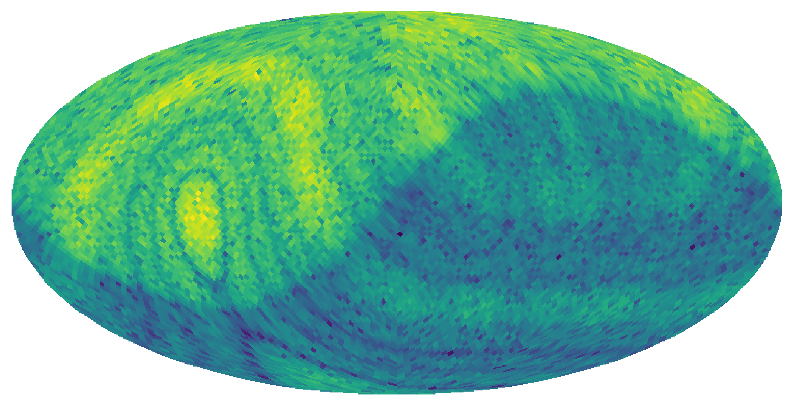
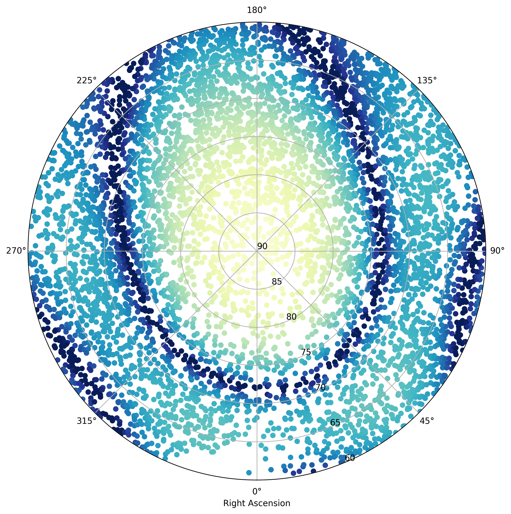

.. _tuto_beam:

Discrete beam model
===================

Rather than computing the NenuFAR beam on the whole sky with a pre-defined grid of pixels with `HEALPix <https://healpix.jpl.nasa.gov/>`_ coordinates (:class:`~nenupy.beam.hpxbeam.HpxABeam`, :class:`~nenupy.beam.hpxbeam.HpxDBeam`), some use-cases only require to compute the beam values at some specific sky coordinates.
This allows for **faster computation**, since the number of points involved is usually lower than a typical HEALPix sky decomposition, and **more precise** as the user decides on the coordinates to solve for.

.. seealso::
    :ref:`tuto_beam_ref`, a tutorial to simulate NenuFAR beam on HEALPix grid.

Throughout this tutorial, some dependencies will be called upon. Most of them are related to coordinates and physical units (:mod:`astropy.coordinates`, :mod:`astropy.time` and :mod:`astropy.units`) in order to precisely define the beam computation configuration:

>>> import numpy as np
>>> import astropy.units as u
>>> from astropy.coordinates import SkyCoord
>>> from astropy.time import Time

Analogical beam model
---------------------

Discrete analogical beam model is enabled with the :class:`~nenupy.beam.beam.ABeam` class, which inherits from the base class :class:`~nenupy.beam.beam.Beam` (which contains methods to compute the NenuFAR antenna gain :meth:`~nenupy.beam.beam.Beam.ant_gain` and the array factor :meth:`~nenupy.beam.beam.Beam.array_factor` that can be applied to Mini-Array antennas or NenuFAR Mini-Arrays):

>>> from nenupy.beam import ABeam

The instance ``anabeam`` of the :class:`~nenupy.beam.beam.ABeam` class is thereafter created with proper attribute filling. :attr:`~nenupy.beam.beam.Beam.freq` is the frequency at which the beam should be computed, :attr:`~nenupy.beam.beam.Beam.polar` is the NenuFAR antenna polarization used (either ``'NW'`` or ``'NE'``), the desired analogical pointing direction in azimuth/elevation is described by :attr:`~nenupy.beam.beam.ABeam.azana` and :attr:`~nenupy.beam.beam.ABeam.elana`, and finally the Mini-Array name :attr:`~nenupy.beam.beam.ABeam.ma` useful to know the corresponding array rotation on the ground:

>>> anabeam = ABeam(
        freq=50*u.MHz,
        polar='NE',
        azana=180*u.deg,
        elana=90*u.deg,
        ma=0
    )

Furthermore, user can also control the beam-squint correction (see also :func:`~nenupy.instru.instru.desquint_elevation`): if it should be applied or not (with :attr:`~nenupy.beam.beam.ABeam.beamsquint`); and, if applied, at which frequency should it be optimized (with :attr:`~nenupy.beam.beam.ABeam.squint_freq`):

>>> anabeam.squint_freq = 50*u.MHz
>>> anabeam.beamsquint = True

Observation time ``obs_time`` is defined below as a :class:`~astropy.time.Time` object. This is mandatory in order to scale NenuFAR beam (with antenna gain defined in a local frame) on the equatorial coordinate system. Secondly, the sky positions at which the user wants to compute NenuFAR beam values are also given as :class:`~astropy.coordinates.SkyCoord` object and gathered within the ``sources`` variable: 

>>> obs_time = Time('2020-04-01 12:00:00')
>>> sources = SkyCoord(
        ra=np.array([299.868, 350.850])*u.deg,
        dec=np.array([40.734, 58.815])*u.deg
    )

NenuFAR analogical beam model values may then be retrieved for the required coordinates ``sources`` at the given time ``obs_time`` with the method :meth:`~nenupy.beam.beam.ABeam.beam_values`:

>>> gain_vals = anabeam.beam_values(
        coords=sources,
        time=obs_time
    )

.. warning::
    NenuFAR beam values returned by :meth:`~nenupy.beam.beam.ABeam.beam_values`, and stored as ``gain_vals`` are un-normalized values that should be taken as coefficient values to serve relative comparison purposes only. There is no physical sense to simply look at a unique sky coordinates for its beam value. 

Digital beam model
------------------

Computation of the so-called digital beam of NenuFAR, considering several Mini-Arrays, is similar to the analogical beam model one, although done with a specific class :class:`~nenupy.beam.beam.DBeam` which also inherits from :class:`~nenupy.beam.beam.Beam`. During the beam computation, it calls at most six times :class:`~nenupy.beam.beam.ABeam` depending on the Mini-Arrays required (which can be at six different rotation configuration due to their hexagonal geometry and physical rotations of the MAs on the field by steps of 10 degrees).

Apart from the attributes previously described, and relative to :class:`~nenupy.beam.beam.ABeam` class definition, a few are added: :attr:`~nenupy.beam.beam.DBeam.azdig` and :attr:`~nenupy.beam.beam.DBeam.eldig` are the desired digital pointing direction in local sky coordinates azimuth and elevation, :attr:`~nenupy.beam.beam.DBeam.ma` defines an array of Mini-Array names:

>>> from nenupy.beam import DBeam
>>> digibeam = DBeam(
        freq=70*u.MHz,
        polar='NE',
        azana=180*u.deg,
        elana=45*u.deg,
        azdig=180*u.deg,
        eldig=45*u.deg,
        ma=np.arange(56),
        squint_freq=70*u.MHz
    )

The discrete NenuFAR beam model computation can be applied to any set of sky coordinates, it is in particular true if this set corresponds to the HEALPix grid coordinates. The HEALPix grid can be reconstructed using :func:`~healpy.pixelfunc.nside2npix` (to determine the number of pixel at a given ``nside``, see also `HEALPix Pixel Coordinates <https://lambda.gsfc.nasa.gov/toolbox/tb_pixelcoords.cfm>`_) and :func:`~healpy.pixelfunc.pix2ang` (to convert the pixels indices to equatorial coordinates) functions:

>>> from healpy.pixelfunc import nside2npix, pix2ang
>>> npix = nside2npix(nside=32)
>>> healpix_ra, healpix_dec = pix2ang(
        nside=32,
        ipix=np.arange(npix),
        lonlat=True
    )

The coordinates ``healpix_ra`` and ``healpix_dec`` contain the Right Ascension and Declination of the HEALPix grid of ``nside=32`` and therefore can be gathered to form a :class:`~astropy.coordinates.SkyCoord` object to be fed to the :meth:`~nenupy.beam.beal.DBeam.beam_values` method:

>>> beam = digibeam.beam_values(
        coords=SkyCoord(
            ra=healpix_ra*u.deg,
            dec=healpix_dec*u.deg
        ),
        time=Time.now()
    )

NenuFAR beam values stored in the ``beam`` variable can then be plotted using, for instance, the :func:`~healpy.visufunc.mollview` function:

and compared with results obtained with the HEALPIx specific NenuFAR beam computation classes :class:`~nenupy.beam.hpxbeam.HpxABeam` and :class:`~nenupy.beam.hpxbeam.HpxDBeam` (see also :ref:`tuto_beam_ref`).

Beam dependent skymodel
-----------------------

A typical use-case of such discrete NenuFAR beam model computation is the direction dependent calibration using a skymodel affected by NenuFAR beam. The tutorial below describes how to get low-frequency radio point-source positions and fluxes and how to compute the analogical NenuFAR beam response at their sky coordinates.

>>> from nenupy.beam import ABeam
>>> from nenupy.skymodel import extrapol_flux, get_point_sources
>>> from nenupy.astro import toAltaz

The sources are looked for within a 30 degree ``radius`` around the North Celestial Pole position (``ncp``) at a given time (``obst``) and frequency ``freq``:

>>> ncp = SkyCoord(
        ra=0*u.deg,
        dec=90*u.deg
    )
>>> obst = Time('2020-04-01 12:00:00')
>>> freq = 50*u.MHz
>>> radius = 30*u.deg

They are retrieved using the LOFAR `Global SkyModel creator <https://lcs165.lofar.eu/>`_ (made from TGSS, NVSS, WENSS and VLSS catalogs) via the function :func:`~nenupy.skymodel.pointsource.get_point_sources`. Their positions (:class:`~astropy.coordinates.SkyCoord` object) are stored in the ``srcs`` variable whereas their fluxes (:class:`~numpy.ndarray` object, extrapolated at the required frequency ``freq``) are stored in ``fluxes``:

>>> srcs, fluxes = get_point_sources(
        freq=freq,
        center=ncp,
        radius=radius
    )

The function :func:`~nenupy.astro.astro.toAltaz` is used to convert the equatorial coordinates of ``ncp`` in local coordinates at the observation time ``obst``:

>>> ncp_altaz = toAltaz(
        skycoord=ncp,
        time=obst
    )

An :class:`~nenupy.beam.beam.ABeam` instance ``anabeam`` can then be generated as it was previously explained:

>>> anabeam = ABeam(
        freq=freq,
        polar='NE',
        azana=ncp_altaz.az,
        elana=ncp_altaz.alt,
        ma=0
    )
>>> anabeam.squint_freq = freq
>>> anabeam.beamsquint = True

The beam values are computed for each source position (``srcs``) and stored in ``vals``:

>>> vals = anabeam.beam_values(
        coords=srcs,
        time=obst
    )

and displayed on a Right Ascension / Declination polar plot centered on the North Celestial Pole: 

>>> import matplotlib.pyplot as plt
>>> ax = plt.subplot(111, projection='polar')
>>> ax.set_rlim(bottom=90, top=90-radius.value)
>>> ax.set_theta_zero_location('S')
>>> sc = ax.scatter(
        x=srcs.ra.rad,
        y=srcs.dec.deg,
        c=np.log10(np.ones(fluxes.size)*vals),
    )

