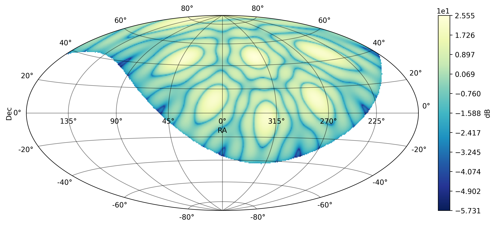
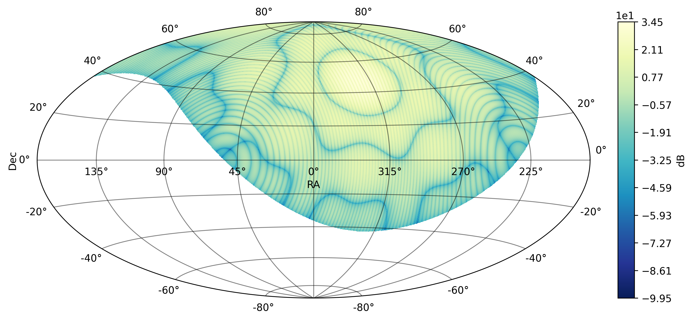
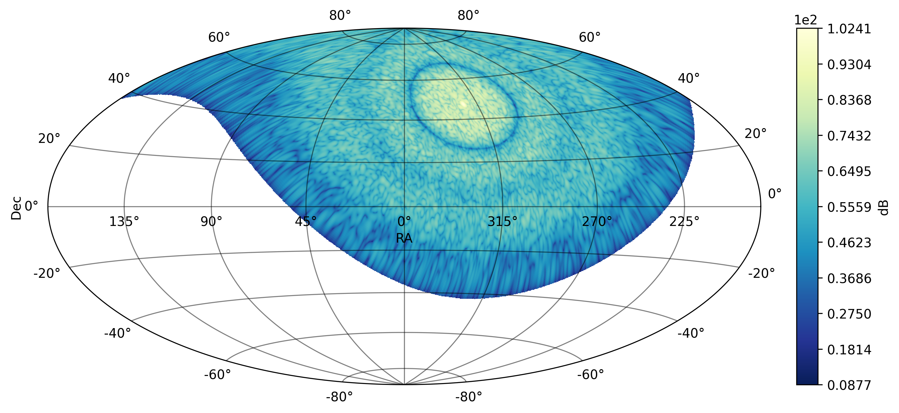

Beam simulation
===============

One Mini-Array / SST beam
-------------------------

Computation of a Mini-Array beam (also here referred to as 'Analog beam') requires to load the :class:`~nenupy.beam.hpxbeam.HpxABeam` class:

>>> from nenupy.beam import HpxABeam

It may also useful to load as well the :class:`~astropy.time.Time` and :class:`~astropy.units.Quantity` modules in order to specify the parameter units.

>>> from astropy.time import Time
>>> import astropy.units as u

The :class:`~nenupy.beam.hpxbeam.HpxABeam` object inherits from the :class:`~nenupy.astro.hpxsky.HpxSky` class, that enables sky coordinates handling using `HEALPix <https://healpix.jpl.nasa.gov/>`_ representation. Instanciation of :class:`~nenupy.beam.hpxbeam.HpxABeam` object is made while setting the ``resolution`` parameter (by default, the value is assumed to be expressed in degrees, but it might be safer to specify the unit):

>>> anabeam = HpxABeam(
        resolution=0.5 * u.deg
    )

A :class:`~nenupy.astro.hpxsky.HpxSky` object has been created with the HEALPix resolution closest to the required 0.5 degrees (see for e.g. the `HEALPix pixel information <https://lambda.gsfc.nasa.gov/toolbox/tb_pixelcoords.cfm>`_ to look for available pixel sizes). 

.. note::
    Therefore, the ``nside`` attribute has been set:

    >>> anabeam.nside
        128
        
    which, by looking a the conversion table, corresponds to a mean spacing of 0.4581 degrees (see also :func:`~healpy.pixelfunc.nside2resol`).

.. warning::
    The higher the resolution, the longer it will take for the computation to perform. For most cases, the ``resolution`` parameter doesn't need to be set lower than 0.2 or 0.1 degrees. Check the beam width at a given frequency on the `NenuFAR summary <https://nenufar.obs-nancay.fr/en/astronomer/>`_.

Beam computation is then simply performed by calling the :meth:`~nenupy.beam.hpxbeam.HpxABeam.beam` method. The example below simulates the beam from the Mini-Array 02 towards local zenith (i.e. azimuth=180deg, elevation=90deg) at a given time: 

>>> anabeam.beam(
        freq=80*u.MHz,
        azana=180*u.deg,
        elana=90*u.deg,
        ma=2,
        time=Time('2020-03-13 10:00:00')
    )

.. note::
    Setting the ``time`` parameter (default is current time) allows for computing the correspondance between visible sky from NenuFAR's location and the equatorial coordinates. This also masks unseen pixels for plotting and further computation purposes.

.. note::
    Some other parameters may also be given for the Analog beam computation, see :class:`~nenupy.beam.hpxbeam.HpxABeam` for the full description. For e.g., the frequency used to compensate for the beamsquint effect can be modified using the ``squintfreq`` keyword:

    >>> anabeam.beam(
        freq=80*u.MHz,
        azana=180*u.deg,
        elana=90*u.deg,
        ma=2,
        time=Time('2020-03-13 10:00:00'),
        squintfreq=50*u.MHz
    )

The beam is now computed and recorded in the :attr:`~nenupy.astro.hpxsky.HpxSky.skymap` attribute, which is basically a :class:`~numpy.ma.MaskedArray` containing the 1D HEALPix map (RING ordered).

:meth:`~nenupy.astro.hpxsky.HpxSky.plot` can be used to plot the beam:

>>> anabeam.plot()

Several Mini-Arrays / BST beam
------------------------------

Computation of the NenuFAR beam (also here referred to as 'Digital beam') requires to load the :class:`~nenupy.beam.hpxbeam.HpxDBeam` class and the following process is roughly similar to the above analog beam computation.

>>> from nenupy.beam import HpxDBeam
>>> digibeam = HpxDBeam(
        resolution=0.2 * u.deg
    )

Aiming at seeing finer structures in the beam, the ``resolution`` has been set to a lower value. Furthermore, besides ``azana`` and ``elana`` that define the analog pointing (and rely on :func:`~nenupy.instru.instru.analog_pointing` to determine the effective pointing with respect to available physical cable delay combinations and :func:`~nenupy.instru.instru.desquint_elevation` to correct for beamsquint effect), the digital pointing direction needs also to be precised using ``azdig`` and ``eldig`` keywords:

>>> digibeam.beam(
        freq=40*u.MHz,
        azana=180*u.deg,
        elana=90*u.deg,
        azdig=180*u.deg,
        eldig=90*u.deg,
        ma=[17, 44],
        time=Time('2020-03-13 10:00:00')
    )

The above example computes the beam for the NenuFAR array, using only a pair of Mini-Arrays, namely 17 and 44 which are roughly located on a East-West direction. Therefore, the array factor results in beam fringes that are North-South orientated:

>>> digibeam.plot()

Any subset of Mini-Arrays can be given, the following example computes the NenuFAR array made of 56 Mini-Arrays:

>>> digibeam.beam(
        freq=40*u.MHz,
        azana=180*u.deg,
        elana=90*u.deg,
        azdig=180*u.deg,
        eldig=90*u.deg,
        ma=numpy.arange(56),
        time=Time('2020-03-13 10:00:00')
    )

>>> digibeam.plot()

