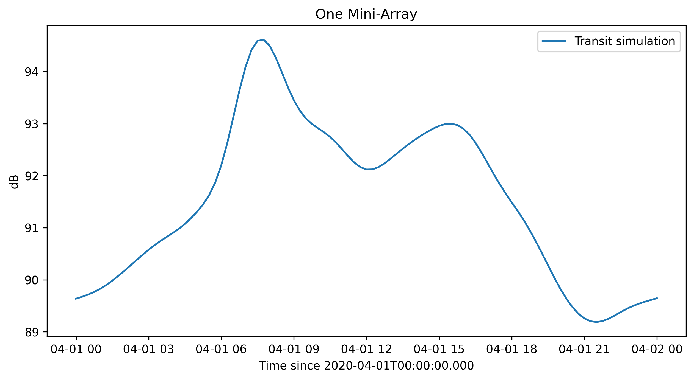
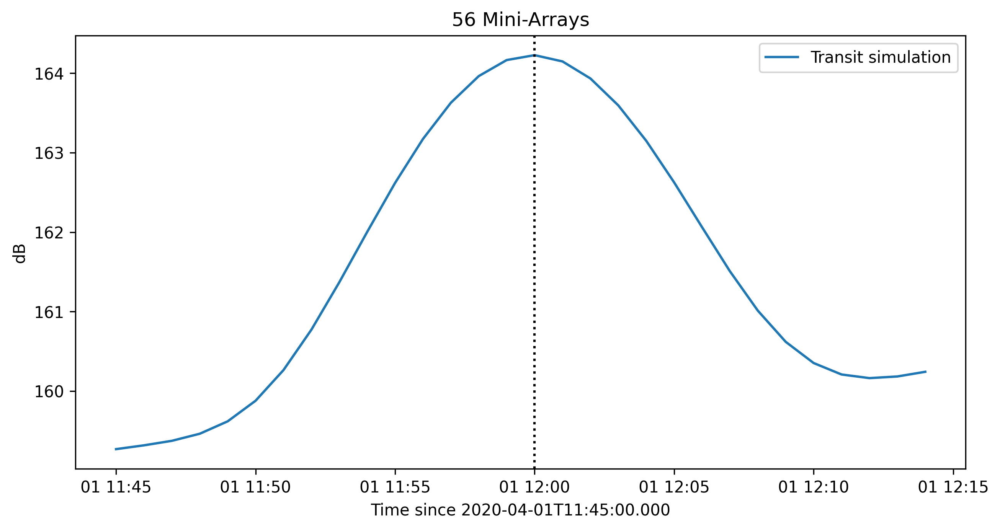
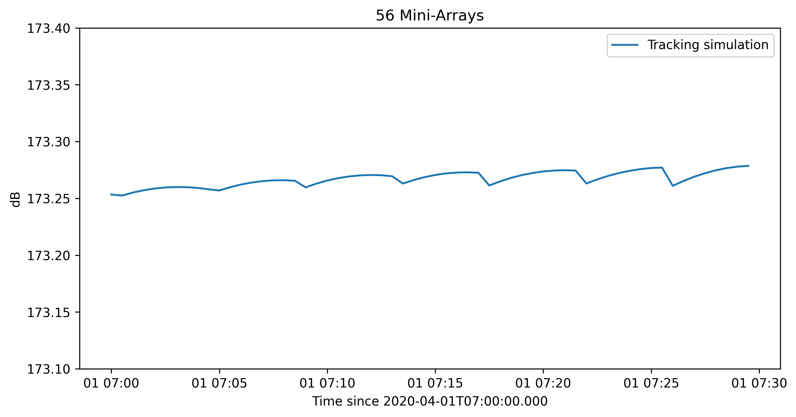
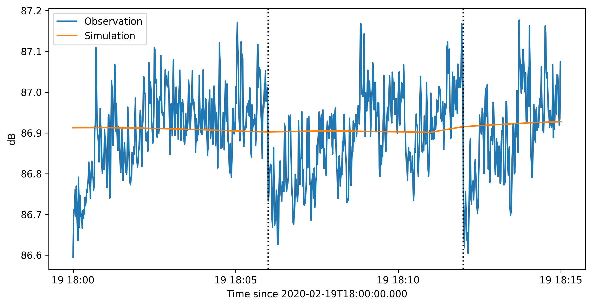

.. _tuto_simu_ref:

Observation simulations
=======================

Simulating NenuFAR observations are permitted thanks to the :class:`~nenupy.simulation.hpxsimu.HpxSimu` class which inherits from the :class:`~nenupy.astro.hpxsky.HpxSky` class, that enables sky coordinates handling using `HEALPix <https://healpix.jpl.nasa.gov/>`_ representation.

>>> from nenupy.simulation import HpxSimu

In order to keep control of the parameter units, it is recommanded to use :class:`~astropy.units.Quantity`, :class:`~astropy.time.Time` and :class:`~astropy.time.TimeDelta` objects:

>>> from astropy.time import Time, TimeDelta
>>> import astropy.units as u

Besides :class:`~nenupy.astro.hpxsky.HpxSky`, simulations make use of :class:`~nenupy.skymodel.hpxgsm.HpxGSM` class that wraps the `PyGSM module <https://github.com/telegraphic/PyGSM>`_ (see `Oliveira-Costa et. al., 2008 <https://onlinelibrary.wiley.com/doi/abs/10.1111/j.1365-2966.2008.13376.x>`_) while using all functionalities of :class:`~nenupy.astro.hpxsky.HpxSky`, namely finding out the visible portion of the sky at a given time. This is intended to build a skymodel at NenuFAR frequencies (10 - 80 MHz).
:class:`~nenupy.simulation.hpxsimu.HpxSimu` computes the NenuFAR beam corresponding to the desired array configuration, taking into account instrumental effects, and multiply it with the GSM skymodel.

.. note::
    Simulation computation time depends on several parameters. In order to optimize it, here are some recommended configurations:

    * SST simulation: ``resolution~1deg``, ``dt~10min``
    * BST simumation: ``resolution~0.1deg``, ``dt~1min``

.. warning::
    Although most intrumental effects are taken into consideration, some still remains to be understood (such as the pointing shift) and some are difficult to take into account (e.g., individual component misbehaviour). Besides, the GSM is not perfect at these low-frequencies (especially regarding point-source apparent size which can be wider than NenuFAR's beam). Therefore, these simulations should always be interpreted in light of the aforementioned and underlying caveats.

Transit observation
-------------------

The following demonstrates how to simulate a transit observation (i.e., NenuFAR is pointing towards the same local coordinates for the whole observation duration) occuring at ``transit_time``:

>>> transit_time = Time('2020-04-01 12:00:00')

from two distinct requirements:

From local transit coordinates
^^^^^^^^^^^^^^^^^^^^^^^^^^^^^^

Transit observation simulations can imitate NenuFAR array pointing towards a local sky coordinates and therefore needs to be provided with an :class:`~astropy.coordinates.AltAz` object. It can be easily produced with the :func:`~nenupy.astro.astro.ho_coord` function:

>>> from nenupy.astro import ho_coord
>>> transit_altaz = ho_coord(
        az=180 * u.deg,
        alt=90 * u.deg,
        time=transit_time
    )

``transit_altaz`` then corresponds to the local zenith.

Setting up NenuFAR array with only one Mini-Array (namely 00), to simulate a SST obervation at 40 MHz with a sky resolution of 1deg and other keywords passed to :class:`~nenupy.simulation.hpxsimu.HpxSimu`:

>>> simu = HpxSimu(
        freq=40*uMHz,
        resolution=1*u.deg,
        ma=0,
        polar='NW'
    )

The call of :meth:`~nenupy.simulation.hpxsimu.HpxSimu.azel_transit` allows for the simulation to start. ``dt`` and ``duration`` keywords stand respectively for simulation time step and total duration of the simulation (``t0=transit_time`` being the mid-time of the simulation).

>>> result = simu.azel_transit(
        acoord=transit_altaz,
        t0=transit_time,
        dt=TimeDelta(15*60, format='sec'),
        duration=TimeDelta(24*3600, format='sec'),
    )

simulates a transit observation of NenuFAR containing a single Mini-Array pointing towards the local zenith for a whole day. Simulation is here stored in the ``result`` variable which is a :class:`~nenupy.beamlet.sdata.SData` object having some properties helpful for analysing and plotting purposes: 

>>> import matplotlib.pyplot as plt
>>> plt.plot(
        result.datetime,
        result.db,
        label='Transit simulation'
    )
>>> plt.legend()
>>> plt.title('One Mini-Array')
>>> plt.ylabel('dB')
>>> plt.xlabel('Time since {}'.format(result.time[0].isot))

From equatorial transit coordinates
^^^^^^^^^^^^^^^^^^^^^^^^^^^^^^^^^^^

Rather than using :class:`~astropy.coordinates.AltAz`, it might be of interest to simulate a transit of a given astrophysical source (i.e., in equatorial coordinates with :class:`~astropy.coordinates.ICRS`) at a particular time (here ``transit_time``), which can be eased by :func:`~nenupy.astro.astro.eq_coord`: 

>>> from nenupy.astro import eq_coord
>>> cyga_radec = eq_coord(
        ra=299.868*u.deg,
        dec=40.733*u.deg
    )

``cyga_radec`` is an instance of :class:`~astropy.coordinates.ICRS` for the Cygnus A source position.

Simulation is initialized as previously shown, but for the Mini-Arrays parameter ``ma`` set to a list of 56 components (rather than one) implying the full (as of April 2020) NenuFAR array. The beam is significantly smaller in this configuration compared to the single Mini-Array beam, therefore a smaller ``resolution`` is also preferred:

>>> simu = HpxSimu(
        freq=40*u.MHz,
        resolution=0.5*u.deg,
        ma=np.arange(56),
        polar='NW'
    )

The method :meth:`~nenupy.simulation.hpxsimu.HpxSimu.radec_transit` is used to compute the simulation on a total ``duration`` of 30 minutes with a time step ``dt`` of 1 min:

>>> result = simu.radec_transit(
        acoord=cyga_radec,
        t0=transit_time,
        dt=TimeDelta(60, format='sec'),
        duration=TimeDelta(30*60, format='sec'),
    )

Simulation ``result`` is a :class:`~nenupy.beamlet.sdata.SData` object and can be shown along with a vertical line indicating the requested transit time of Cyg A.

>>> import matplotlib.pyplot as plt
>>> plt.plot(
        result.datetime,
        result.db,
        label='Transit simulation'
    )
>>> plt.axvline(
        transit_time.datetime,
        color='black',
        linestyle=':'
    )
>>> plt.legend()
>>> plt.title('56 Mini-Arrays')
>>> plt.ylabel('dB')
>>> plt.xlabel('Time since {}'.format(result.time[0].isot))

Tracking observation
--------------------

Simulating a tracking observation (i.e., fixed pointing in equatorial coordinates) is fairly similar to the aforementioned simulation of a transit observation (see above for a more detailed description regarding the initialization).

Once the :class:`~nenupy.simulation.hpxsimu.HpxSimu` instance is properly set up, the :meth:`~nenupy.simulation.hpxsimu.HpxSimu.radec_tracking` method allows for simulating a tracking. Here, Cygnus A ``cyga_radec`` is followed since 2020-04-01 07:00:00 and for 30 minutes with a time step of 10 sec:

>>> result = simu.radec_tracking(
        acoord=cyga_radec,
        t0=Time('2020-04-01 07:00:00'),
        dt=TimeDelta(10, format='sec'),
        duration=TimeDelta(30*60, format='sec'),
    )

Again, ``result`` is a :class:`~nenupy.beamlet.sdata.SData` object, and the simulation profile can be shown:

>>> plt.plot(
        result.datetime,
        result.db,
        label='Tracking simulation'
    )
>>> plt.legend()
>>> plt.title('56 Mini-Arrays')
>>> plt.ylabel('dB')
>>> plt.xlabel('Time since {}'.format(result.time[0].isot))

.. note::
    Irregularities in the time profile of the Cygnus A tracking is due to the discrete grid of analog-pointable positions (see `NenuFAR website Figure 9 <https://nenufar.obs-nancay.fr/en/astronomer/#pointing>`_).

Simulating BST observations
---------------------------

There is a need in simulating real observations, taking into account actual instrument pointing, in order to assess the correct behaviour of NenuFAR. If NenuFAR BST observation files are available, there is the possiblity to simulate with :class:`~nenupy.simulation.hpxsimu.HpxSimu` the contained observations as they occurred, since every instrument and observation configuration metadata are included within the BST FITS files.

A BST observation is loaded using the :class:`~nenupy.beamlet.bstdata.BST_Data` class and, in the following, instanciated as the ``bst`` variable: 

>>> from nenupy.beamlet import BST_Data
>>> bst = BST_Data('20200219_175900_BST.fits')
>>> data = bst.select(
        freqrange=60*u.MHz
    )

The file ``'20200219_175900_BST.fits'`` contains a Taurus A tracking observation. The :meth:`~nenupy.beamlet.bstdata.BST_Data.select` method allows for data selection. Here, in order to simulate a time-profile, a single frequency is selected (the :class:`~nenupy.beamlet.bstdata.BST_Data` object is updated while performing any data selection). The data selected are stored in the ``data`` variable, a :class:`~nenupy.beamlet.sdata.SData` object as well.

The classmethod :class:`~nenupy.simulation.hpxsimu.HpxSimu.from_bst` from :class:`~nenupy.simulation.hpxsimu.HpxSimu` takes as input a :class:`~nenupy.beamlet.bstdata.BST_Data` object (here ``bst``) and the current selection are read in order to perform the simulation:

>>> result = HpxSimu.from_bst(
        bstdata=bst,
        resolution=0.2*u.deg,
        dt=TimeDelta(60, format='sec')
    )

In order to compare simulation ``result`` with real BST ``data``, the simulation needs to be scaled as it is not calibrated, this can be done, in a quick manner by:

>>> scale = np.median(data.db) / np.median(result.db)

And here is the result:

>>> plt.plot(
        data.datetime,
        data.db,
        label='Observation'
    )
>>> plt.plot(
        result.datetime,
        result.db * scale,
        label='Simulation'
    )
>>> plt.ylabel('dB')
>>> plt.xlabel('Time since {}'.format(result.time[0].isot))
>>> plt.legend()
>>> plt.axvline(
        (dd.time[0] + TimeDelta(6*60, format='sec')).datetime,
        color='black',
        linestyle=':'
    )
>>> plt.axvline(
        (dd.time[0] + TimeDelta(12*60, format='sec')).datetime,
        color='black',
        linestyle=':'
    )

.. note::
    The simulation is of course much smoother than the observation which is affected by noise and also by a few tenths of dB variation due to analog pointing switchs, highlighted in the figure by the vertical dotted black lines 
    (see also `Identified features under study <https://nenufar.obs-nancay.fr/en/astronomer/>`_).
