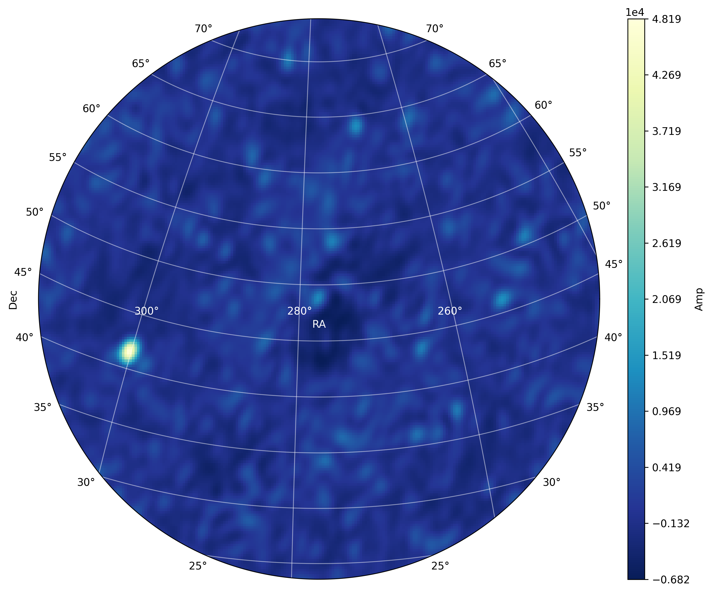

.. _tuto_tv:

NenuFAR TV image
================

NenuFAR produces cross-correlation statistics data called XST that can be converted to Measurement Set format suited for radio imaging softwares (this is the 'proto-imager' mode, in contrast with the proper imager mode using data from the NICKEL correlator).

When NenuFAR does not observe in XST mode, the cross-correlations are saved with 10 sec integration time and 16 sub-bands in 5-min exposure time binary files. They are immediately converted in images and displayed as the NenuFAR-TV.

TV image production requires loading of the :class:`~nenupy.crosslet.tvdata.TV_Data` class, which inherits from :class:`~nenupy.crosslet.crosslet.Crosslet`:

>>> from nenupyst.crosslet import TV_Data

An instance of :class:`~nenupy.crosslet.tvdata.TV_Data` is made by simply giving the path to the NenuFAR-TV data file:

>>> tv = TV_Data('20191204_132113_nenufarTV.dat')

As the object ``tv`` is also of type :class:`~nenupy.crosslet.crosslet.Crosslet`, it has access to the :class:`~nenupy.crosslet.crosslet.Crosslet.image` method which performs imaging of the cross-correlation data in a few steps:

* Initialize a :class:`~nenupy.astro.hpxsky.HpxSky` object, allowing for a `HEALPix <https://healpix.jpl.nasa.gov/>`_ sky representation and accessing methods such as :meth:`~nenupy.astro.hpxsky.HpxSky.lmn` in order to convert sky equatorial coordinates in image domain coordinates.
* Compute UVW coordinates associated with the NenuFAR configuration corresponding to the data file with :meth:`~nenupy.crosslet.uvw.UVW.from_tvdata` classmethod.

.. note::
    UV coverage plot can be achieved in a straightforward manner with :meth:`~nenupy.crosslet.uvw.UVW.from_tvdata`:

    >>> from nenupy.crosslet import UVW
    >>> import matplotlib.pyplot as plt
    >>> uvw = UVW.from_tvdata(tv)
    >>> plt.plot(
            uvw.uvw[0, :, 0],
            uvw.uvw[0, :, 1],
            linestyle='',
            marker='.',
            color='tab:blue'
        )
    >>> plt.plot(
            -uvw.uvw[0, :, 0],
            -uvw.uvw[0, :, 1],
            linestyle='',
            marker='.',
            color='tab:blue'
        )
    >>> plt.xlabel('U (m)')
    >>> plt.ylabel('V (m)')
    >>> plt.title('Instantaneous UV coverage (local zenith-phased)')

    .. image:: ./_images/uvcoverage.png
      :width: 700

* Perform the Fourier Transform of the cross-correlations to compute the image (auto-correlations are flagged for this process).

The HEALPix ``resolution`` and the field of view centered on the local zenith ``fov`` must be set:

>>> import astropy.units as u
>>> im = tv.image(
        resolution=0.2*u.deg,
        fov=60*u.deg
    )

The image is now computed and stored as a :class:`~nenupy.astro.hpxsky.HpxSky` object in the ``im`` variable and can be displayed and centered on a particular sky position (using :class:`~astropy.coordinates.SkyCoord`) here the source 3C 380:

>>> from astropy.coordinates import SkyCoord
>>> src_3c380 = SkyCoord(
        ra=277.382*u.deg,
        dec=48.746*u.deg
    )

>>> im.plot(
        db=False,
        center=src_3c380
        size=30 * un.deg,
    )

