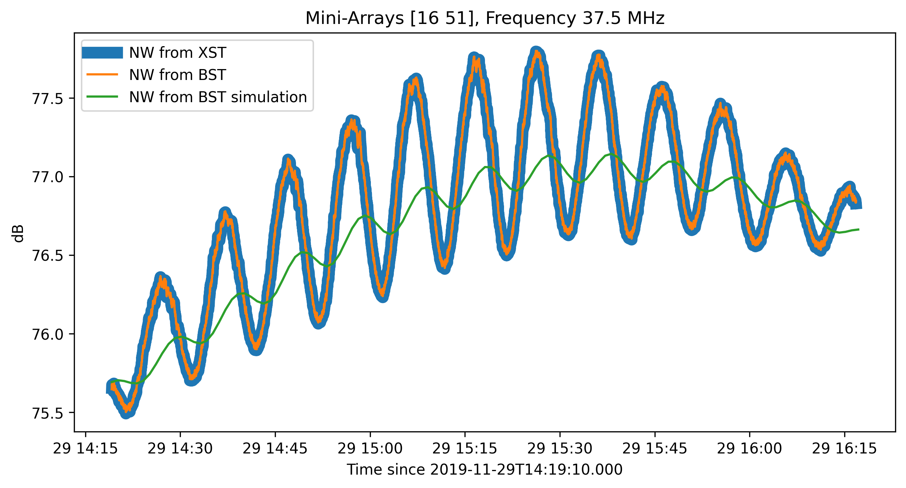
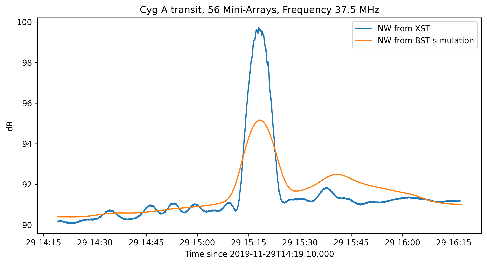

.. _tuto_beamforming:

Beamforming from XST
====================

Cross-correlation statistics data (or XST), although mainly used in the NenuFAR 'proto-imager' mode and for the NenuFAR-TV (see :ref:`tuto_tv` tutorial), can be suited to achieve different purposes. Indeed, they contain recorded amplitude and phase data for each baseline involved in the observation. Hence their ability to be converted to beamformed statistics data (or BST) at will. This can in particular be done for any subset of Mini-Arrays in any pointing direction allowing for numerous potential array configurations available at once with a single XST observation, rather than performing as many BST observations as desired configurations.

The following tutorial aims at reproducing an existing BST observation (here a Cygnus A meridian transit observed with different East-West orientated Mini-Array pairs: ``'20191129_141900_BST.fits'``) with the corresponding XST data taken at the same time (``'20191129_141900_XST.fits'``).

Both data sets are loaded using :class:`~nenupy.beamlet.bstdata.BST_Data` and :class:`~nenupy.crosslet.xstdata.XST_Data` classes and stored as ``bst`` and ``xst`` instances respectively:

>>> from nenupy.beamlet import BST_Data
>>> from nenupy.crosslet import XST_Data
>>> bst = BST_Data('20191129_141900_BST.fits')
>>> xst = XST_Data('20191129_141900_XST.fits')

The BST data contains four array configurations corresponding to four pairs of different Mini-Arrays. Selection of the first configuration is done by setting :attr:`~nenupy.beamlet.bstdata.BST_Data.dbeam` index to 0. The selected configurations involves the pair of Mini-Arrays 16 and 51 (checked with :attr:`~nenupy.beamlet.bstdata.BST_Data.mas` attribute). The final comparison will be on a single frequency time profile indexed ``freq_idx``. BST data are selected accordingly with the :meth:`~nenupy.beamlet.bstdata.BST_Data.select` method and giving :attr:`~nenupy.beamlet.bstdata.BST_Data.freqrange` the XST frequency corresponding to ``freq_idx`` index:

>>> freq_idx = 1
>>> bst.dbeam = 0
>>> bst_d = bst.select(
        freqrange=xst.freqs[freq_idx]
    )

Beamforming the cross-correlation data is done using :meth:`~nenupy.crosslet.crosslet.Crosslet.beamform` method. The phasing direction must be given in local sky coordinates. Hence, to compare the BST and XST data, the pointing direction (:attr:`~nenupy.beamlet.bstdata.BST_Data.azdig` and :attr:`~nenupy.beamlet.bstdata.BST_Data.eldig`) stored in the BST file metadata are given to ``az`` (azimuth) and ``el`` (elevation) parameters.
The ``ma`` parameter is set with the selected Mini-Array pair (:attr:`~nenupy.beamlet.bstdata.BST_Data.mas`), although it could accept any subset of Mini-Arrays.
The polarization ``pol`` is such as the current selected BST polarization: :attr:`~nenupy.beamlet.bstdata.BST_Data.polar`.
Finally, the ``calibration`` table is specified (``'default'`` value enables the calibration table used during the BST observation).
``bst_d`` and ``xst_d`` are both :class:`~nenupy.beamlet.sdata.SData` objects.

>>> xst_d = xst.beamform(
        az=bst.azdig[0],
        el=bst.eldig[0],
        pol=bst.polar,
        ma=bst.mas,
        calibration='default'
    )

.. warning::
    XST beamforming in tracking mode is not enabled yet.

Corresponding BST observation can be simulated using :meth:`~nenupy.simulation.hpxsimu.HpxSimu.from_bst` method (see :ref:`tuto_simu_ref` tutorial for more details):

>>> from nenupy.simulation import HpxSimu
>>> from astropy.time import TimeDelta
>>> simu = HpxSimu.from_bst(
        bst,
        dt=TimeDelta(60, format='sec'),
        resolution=0.5
    )

``simu`` is another :class:`~nenupy.beamlet.sdata.SData` object, and everything can de displayed together for comparison:

>>> import matplotlib.pyplot as plt
>>> plt.plot(
        xst_d.datetime,
        xst_d.db[:, freq_idx],
        label='{} from XST'.format(bst.polar),
        linewidth=8
    )
>>> plt.plot(
        bst_d.datetime,
        bst_d.db,
        label='{} from BST'.format(bst.polar),
        linewidth=1.5
    )
>>> scale = np.median(bst_d.db) / np.median(simu.db)
>>> plt.plot(
        simu.datetime,
        simu.db * scale,
        label='{} from BST simulation'.format(bst.polar)
    )
>>> plt.legend()
>>> plt.ylabel('dB')
>>> plt.xlabel('Time since {}'.format(bst.time[0].isot))
>>> plt.title('Mini-Arrays {}, Frequency {}'.format(bst.mas, xst.freqs[freq_idx]))

.. note::
    The above figure shows in blue the time-profile at 37.5 MHz obtained from beamforming the XST observation and in orange the corresponding BST profile. Both are perfectly identical, as expected.
    The Mini-Array pair being roughly East-West orientated implies North-South beam fringes. The meridian transit of Cygnus A thus appears like a sinusoidal curve.
    The corresponding simulation is shown in green and some discrepancies can be noted: lower fringe amplitudes (mostly due to Cygnus A not being a perfect point source in the `GSM <https://github.com/telegraphic/PyGSM>`_ skymodel) and phase-shift of the fringes (maybe due to a slight instrument `shift from ideal pointing <https://nenufar.obs-nancay.fr/en/astronomer/#identified-features>`_).

The same dataset can also be used to beamform any subset of NenuFAR Mini-Arrays, in particular the whole array. ``miniarrays`` variable is a list of the 56 Mini-Arrays names:

>>> miniarrays = np.arange(56)

The :meth:`~nenupy.crosslet.crosslet.Crosslet.beamform` method is once again called with this new Mini-Array subset in input, and the results are stored in the :class:`~nenupy.beamlet.sdata.SData` object ``bst_d``:

>>> bst_d = xst.beamform(
        az=bst.azdig[0],
        el=bst.eldig[0],
        pol=bst.polar,
        ma=miniarrays,
        calibration='default'
    )

A simulation can also be made using the (almost) same array configuration while calling :meth:`~nenupy.simulation.hpxsimu.HpxSimu.azel_transit` after having defined a coordinate object with :func:`~nenupy.astro.astro.ho_coord`:

>>> from nenupy.astro import ho_coord
>>> transit_altaz = ho_coord(
        az=bst.azdig[0],
        alt=bst.eldig[0],
        time=bst.times[0]
    )
>>> simu = HpxSimu(
        freq=xst.freqs[freq_idx],
        resolution=0.5,
        ma=miniarrays,
        polar=bst.polar
    )
>>> exposure = bst.times[-1] - bst.times[0]
>>> result = simu.azel_transit(
        acoord=transit_altaz,
        t0=bst.times[0] + exposure/2.,
        dt=TimeDelta(60, format='sec'),
        duration=exposure,
    )

.. note::
    It should be noted that the reconstructed beamformed observation (blue curve) was made with only 8 Mini-Arrays analog phased towards the meridian transit of Cygnus A, the other 48 were default phased at the local zenith. However, the simulation (orange curve) assumed that the 56 Mini-Arrays were analog phased towards the target. This, in addition to the skymodel uncertainties, are the main caveats for this comparison interpretation.
